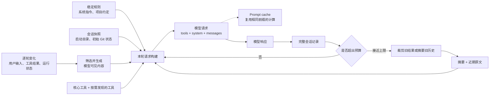

# 有限窗口中的 Agent：PI 与 Claude Code 的上下文机制

## 引言：上下文不是会话的原样回放

Agent 的上下文不能和会话记录画等号。会话记录可以完整保存在磁盘上，但模型每次调用只能接收一份有限的输入；这份输入还要同时容纳系统指令、项目规则、工具定义、用户消息、工具结果和历史进展。Agent 运行时间越长，两者的差别越明显：磁盘上的记录继续增长，真正送给模型的内容则必须经过选择、排列和压缩。

本文主要分析 [PI](https://github.com/earendil-works/pi/tree/46bb9a2c3bdb296b0d2179f7309ec6b79a7f3106) 固定 commit `46bb9a2c3bdb296b0d2179f7309ec6b79a7f3106`，以及 Claude Code commit `09f43552c76cb8856c4a5414f9aa9c9cda6ee035` 的本地源码快照。后者来自公开暴露的 source map 镜像，不是 Anthropic 官方源码仓库，因此本文只把快照中可以直接核对的实现当作证据。OpenAI 与 Anthropic 的当前官方文档用于补充源码之外的新 API 能力和通用做法。

### 四个容易混淆的对象

讨论这个问题时，有四个对象需要先分开。

- **完整会话记录**保存用户消息、模型响应、工具调用以及运行时事件，主要用于恢复、审计和重新构建状态。
- **本轮请求上下文**是当前这一次模型调用真正看到的内容。它来自完整记录，但不必包含完整记录。
- **Prompt caching（提示缓存）**复用相同提示前缀已经完成的计算，减少延迟和费用；被缓存的 token 仍然占据上下文窗口。
- **压缩摘要**替代一部分旧消息，使模型在更少的 token 中继续原任务。摘要是新的工作上下文，不是完整历史的替代存档。

### 一轮请求的主干

下面这张图只画一轮请求的主干。完整记录一直留在存储中；请求构建器从中选出历史，再与稳定规则、会话快照、逐轮变化和工具定义合并。空间不足时，旧历史先经过裁剪或摘要，输出变成“历史摘要 + 近期原文”，而不是删除磁盘上的完整记录。



## 第一部分　源码如何管理有限窗口

### 1. 请求上下文的组成

#### 请求在 API 中的形态

OpenAI 的 Chat Completions 用 `messages` 保存有序消息，用 `tools` 描述模型可以调用的工具。下面只展示与上下文有关的字段，不是完整请求。

```json
{
  "tools": [
    {
      "type": "function",
      "function": {
        "name": "read_file",
        "parameters": {
          "type": "object",
          "properties": { "path": { "type": "string" } },
          "required": ["path"]
        }
      }
    }
  ],
  "messages": [
    {
      "role": "system",
      "content": "You are a coding agent."
    },
    {
      "role": "user",
      "content": "项目约束：只修改与任务相关的文件。\n当前工作目录：/workspace/repo\n检查 src/config.ts 的默认值。"
    },
    {
      "role": "assistant",
      "tool_calls": [
        {
          "id": "call_read_1",
          "type": "function",
          "function": {
            "name": "read_file",
            "arguments": "{\"path\":\"src/config.ts\"}"
          }
        }
      ]
    },
    {
      "role": "tool",
      "tool_call_id": "call_read_1",
      "content": "export const timeout = 30;"
    },
    {
      "role": "user",
      "content": "把默认值改成 60。"
    }
  ]
}
```

这段请求里，`tools` 只是能力定义；`assistant.tool_calls` 才是模型提出的调用；Agent 执行工具后，再用 `tool` 消息返回结果。`call_read_1` 把调用和结果连在一起。下一次调用模型时，Agent 会把这组消息作为历史重新发送，最后一条 `user` 才是当前要求。

| 协议位置 | 在 Agent 中常见的内容 |
|---|---|
| `system` / `developer` | Agent 行为、安全和长期规则 |
| `user` | 用户任务，以及 Agent 注入的项目说明、环境材料和必要的状态提醒 |
| `assistant` | 模型此前生成的文本或工具调用 |
| `tool` | Agent 运行时执行工具后取得的结果 |
| `tools` | 模型当前可以调用的接口定义 |

角色只说明内容在协议中的位置，不保证它来自谁。示例第一条 `user` 同时包含项目约束、工作目录和用户任务，其中前两项可以由 Agent 注入；`assistant` 是模型的历史输出，不是 Agent 运行时的全部状态。CLAUDE.md、环境快照和历史摘要也不是 API 的专用字段，Agent 必须先把它们整理成文本，再放入 provider 支持的位置。

#### PI：运行状态如何变成模型请求

上面的 JSON 仍然隐藏了一步：Agent 内存中的状态远比 LLM API 能接收的内容丰富，不能直接序列化后发给模型。PI 的[状态与消息模型](https://github.com/earendil-works/pi/blob/46bb9a2c3bdb296b0d2179f7309ec6b79a7f3106/packages/agent/src/types.ts)把这层差异写进了类型设计：`AgentState` 保存完整状态，一次运行开始时再从中复制模型调用需要的部分。

```text
AgentState
├─ systemPrompt、messages、tools → 本次运行的 AgentContext
├─ model、thinkingLevel          → 模型调用配置
└─ streaming、pending、error     → 运行时控制与观察

AgentMessage[]
→ 上下文筛选和补充
→ LLM 消息转换
→ Provider 适配
→ Wire request
```

`AgentContext` 是本次运行的上下文快照，只包含 system prompt、消息和工具。`AgentMessage` 是 PI 应用层的消息联合类型，既有标准用户、模型和工具结果消息，也允许应用加入自定义类型。进入 provider 层前，消息先经过裁剪或外部材料注入，再转换成通用的 `Message`：UI-only 内容被过滤，需要让模型知道的自定义消息则改写成 LLM 能接收的形式。

| PI 中的状态 | 在运行时的作用 | 怎样进入 LLM API |
|---|---|---|
| `systemPrompt` | 保存当前基础提示 | 转成 provider 的 system 或 developer 内容 |
| `messages` | 保存会话历史和应用自定义消息 | 筛选、转换后进入有序消息历史 |
| `tools` | 同时包含 schema 和本地执行能力 | 只发送名称、说明和参数 schema |
| `model`、`thinkingLevel` | 决定模型和推理配置 | 进入顶层请求参数，不作为消息正文 |
| `isStreaming`、`streamingMessage` | 表示响应是否仍在生成 | 不直接发送；完成后才成为 assistant 历史 |
| `pendingToolCalls` | 跟踪尚未完成的工具调用 | 留在 Agent loop；完成后生成配对的工具结果 |
| `errorMessage` | 记录最近一次失败或中止 | 不直接发送；恢复需要时必须另行生成模型消息 |

`AgentContext` 虽在运行开始时复制，却会在运行中加入已完成的 assistant message 和带调用 ID 的 tool result，供下一轮模型调用使用；未完成的流式片段和 pending 集合不会被伪装成完整历史。模型和 thinking level 虽然也进入 API 请求，却属于调用配置，不是占用 prompt token 的消息正文。

工具结果进一步展示了字段级拆分。PI 的工具执行结果同时包含 `content` 和 `details`：前者是模型需要看到的文本或图片，后者保存 UI、日志或工具专用结构。转换时会使用 `content` 和 `toolCallId`；`isError` 标记执行是否失败，并在 provider 支持时继续映射。`details`、工具 usage 和消息时间可以留在记录与统计中。一次执行由此可以同时服务模型、界面和运行控制，而不必共享同一份 wire 数据。

这种分层让内部状态可以服务 UI、恢复和调度，不受某一家 LLM 协议限制；provider 适配层只处理整理后的通用消息。模型可见字段也可以单独检查，既减少无关 token，也避免意外发送执行函数和内部数据。

#### Provider 差异由适配层处理

这种角色结构被许多 OpenAI-compatible 接口采用，但不是统一的 LLM 协议。OpenAI 仍支持 Chat Completions，同时[建议新项目使用 Responses API](https://developers.openai.com/api/docs/guides/migrate-to-responses)；Anthropic Messages 则使用顶层 `system`、assistant `tool_use` 和 user `tool_result`。这里选择 Chat Completions，只因为它能用较少字段把四种消息角色和工具配对放在一起。

PI 的[请求适配实现](https://github.com/earendil-works/pi/blob/46bb9a2c3bdb296b0d2179f7309ec6b79a7f3106/packages/ai/src/api/openai-completions.ts)，负责把前面整理出的通用内容转换成目标协议。面向 Chat Completions 时，system prompt 会成为 `developer` 或 `system` 消息，工具调用和结果会成为 `assistant.tool_calls` 与 `tool`；面向 Responses API 时，对应内容则改写为 input message、`function_call` 和 `function_call_output`。协议字段的差异留在这一步，上层状态不必随 provider 改变。

#### PI 的系统提示组装

PI 的[系统提示构建实现](https://github.com/earendil-works/pi/blob/46bb9a2c3bdb296b0d2179f7309ec6b79a7f3106/packages/coding-agent/src/core/system-prompt.ts)，会把默认规则和项目材料分层组装。默认部分包含 Agent 身份、当前可用工具的简短说明、随工具变化的使用规则和 PI 文档入口，随后追加项目指令、Skill 说明以及当前工作目录。项目文件被放在 `<project_context>` 中，每个文件再用带路径的 `<project_instructions>` 包裹，以标明来源并减少不同文件混成一段文字后的歧义。

自定义 system prompt 的语义也很明确：它替换 PI 的默认提示，但不会吞掉追加提示、项目上下文和工作目录。Skill 只有在文件读取能力可用时才加入提示，因为 Skill 内容通常需要模型继续读取文件；没有读取能力却告诉模型“这里有一组可读 Skill”，只会形成无法兑现的指令。

会话层会根据运行时状态重建这份提示：从当前工具注册表收集有效工具、工具说明和使用规则，再合并已经加载的自定义提示、追加提示、Skill 与 AGENTS 文件。扩展可以在一次 Agent 运行开始前加入自定义消息，也可以只对本次运行临时覆盖 system prompt；运行结束后覆盖自动清除，不会无意间变成后续会话的永久规则。

#### Claude Code 怎样放置规则、项目说明与 Git 快照

Claude Code 源码中的 system context 和 user context 是项目内部的变量名，不是 Anthropic API 字段，也不是两种通用的上下文类型。要理解这些名称，不能只看其中的 system 和 user，而要看它们实际装入什么内容、最后放到请求的哪里。

| Claude Code 中的名称 | 实际包含什么 | 最终进入哪里 | 覆盖和复用方式 |
|---|---|---|---|
| 默认 system prompt | Agent 身份、行为与安全规则、工具使用说明等 | system prompt 主体 | custom system prompt 会替换它 |
| system context | 可选的会话开始 Git 快照，包括当前分支、主分支、简短状态和近期提交 | system prompt 尾部 | 会话内复用；使用 custom system prompt 时跳过 |
| user context | 自动发现的 CLAUDE.md、规则文件、可用的持久 memory 文件内容，以及当天日期 | 会话历史最前面一条由运行时创建的 user message（meta user message） | 会话内复用；custom system prompt 不会移除它 |
| append system prompt | CLI 或 SDK 调用方额外补充的系统规则 | 默认或自定义 system prompt 之后 | 只追加，不替换原有提示 |
| custom system prompt | 调用方完整提供的基础系统提示 | 替代默认 system prompt | 仍保留 append system prompt 和 user context |

主路径可以压缩成下面两组关系：

```text
默认路径：system = 默认 system prompt + append system prompt + system context
          messages = user context 元信息消息 + 会话历史

自定义路径：system = custom system prompt + append system prompt
            messages = user context 元信息消息 + 会话历史
```

因此，append system prompt 中的 append 表示“在现有基础上补充”，custom system prompt 才表示“替换默认基础”。system context 也不是当前所有运行环境的统称；在这份源码快照的正常路径中，它主要承载启动时取得的 Git 快照。user context 虽然最终使用 user role，却不是用户刚刚键入的消息，而是 Claude Code 放在真实会话之前的项目说明和日期。

#### 类似 XML 的标签标记文本边界

PI 和 Claude Code 都会在提示文本中使用看起来像 XML 的标签，但用途不完全相同。PI 把项目文件放进最终 system prompt，大致形态如下：

```text
<project_context>
  <project_instructions path="AGENTS.md">
    ...项目规则...
  </project_instructions>
</project_context>
```

外层 `<project_context>` 表示这一段都是项目材料，内层 `<project_instructions>` 区分每一份文件，`path` 属性保留来源。Claude Code 则会把运行时补充的信息包进 `<system-reminder>`。例如，放在会话开头的元信息用户消息会采用类似结构：

```text
<system-reminder>
As you answer the user's questions, you can use the following context:
# claudeMd
...项目与用户规则...
# currentDate
Today's date is 2026-08-17.
</system-reminder>
```

`<system-reminder>` 还可以出现在工具结果和其他运行时附件中，用来告诉模型“这段文字是 Agent 运行时补充的”，不必与它旁边的用户问题或工具输出直接相关。

这里没有新增一套 LLM API 协议，也不要求这些文本通过 XML schema、namespace 或专门的 XML 字段校验。项目只是借用了成对标签、嵌套和属性这几种熟悉的写法，让模型更容易区分规则、上下文、文件内容和来源；运行时也可以按固定标签识别、隐藏或整理这些附加文本。Anthropic 的[提示编写建议](https://platform.claude.com/docs/en/build-with-claude/prompt-engineering/claude-prompting-best-practices)同样建议在复杂提示混合指令、上下文和输入时，用一致、含义明确的 XML 标签分隔内容。

类似 XML 的标签不是唯一选择。Markdown 标题或其他稳定分隔符也能组织提示，Claude Code 的 `<system-reminder>` 内部本身就在使用 Markdown 标题。标签也不会改变消息角色：放在 user message 里的 `<system-reminder>` 仍然属于 user role，名字中含有 system 不会把它变成 API 的 system prompt。它同样不是安全边界；外部内容也可能带有相似字符串，运行时不能仅凭标签名称就把其中内容当成可信规则。

至此可以把几层关系分开：运行状态先筛选成模型可见内容，API role 决定它在请求中的协议位置，Claude Code 的内部名称描述提示材料怎样组合，类似 XML 的标签只负责在一段文本中标出边界和来源。第 1 节解决了当前状态怎样进入请求；接下来还要判断每项状态应该在什么时候取得，旧值又应在什么时候更新。

### 2. 请求材料何时读取、何时更新

初始 Git 状态和当前权限都可以归入环境信息，更新时间却不应相同。Git 状态主要帮助模型了解会话从哪里开始，可以保存为注明时间的启动快照；权限若决定下一步操作能否执行，就要在执行前重新确认。差别不在于它们是否都叫“动态信息”，而在于旧值会不会让 Agent 作出错误操作。

一项信息何时更新，还要考虑重新取得的成本，以及同一轮运行是否需要保持一致。目标不是让所有内容持续变化，而是在旧值影响下一次模型请求或实际操作之前取得足够新的状态。

#### 过期后的影响决定刷新时机

| 内容 | 默认取得方式 | 需要更新的条件 | 这样处理的原因 |
|---|---|---|---|
| AGENTS.md、CLAUDE.md、Skill、提示模板 | 会话开始时读取 | 显式 reload 或资源发生变化 | 通常较稳定，反复扫描成本高 |
| 初始 Git 状态、会话日期 | 会话开始时形成快照 | 当前分支、文件状态或日期会影响判断 | 平时只用于定位，不必每轮查询 |
| 活动工具、模型、权限、MCP 连接 | 新请求或相关操作前确认 | 配置、连接或权限发生变化 | 旧值可能直接造成错误调用 |
| 新用户消息、工具结果、文件变化附件 | 产生后加入下一次模型请求 | 每次出现新事件 | 它们表示任务的当前进度 |
| 文件全文、完整日志、远程详情 | 任务需要时查询 | 任务需要相关细节或内容可能已变化 | 体积较大，而且能够重新取得 |

这张表表达的是判断方法，不是固定协议：具体刷新点应落在旧值可能影响判断或操作之前。

#### PI：项目资源显式重载，运行配置按轮更新

PI 在会话初始化时加载 AGENTS 文件、Skill、提示模板和扩展，只有执行 reload 才重新读取这些项目资源并重建运行时，不会在每次工具调用后扫描一遍。项目说明通常稳定，显式刷新足以让用户控制何时接受磁盘上的变化。

活动工具采用更短的更新时间。工具集合发生变化时，PI 会立即重建基础 system prompt；下一轮开始前，再把当时的提示、工具列表、模型和 thinking level 写入本轮请求配置。这里没有把所有信息简单分成“静态”和“动态”，而是分别选择资源重载和下一轮这两个真正会影响行为的边界。

#### Claude Code：启动材料复用，行动状态按边界更新

Claude Code 会在一次会话中复用自动发现的 CLAUDE.md、规则与 memory 内容、当天日期以及可选的初始 Git 状态。Git 状态最多保留 2,000 个字符，文本本身明确说明这是会话开始时的快照，之后不会自动更新；需要当前状态时，模型应重新运行 `git status`。

新的模型请求会结合当时的权限和 MCP（Model Context Protocol）连接状态整理工具池，并收集新的用户消息、文件变化、相关记忆和附件。进入一次 Agent 运行后，环境、实验开关和会话配置则作为本轮快照保持不变，避免同一轮中的多次模型调用看到相互矛盾的配置。因此，这里的“及时更新”不是在流式生成期间不断改写上下文，而是在下一次模型请求或相关操作需要作出决定前取得足够新的状态。

#### 冲突时重新读取当前状态

会话快照和压缩摘要都只能说明此前知道的状态。摘要说测试尚未通过，如果最新工具结果显示测试已经通过，应以后者为准；摘要记录的文件结构若与磁盘内容冲突，也应重新读取文件。数据库、权限和远程资源同理：当旧记录可能影响当前操作时，Agent 应查询当前状态并更新判断，而不是把历史上下文当作外部系统的副本。

摘要负责保存哪些任务状态将在第 6 节展开；这里需要确定的只是新旧信息冲突时的处理方式。到这里，材料的更新时间已经明确，接下来还要解决这些材料能否装进模型窗口。

### 3. 让有限窗口优先承载必要信息

上一节解决的是材料是否足够新。即使每项信息都在正确时机取得，文件、工具定义和会话历史仍可能超过容量；接下来要判断的，是哪些内容需要在当前请求中完整出现，哪些只需保留发现入口、片段或重新读取的位置。

这一步发生在内容进入模型可见窗口之前。重复前缀怎样减少计算成本留到第 4 节讨论，已经进入历史的内容怎样裁剪和摘要则属于第 5 节。

#### 先为输出和恢复留出空间

上下文窗口的约束可以先写成一个简单关系：

```text
本轮输入 + 预期输出 + 安全余量 ≤ 模型上下文窗口
```

输入不仅包括聊天文字。system prompt、工具 schema、图像、模型推理块（thinking block）、工具结果和压缩摘要都会占空间。只统计 `messages` 字符数，通常会低估真实请求；把整个窗口都留给输入，则会让模型没有足够空间完成回答，甚至让压缩请求本身无法生成摘要。

容量控制不仅要计算还剩多少 token，还要决定材料以什么形态进入。当前目标、硬约束、近期工作，以及无法重新取得且会影响当前判断的事实，应当完整保留；低频能力可以先保留发现入口；文件全文、长日志和其他能够重新取得的大块材料，则可以只保留相关片段和定位信息。这样分配不是尽可能少放内容，而是先把空间留给当前决策、模型输出和必要的溢出恢复。

PI 默认从上下文窗口中预留 16,384 token，并在压缩时尽量保留约 20,000 token 的近期原文。当已用空间超过“模型窗口减去预留空间”时，自动压缩才会触发。前一个数字给后续提示和模型输出留下余量，后一个数字控制压缩后仍能看到多少近期对话；它们是当前版本的工程默认值，不是适用于所有模型的固定比例。

PI 估算 token 时，优先找到最近一条带有有效 provider usage 的 assistant message，以这次真实用量为基线，只对后来新增的消息按约四字符一个 token 估算。这样既利用 provider 已经计算的事实，又能覆盖尚未反映在 usage 中的新内容；只有整段历史都没有 usage 时，才对全部消息进行估算。

Claude Code 将预留拆得更细：先从模型窗口中扣除最大输出空间，摘要本身最多预留 20,000 token，自动压缩线再提前 13,000 token。关闭自动压缩时，距离有效窗口 3,000 token 会进入 blocking limit，目的是仍给手动 `/compact` 留出机会。20,000、13,000 和 3,000 同样只是该快照的工程参数。它们更值得借鉴的是预算次序：输出和恢复先占有空间，剩余部分才分给当前输入，而不是等 provider 返回 413 或 prompt too long 才开始处理。

#### 低频工具保留发现入口

工具定义是一项每轮都可能重复的固定输入。给 Agent 注册一百个工具，即使一个都不调用，它们的名称、说明和参数 schema 仍可能进入每次请求。PI 会把工具分成立即可见和延迟提供两组，不同 provider 可以通过 additional tools、tool search 或 `tool_reference` 在会话后部加载后一组。Claude Code 让内置基础工具保持可见，把 MCP 和其他低频工具交给工具搜索；自动模式默认在工具定义达到模型窗口的 10% 时启用延迟加载，优先调用 token counting API，失败后才按 2.5 字符一个 token 估算。

这不等于“先预测本轮只会用五个工具，其余全部删除”。如果预测错了，模型连纠正选择的入口都没有。更可靠的结构是：文件读取、命令执行等高频基础工具直接提供完整 schema；保险、邮件、数据库等专业工具先提供简短的名称、用途或搜索入口，模型确认需要后再加载完整定义。OpenAI 当前的 [Tool search](https://developers.openai.com/api/docs/guides/tools-tool-search) 采用 `defer_loading`，并把新发现的工具加在上下文末尾；Anthropic 的 [Manage tool context](https://platform.claude.com/docs/en/agents-and-tools/tool-use/manage-tool-context) 也把工具搜索作为减少预加载定义的方式。

工具不是越少越好。这里节省的是当前不需要的完整定义，同时必须保留发现必要能力的路径。

#### 大块且可重新取得的内容留在窗口外

文件全文、长日志、远程详情和工具返回都可能迅速占满窗口。它们如果可以从磁盘、命令或外部服务重新取得，就不必在第一次进入模型可见上下文时携带全文；运行时可以先保留命中片段、简短预览、来源路径和重新读取方式。

Claude Code 对工具结果设置了几层保护：常规结果默认不超过 50,000 字符，超出时可以转存磁盘；单个结果还有约 100,000 token 的上限。一次 user message 中多个并行 `tool_result` 合计的默认预算为 200,000 字符，相关功能开关开启后会优先转存最大的结果，直到回到预算以内。模型看到的是预览和文件路径，需要细节时可以再次读取。

这种处理的前提是原始内容确实可以恢复。一次性返回、无法重放的外部响应，或者会直接影响当前判断的关键证据，不能只留下一个可能失效的路径；至少要保留足以支持后续决策的内容和来源。外置大块材料不是统一截断，而是只让当前请求携带必要片段，把能够重新取得的正文留在窗口外。

因此，高效利用窗口不是尽可能少放内容，而是让当前决策需要的信息完整出现，同时为可恢复材料保留返回路径。先控制新内容以什么形态进入，能减少后续压缩不得不承担的信息损失。

### 4. Prompt caching 与稳定前缀

#### 缓存复用的是请求开头的一段计算

Agent loop 会在一次用户任务中多次调用模型。每次工具执行后，旧请求大部分保持不变，只在末尾加入新结果。Prompt caching 利用的正是这种关系：provider 保存请求开头一段内容已经完成的计算，后续请求如果具有相同前缀，就可以复用它。

```text
请求 1：[稳定规则][工具定义][已有历史]｜缓存边界
请求 2：[相同规则][相同工具][相同历史]｜缓存边界｜[新增工具结果]
```

第一次请求可以把边界之前的计算写入缓存；第二次请求找到相同前缀后，只需继续处理新增尾部。这里把“找到可复用前缀”称为命中，把“没有找到相同前缀”称为未命中。边界之前的内容或顺序发生变化，旧计算便无法继续复用；边界之后追加内容，不会改变已经写入的前缀。

“稳定前缀”不是一个 API 字段，而是 provider 将规则、工具和消息转换成模型输入后，从开头起保持一致的那段内容。“缓存边界”（cache breakpoint）只表示希望可复用的前缀在哪里结束，不是程序调试时使用的断点。OpenAI 在 [Codex agent loop 的说明](https://openai.com/index/unrolling-the-codex-agent-loop/)中也把只在尾部追加新内容作为提高缓存复用率的重要条件。

#### PI 与 Claude Code 怎样保持前缀稳定

PI 会根据 provider 的能力把同一套缓存选项转换成不同请求字段。Anthropic 风格的 `cache_control` 是附在内容块上的缓存标记，用来指出缓存边界，并可指定缓存有效期。OpenAI 的 `prompt_cache_key` 则是一个路由提示，让具有共同前缀的请求更容易被送到可复用的缓存位置；它不是缓存条目的 ID，也不能代替前缀匹配。PI 提供的短期、长期和关闭缓存选项会映射成各 provider 支持的字段，而不是假定所有 API 使用相同的时长和标记方式。

Claude Code 主要通过请求布局保持前缀稳定：基础身份和通用规则放在前面，项目说明、环境变化等会话内容追加在后面；内置工具与 MCP 工具分别保持确定顺序，避免一次工具增减改变整段工具定义的排列。已经转存或缩短的工具结果也会依据对应的 `tool_use_id` 延续同一种表示，避免一条旧结果在后续请求中从全文突然变成预览。

缓存设置本身也会成为前缀匹配的一部分。Claude Code 在一次会话中固定是否使用较长有效期，避免同一段内容的缓存标记中途改变。TTL（time to live）指缓存条目可以被复用的有效时间；在 Claude Code 使用的 Anthropic 缓存中，[默认有效期为 5 分钟，也可选择 1 小时](https://platform.claude.com/docs/en/build-with-claude/prompt-caching)。这是该 provider 的设置示例，不同 provider 和模型可能采用不同方式。

#### 前缀或缓存设置变化后无法继续复用

模型、系统规则、工具名称、工具 schema 或工具顺序改变时，请求前缀随之改变。缓存边界、有效期或者会影响 provider 最终输入的关键配置发生变化时，即使正文看起来相同，也可能无法复用旧计算。内容没有改变但已超过有效期，或者 provider 提前移除了缓存条目，同样会造成未命中。

所谓“主动失效”，通常不是应用去删除 provider 内部的缓存，而是语义确实变化后发送新的前缀或配置，使旧条目不再匹配。没有变化的内容应保持稳定，不要为了刷新缓存而无意义地扰动它。

Claude Code 会在请求前记录系统提示、工具定义、模型和缓存设置是否改变，响应后再检查缓存读取量是否明显下降。固定快照把“下降超过 5%，并且至少减少 2,000 token”作为告警条件；这只是该项目筛选显著变化的阈值，不是通用的缓存失效标准。

provider 的响应统计可以帮助确认复用是否发生。OpenAI 的 `cached_tokens` 表示本次输入中从缓存复用的 token 数；Anthropic 的 `cache_read_input_tokens` 表示缓存读取量，`cache_creation_input_tokens` 表示本次新写入缓存的输入量。字段名称不同，观察重点相同：稳定前缀没有预期变化时，缓存读取量却明显下降，就需要检查有效期、请求布局和配置是否改变。具体字段语义可分别参考 [OpenAI Prompt caching](https://developers.openai.com/api/docs/guides/prompt-caching) 与 [Anthropic Prompt caching](https://platform.claude.com/docs/en/build-with-claude/prompt-caching)。

#### 缓存不会释放上下文空间

缓存改变的是输入的计算和计费方式，不会把这段输入从本轮请求中删除。一个 150K-token 请求即使有 140K token 来自缓存，模型仍然在 150K-token 的上下文上工作。第 3 节通过内容准入减少第一次进入窗口的材料，第 5 节缩减已经累积的历史；缓存可以降低延迟和费用，不能代替其中任何一种容量控制。

### 5. 从裁剪到摘要

第 3 节控制的是新内容第一次以什么形态进入模型可见窗口。内容进入历史并完成当时的用途后，对后续请求的价值还会继续变化：当时必须完整出现的工具结果，几轮之后可能只需要保留调用记录和结论。

因此，上下文变长以后不必立刻把整段会话改写成一份摘要。先清理已经完成使命、又能够重新取得的旧内容，通常更便宜，也更少损失信息。

#### 先清理可以重新取得的旧结果

Claude Code 的轻量清理只处理文件读取、命令执行、搜索和编辑等可重新执行的工具。较旧的 `tool_result` 正文会被替换成 `[Old tool result content cleared]`，工具调用本身仍然保留，因此模型知道曾经读过或执行过什么。时间触发版本会等服务端缓存很可能已经过期后再清理，并默认保留最近五个可清理结果；另一路把清理规则交给 provider，由它在处理请求时从模型可见上下文中移除符合条件的旧结果，本地完整消息不必随之改写。

这种处理适用于“内容已经完成使命，而且能够重新取得”的结果。一次 `git diff`、文件全文或搜索列表可能在当时很重要，但任务推进后只需要结论和路径；用户需求、方案决策和未解决错误则不适合用同样方式清空。Anthropic 的 [Context editing](https://platform.claude.com/docs/en/build-with-claude/context-editing) 也把 tool result clearing 单独设计成一种策略，并提醒：清理会使修改点之后的缓存失效，因此一次应释放足够多的 token，避免为很小收益反复重写缓存。

#### PI：旧摘要与近期原文共同更新

当旧工具结果已经不足以释放空间，才需要摘要历史。PI 的[压缩实现](https://github.com/earendil-works/pi/blob/46bb9a2c3bdb296b0d2179f7309ec6b79a7f3106/packages/agent/src/harness/compaction/compaction.ts)，会在上下文超过预留线后，从最新消息向前累计需要保留的近期内容，再寻找合法切点。切点之前的历史交给摘要模型，之后的近期原文保持不变。后续请求只使用“最近一次压缩摘要 + 近期原文 + 压缩后新增消息”构建活动上下文，完整会话仍然保存在存储中。

如果会话已经压缩过，PI 不会只摘要上次之后的内容然后遗忘更早历史。下一次压缩会同时读取上一版摘要、上次保留的近期原文和后来新增的消息，再用更新提示合并旧状态与新进展。新的摘要不是脱离旧任务状态重新概括，而是对上一检查点的增量更新。

#### Claude Code：重建上下文并恢复运行状态

Claude Code 的完整压缩（full compact）路径更重。它先生成详细 summary，清空需要重新建立的文件读取状态，再按固定顺序放入压缩边界、摘要消息、附件和 hook 结果。full compact 通常不保留旧消息原文；部分压缩（partial compact）才会把未被摘要的一侧原文重新放回请求。完整压缩后，系统最多恢复五个近期文件，单文件最多 5,000 token、文件总预算 50,000 token；已调用 Skill 另有单项和总量限制。当前 plan、plan mode、异步 Agent 状态、延迟工具变化和 MCP 指令也可以重新挂载。

压缩边界还会保存压缩前已经发现的 deferred tool 名称。工具搜索返回的 `tool_reference` 原本存在于旧消息中，历史被摘要后这些 block 会消失；如果只依赖 summary 用自然语言记住工具，API 层并不知道哪些 schema 应继续发送。Claude Code 因此把已发现的工具名写进结构化压缩 metadata，后续同时从当前消息和压缩边界恢复这些工具。

Claude Code 还支持 partial compact。一种模式摘要选择点之后的内容并保留更早前缀，保留部分仍能命中原缓存；另一种模式摘要较早前缀并保留更新的尾部，summary 会插到保留消息之前，原缓存因此失效。这个差别说明，压缩位置不仅影响语义，还影响请求前缀是否继续相同。

#### 处理方式的损失逐步增加

可以把这些处理放在一张表里比较：

| 处理方式 | 移除或改写什么 | 恢复能力 | 适用时机 |
|---|---|---|---|
| 延迟低频工具、外置超大新结果 | 未使用的 schema、超大结果全文 | 工具可再次发现，结果可从文件读取 | 从第一轮就启用 |
| 清理旧工具结果 | 旧 `tool_result` 的正文 | 保留调用记录，可重新执行或读取 | 工具密集、任务方向仍清楚时 |
| 摘要旧历史并保留近期原文 | 较早对话、推理和结果细节 | 依靠摘要、完整 transcript 和外部文件 | 接近预留阈值时 |
| 重建压缩检查点 | 大部分当前请求视图 | 依靠 summary、metadata 和重新挂载的附件 | 多轮长任务或再次接近上限时 |
| 溢出后的丢弃与重试 | 最旧的完整消息组 | 有损，只能回查 transcript | 常规压缩请求本身也无法执行时 |

#### Provider 原生压缩的边界

最新 API 正在把最后两类能力下沉到 provider。OpenAI 的 [Compaction](https://developers.openai.com/api/docs/guides/compaction) 可以通过 `compact_threshold` 自动触发，也提供无状态 `/responses/compact`，返回包含 opaque compaction item 的新上下文；官方要求把该返回整体作为下一轮的标准输入，不再自行裁剪。Anthropic 的 [server-side compaction](https://platform.claude.com/docs/en/build-with-claude/compaction) 会在达到输入阈值时生成 `compaction` block，后续自动忽略它之前的旧消息。对于新系统，provider 原生压缩通常比自行维护摘要协议简单；但本地仍需要保留完整 transcript、当前文件状态和业务侧的恢复信息，因为 provider 的压缩块只负责模型上下文，不会替应用保存全部运行事实。

### 6. 摘要中的任务状态

#### 摘要保存的是任务状态

压缩摘要不是会议纪要。会议纪要可以按时间复述发生过什么；Agent 摘要必须让另一个模型在没有旧消息正文的情况下继续工作。因此，筛选标准不是“这件事是否出现过”，而是“缺少它以后，下一步会不会走错”。

PI 把摘要格式写进固定 prompt，包含 Goal、Constraints & Preferences、Progress、Key Decisions、Next Steps 和 Critical Context。Progress 又区分 Done、In Progress 和 Blocked；更新摘要时明确要求保留旧目标、约束、已完成工作和决策，同时用新消息更新进度。提示还要求保存准确的文件路径、函数名和错误信息。Claude Code 的 compact prompt 使用另一套结构，但关注点相近：Primary Request and Intent、技术概念、文件与代码、错误及修复、问题处理、全部用户消息、待办、当前工作和直接相关的下一步。它要求特别关注用户纠正，生成时可以先写 `<analysis>` 草稿，最终进入上下文前再删除这段草稿，只保留 `<summary>`。

两套格式共同保留的内容，可以按它防止的错误来理解：

| 必须保留的内容 | 缺失后容易发生什么 |
|---|---|
| 最初目标与后来确认的意图 | Agent 完成局部工作后误以为整个任务结束 |
| 用户约束和表达偏好 | 方案技术上可行，却违反不能改文件、兼容版本或输出格式要求 |
| 已完成、进行中、阻塞的工作 | 重复执行已有步骤，或把未验证结果写成完成 |
| 关键选择及理由 | 后续模型推翻已确认方案，或者条件变化后仍机械坚持旧结论 |
| 当前修改对象和下一步 | 压缩后重新探索，无法从断点继续 |
| 文件、函数、命令和外部标识 | 找不到具体落点，只剩抽象描述 |
| 错误、失败方法及原因 | 再次走同一条失败路径，甚至重复有副作用的操作 |
| 用户纠正与否决 | 摘要保留了 Agent 的旧理解，却丢掉用户最新意图 |

#### 关键选择要连同理由保留

“关键选择”必须带理由。例如，只写“使用会话快照”不够；还要说明被快照的信息变化慢、读取成本高，且正文已提示必要时重新查询。以后若它变成会影响支付或权限的实时状态，新的 Agent 才知道原选择的成立条件已经消失。失败历史也不宜写成完整调试日志，但至少要留下尝试、结果和不能重试的原因。

#### 确定事实交给结构化 metadata

自然语言摘要并不适合保存所有事实。PI 会从工具消息中确定性地提取 read files 和 modified files，再把列表附到 summary；Claude Code 把已发现工具写进 compact boundary，并重新挂载文件、plan 和 Skill。它们都没有要求摘要模型凭记忆猜出全部运行状态。可以由程序精确记录的内容——文件变更集合、工具调用 ID、权限、任务状态、外部资源 ID——应该放进结构化 metadata；摘要负责解释目标、判断和因果关系。

#### 旧摘要参与下一次摘要

多轮压缩后的连续性也不能只靠一句“请不要忘记”。PI 会把上一版摘要明确交给下一次压缩，Claude Code 的下一次 full compact 则会看到包含上一版 summary 的当前请求视图；两者都保留近期原文，并在压缩边界之外保存完整 transcript。更稳妥的自研实现还应在压缩完成后做最小校验：原始目标是否仍出现，硬约束是否齐全，当前工作对象和下一步是否明确，未解决错误是否被误写成完成。摘要可以由模型生成，检查项不必也完全交给同一个模型自由判断。

### 7. 边界、异常与恢复

#### 工具调用与结果必须成对保留

摘要决定保留哪些语义，切分位置决定压缩后的消息序列是否仍合法。第 1 节示例中的 `assistant.tool_calls` 必须与后续具有相同 `tool_call_id` 的 `tool` 消息配对；Anthropic 的 `tool_use` 和 `tool_result` 也有同样要求。只保留结果会让模型不知道它属于什么调用，只保留调用则会让 API 认为工具尚未返回，甚至直接拒绝请求。

#### PI 与 Claude Code 的合法切分点

PI 只会在完整的非工具结果消息之前切分，并优先选择新的 user message 作为边界，不会让保留历史从孤立的工具结果开始。如果为了保留约定的近期内容必须切进同一个用户轮次，它会找到这轮的开头，单独总结前半段的原始请求、早期进展以及后半段继续执行所需的上下文，再保留较新的后半段。这样既不必让一个特别长的 Agent turn 整体常驻，也不会让保留的 suffix 失去开头请求。

Claude Code 采用更细的 API round 边界：新的 assistant response ID 表示一次新的模型调用，流式产生但 ID 相同的 assistant block，以及穿插其间的工具结果，都留在同一组中。正常 API 协议要求进入下一个 assistant response 前解决上一轮的工具调用，因此按这一边界分组能够自然保持配对；恢复旧的完整会话记录（transcript）时若存在悬空调用，请求规范化还会补齐或清理异常 pair。

#### 单轮和摘要请求过长时的退让顺序

单轮特别长时，处理顺序仍应从损失最小的地方开始。单个日志或文件读取过大，先落盘并只发送预览；多个并行结果合计过大，先移走最大的结果；旧工具结果已经使用完，替换为清理标记。只有当前轮的早期工作本身占满窗口，才摘要轮次前缀并保留最近 suffix。

还有一种更极端的情况：用于生成摘要的请求自己就超过窗口。Claude Code 会先按 API round 分组，再从最旧组开始累计移除，优先覆盖 provider 返回的 token gap；解析不到差额时，每次丢弃约 20% 的组，但至少保留一组可供摘要。如果移除后序列以 assistant 开头，就补一条元信息用户标记使请求合法。

#### 溢出恢复必须限制重试

该路径最多尝试三次，是源码明确标注的有损（lossy）最后手段。

PI 的溢出恢复同样设置了上限。它区分接近阈值与真实 overflow：前者压缩后等待用户继续，不自动重放已经成功的回答；后者先从活动上下文移除失败或被截断的 assistant response，压缩后只自动重试一次。压缩前的失败消息仍保存在 session history，但不会重新进入本轮活动上下文。会话状态会记录本轮是否已经尝试过恢复，以阻止 compact-and-retry 无限循环；旧压缩边界之前的 usage 也不会再次触发压缩。

这些异常路径说明，完整 transcript 和活动上下文必须分开维护。活动上下文为了继续运行可以有损，完整记录则保留被移除的响应和旧材料，供人工审计或必要时回查。若压缩操作同时物理删除唯一的历史副本，一次摘要遗漏就会变成不可恢复的数据丢失。

## 第二部分　面试表达

### 8. 完整回答

面试中可以这样回答：

> 我理解 Agent 的上下文不是把聊天记录直接拼起来，而是每次调用模型前构建一份请求。里面通常有稳定的系统规则和项目约定、会话开始时取得的环境快照、本轮最新的用户消息和工具结果、工具 schema，以及从历史中选出的摘要和近期原文。在 wire 层，它们最终映射为 provider 支持的请求字段；工具 schema、模型发出的 tool call 和运行时返回的 tool result 是三个不同部分。完整会话应该另外持久化，模型当前看到的只是它的一个受预算约束的版本。
>
> 运行状态也不会整体发给模型。以 PI 为例，一次运行开始时只把当前 system prompt、消息和工具复制成上下文快照；自定义消息经过筛选和转换后再进入 provider，模型和 thinking level 作为请求参数。streaming 状态、pending tool calls 和 UI 数据继续留在运行时。工具结果也会拆开：`content` 给模型，`details` 留给 UI 或日志，执行函数始终在 Agent 一侧。
>
> 这些内容不会采用同一种刷新频率。像基础行为规则、AGENTS.md 或 CLAUDE.md，通常在会话开始时读取，或者在显式 reload 后更新；初始 Git 状态也可以做快照，但必须告诉模型它不是实时状态。权限、活动工具、文件变化和工具返回会影响下一步是否正确，应该在下一次模型请求或执行相关操作前确认。文件全文和完整日志体积大而且可以重读，更适合按需获取。
>
> token 容量控制包含总量预留和内容进入规则。我会先从 context window 中扣掉最大输出和异常恢复需要的空间，再安排系统规则、当前任务和最近几轮原文。当前判断需要、又无法重新取得的内容应完整进入；基础工具直接提供，低频工具通过 tool search 或命名空间保留发现入口；大的工具结果优先落盘，只给模型预览、结论和重新读取路径。PI 分别控制安全预留和近期原文的保留量；Claude Code 还对延迟工具和单次工具结果设置了多层限制。
>
> Prompt caching 和压缩要分开理解。缓存复用的是相同请求前缀已经完成的计算，所以稳定指令和固定顺序的工具放在前面，环境变化追加在后面。它减少延迟和费用，但被复用的 token 仍在窗口里；缓存读取量很高，也不能代替内容限长和历史压缩。
>
> 当上下文继续增长时，我不会直接做一次全量摘要。先限制新工具和大结果，再清理已经用完、可以重新取得的旧 tool result；仍然接近阈值时，摘要较早历史并保留最近原文。摘要至少保留目标、约束、进度、关键选择及理由、下一步、关键文件和错误、失败历史以及用户纠正。文件变更集合、工具 ID 这类确定事实由程序单独保存，不全靠模型概括。
>
> 多轮压缩时，用上一版摘要和新增消息更新下一版，并保留近期原文和完整 transcript。切分必须落在完整消息或 API round 边界，不能拆开 tool call 与 tool result。单个结果过大先外置；压缩请求本身也超长时，才按完整消息组丢弃最旧内容并有限重试。PI 和 Claude Code 的实现细节不同，但共同点都是：先控制进入窗口的内容，再逐步增加压缩强度，同时把可恢复的完整状态留在窗口之外。

这段回答的重点不是背出具体阈值，而是把六个关系说清楚：请求上下文与完整记录、运行状态与模型可见内容、启动快照与逐轮更新、完整进入与重新取得、缓存与容量、摘要语义与消息结构。

### 9. 追问与展开

#### 上下文组织

**system prompt、项目说明和环境信息为什么不全部放在一起？**

因为它们的职责和变化频率不同。system prompt 负责持续约束行为，适合稳定；项目说明来自文件，需要保留来源并支持 reload；环境信息里既有启动快照，也有随时可能变化的权限和文件状态。如果全部拼进同一段，任何环境变化都会改写大前缀，既破坏缓存，也让模型难以判断哪部分是长期规则、哪部分只是当时状态。

拆分不一定意味着都使用不同 role。也可以在同一 system prompt 内划出稳定区和动态区，或者把项目说明放进带来源标签的 meta message。关键是来源、更新时间和覆盖关系必须明确。

**Agent 的运行状态是否都要发送给模型？**

不需要。模型只应看到完成当前判断所需的那部分。PI 会把 system prompt、转换后的消息和工具 schema 放进模型上下文，把模型与 thinking level 放进请求参数；streaming、pending tool calls 和错误状态主要用于控制 Agent loop。工具结果中的 `content` 会进入模型历史，`details` 留给 UI 或日志；工具的本地执行函数和调用时检查也必须留在运行时。需要让模型知道某个状态时，应显式转换成消息或工具结果，而不是序列化整个状态对象。

**会话快照过期后如何处理？**

先看旧值会不会影响当前操作。初始 Git 状态只用于帮助模型了解仓库，可以明确标成 snapshot，需要时重新执行 `git status`；支付状态、审批结果和写权限则不能依赖旧快照，执行动作前必须重新查询。快照不是缓存一切，而是承认某些定位信息不值得每轮重读。

**历史摘要与当前文件冲突时以什么为准？**

以当前文件、数据库或最新工具结果为准。摘要说明的是“之前知道什么、做过什么、为什么这样做”，不应覆盖外部系统的当前事实。检测到冲突后，应更新任务判断，并让下一次摘要记录这次变化。

#### 成本与容量

**工具是否越少越好？**

不是。工具过多会增加 schema token，也会让模型选择困难；工具过少又可能让任务无解。更好的目标是保持一个小而稳定的基础集合，同时提供发现低频工具的入口。工具搜索的价值就在于减少预加载，而不是永久隐藏能力。还要观察真实指标：工具 schema 占用、搜索额外轮次、选错工具率和任务成功率。

**token 预算如何预留？**

先确定模型窗口和最大输出，再留一段恢复余量；剩下的输入预算按“不可缺少且不可重建”到“可按需重取”排序。系统规则、当前目标和近期工作优先；旧文件全文、日志和工具结果靠后。阈值要用实际 usage 校准，不直接照搬 PI 的 16,384 或 Claude Code 的 13,000。

**缓存命中后为什么仍可能超出窗口？**

因为 prompt cache 缓存的是计算结果，不是把 token 从请求中删除。150K token 的输入命中缓存后，计费和首 token 延迟可能下降，但模型仍要在这 150K token 上继续生成，也仍受 context window 限制。

**什么时候应该主动让缓存失效？**

当模型、系统规则、工具 schema、权限或缓存设置真的改变时，应发送反映新语义的前缀；旧缓存因为不再匹配而自然失效。内容未变但超过有效期，或 provider 提前移除条目，也会造成未命中。可以用响应统计验证：OpenAI 的 `cached_tokens` 是本次复用的输入 token，Anthropic 的缓存读取量和写入量分别说明复用了多少、又新缓存了多少。没有语义变化时，不必为了“刷新”而改动稳定前缀。

#### 压缩可靠性

**如何避免多轮摘要后目标漂移？**

把目标、硬约束和用户纠正写成摘要的固定字段；下一次摘要同时输入旧摘要和新消息；保留最近原文；压缩后检查目标、待办、当前工作对象和阻塞项是否仍存在。确定性的文件列表和工具状态用 metadata 传递。完整 transcript 继续保存，以便摘要遗漏时回查。

**为什么工具调用和结果不能拆开？**

多数工具协议通过 `tool_use_id` 配对。模型先产生调用，应用再以对应 ID 返回结果。切分后如果只剩一边，请求在语义上不完整，provider 也可能直接报错。因此压缩应按完整 API round 分组，或选择不会让 `tool_result` 脱离调用的切点。

**单轮内容已经超出窗口怎么办？**

先判断大头是什么。单个工具结果过大就外置并给预览；多个并行结果过大就逐个转存；旧结果可重新取得就清理正文。如果是一个长 Agent turn 的早期工作占满空间，可以摘要这一轮前缀，保留最近仍在执行的 suffix。只有摘要请求本身也无法运行时，才丢弃最旧的完整 API round，并限制重试次数。

**为什么摘要里要保留失败历史？**

因为“没成功”本身不足以指导下一步。需要知道尝试过什么、为什么失败、是否产生副作用，以及什么条件变化后才值得重试。否则压缩后的模型很容易再次执行相同命令、重复发送请求，或者重新提出用户已经否决的方案。

**如何评估压缩前后的任务连续性？**

不能只评价摘要是否通顺。更有效的测试是保存一组长任务，在同一断点分别用原历史和压缩上下文继续，比较：是否还能复述目标和硬约束，能否找到当前文件与下一步，是否重复已完成工作，是否重试已知失败路径，最终任务成功率和额外工具调用数是否恶化。线上还应记录压缩前后 token、再次触发压缩的间隔、回查 transcript 的次数和用户纠正率。

**更大的 context window 能彻底解决问题吗？**

不能。更大窗口会推迟硬上限，却不会自动减少工具 schema、重复结果和无关历史；输入成本和延迟仍然存在，长上下文中的有效信息也可能更难被利用。窗口扩大后，预算阈值可以后移，但稳定前缀、按需工具、结果外置、历史摘要和完整记录分离仍然有价值。

## 结语：上下文管理的核心取舍

PI 展示了一条清楚的基础路径：根据当前资源和工具构建提示，在下一轮刷新运行配置，达到阈值后以摘要替换旧历史，同时保留近期原文和完整 session。Claude Code 快照进一步展示了更细的生产处理：会话快照与逐轮变化分离、工具延迟发现、结果外置、稳定缓存前缀、旧工具结果清理，以及压缩后重新挂载文件和运行状态。

这些实现没有试图让模型永远看到全部历史。必须持续保留的是任务目标、用户约束、关键选择和当前进度；容易变化的事实要刷新或重新查询；体积大且可重新获得的材料应尽早移出；已经结束的过程可以摘要，但失败原因和用户纠正不能一起抹掉。上下文窗口是有限的，可靠性来自有依据地取舍，而不是单纯把窗口塞满。

## 参考资料

### 源码

- [PI 固定源码版本 `46bb9a2c`](https://github.com/earendil-works/pi/tree/46bb9a2c3bdb296b0d2179f7309ec6b79a7f3106)
- Claude Code 本地源码快照 commit `09f43552c76cb8856c4a5414f9aa9c9cda6ee035`（非官方源码；来源边界见引言）

### 官方文档

- [OpenAI：Unrolling the Codex agent loop](https://openai.com/index/unrolling-the-codex-agent-loop/)
- [OpenAI：Function calling](https://developers.openai.com/api/docs/guides/function-calling)
- [OpenAI：Migrate to the Responses API](https://developers.openai.com/api/docs/guides/migrate-to-responses)
- [OpenAI：Prompt caching](https://developers.openai.com/api/docs/guides/prompt-caching)
- [OpenAI：Tool search](https://developers.openai.com/api/docs/guides/tools-tool-search)
- [OpenAI：Compaction](https://developers.openai.com/api/docs/guides/compaction)
- [Anthropic：Manage tool context](https://platform.claude.com/docs/en/agents-and-tools/tool-use/manage-tool-context)
- [Anthropic：Prompting best practices](https://platform.claude.com/docs/en/build-with-claude/prompt-engineering/claude-prompting-best-practices)
- [Anthropic：Prompt caching](https://platform.claude.com/docs/en/build-with-claude/prompt-caching)
- [Anthropic：Context editing](https://platform.claude.com/docs/en/build-with-claude/context-editing)
- [Anthropic：Compaction](https://platform.claude.com/docs/en/build-with-claude/compaction)
