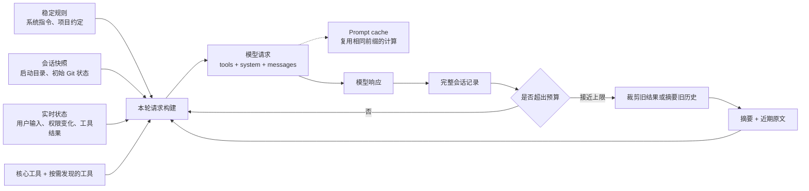

# 有限窗口中的 Agent：PI 与 Claude Code 的上下文机制

## 引言：上下文不是会话的原样回放

Agent 的上下文不能和会话记录画等号。会话记录可以完整保存在磁盘上，但模型每次调用只能接收一份有限的输入；这份输入还要同时容纳系统指令、项目规则、工具定义、用户消息、工具结果和历史进展。Agent 运行时间越长，两者的差别越明显：磁盘上的记录继续增长，真正送给模型的内容则必须经过选择、排列和压缩。

本文主要分析 [PI](https://github.com/earendil-works/pi/tree/46bb9a2c3bdb296b0d2179f7309ec6b79a7f3106) 固定 commit `46bb9a2c3bdb296b0d2179f7309ec6b79a7f3106`，以及 Claude Code commit `09f43552c76cb8856c4a5414f9aa9c9cda6ee035` 的本地源码快照。后者来自公开暴露的 source map 镜像，不是 Anthropic 官方源码仓库，因此本文只把快照中可以直接核对的实现当作证据。OpenAI 与 Anthropic 的当前官方文档用于补充源码之外的新 API 能力和通用做法。

### 四个容易混淆的对象

讨论这个问题时，有四个对象需要先分开。

- **完整会话记录**保存用户消息、模型响应、工具调用以及运行时事件，主要用于恢复、审计和重新构建状态。
- **本轮请求上下文**是当前这一次模型调用真正看到的内容。它来自完整记录，但不必包含完整记录。
- **Prompt caching（提示缓存）**复用相同提示前缀已经完成的计算，减少延迟和费用；被缓存的 token 仍然占据上下文窗口。
- **压缩摘要**替代一部分旧消息，使模型在更少的 token 中继续原任务。摘要是新的工作上下文，不是完整历史的替代存档。

### 一轮请求的主干

下面这张图只画一轮请求的主干。完整记录一直留在存储中；请求构建器从中选出历史，再与稳定规则、会话快照、实时状态和工具定义合并。空间不足时，旧历史先经过裁剪或摘要，输出变成“历史摘要 + 近期原文”，而不是删除磁盘上的完整记录。



## 第一部分　源码如何管理有限窗口

### 1. 请求上下文的组成

#### 请求在 API 中的形态

OpenAI 的 Chat Completions 用 `messages` 保存有序消息，用 `tools` 描述模型可以调用的工具。下面只展示与上下文有关的字段，不是完整请求。

```json
{
  "tools": [
    {
      "type": "function",
      "function": {
        "name": "read_file",
        "parameters": {
          "type": "object",
          "properties": { "path": { "type": "string" } },
          "required": ["path"]
        }
      }
    }
  ],
  "messages": [
    {
      "role": "system",
      "content": "You are a coding agent."
    },
    {
      "role": "user",
      "content": "<project_context>Only edit related files.</project_context>\n<environment>cwd=/workspace/repo</environment>\n检查 src/config.ts 的默认值。"
    },
    {
      "role": "assistant",
      "tool_calls": [
        {
          "id": "call_read_1",
          "type": "function",
          "function": {
            "name": "read_file",
            "arguments": "{\"path\":\"src/config.ts\"}"
          }
        }
      ]
    },
    {
      "role": "tool",
      "tool_call_id": "call_read_1",
      "content": "export const timeout = 30;"
    },
    {
      "role": "user",
      "content": "把默认值改成 60。"
    }
  ]
}
```

这段请求里，`tools` 只是能力定义；`assistant.tool_calls` 才是模型提出的调用；Agent 执行工具后，再用 `tool` 消息返回结果。`call_read_1` 把调用和结果连在一起。下一次调用模型时，Agent 会把这组消息作为历史重新发送，最后一条 `user` 才是当前要求。

| 协议位置 | 在 Agent 中常见的内容 |
|---|---|
| `system` / `developer` | Agent 行为、安全和长期规则 |
| `user` | 用户任务，以及 Agent 注入的项目说明和环境材料 |
| `assistant` | 模型此前生成的文本或工具调用 |
| `tool` | Agent 运行时执行工具后取得的结果 |
| `tools` | 模型当前可以调用的接口定义 |

角色只说明内容在协议中的位置，不保证它来自谁。示例第一条 `user` 同时包含项目说明、环境信息和用户任务，其中一部分由 Agent 注入；`assistant` 是模型的历史输出，不是 Agent 运行时的全部状态。`<project_context>` 等 XML 标签也只是文本分隔。CLAUDE.md、环境快照和历史摘要都不是 API 的专用字段。

#### Provider 差异由适配层处理

这种角色结构被许多 OpenAI-compatible 接口采用，但不是统一的 LLM 协议。OpenAI 仍支持 Chat Completions，同时[建议新项目使用 Responses API](https://developers.openai.com/api/docs/guides/migrate-to-responses)；Anthropic Messages 则使用顶层 `system`、assistant `tool_use` 和 user `tool_result`。这里选择 Chat Completions，只因为它能用较少字段把四种消息角色和工具配对放在一起。

PI 的适配层展示了内部状态怎样投影到不同协议。[`packages/ai/src/api/openai-completions.ts:convertMessages`](https://github.com/earendil-works/pi/blob/46bb9a2c3bdb296b0d2179f7309ec6b79a7f3106/packages/ai/src/api/openai-completions.ts) 会把同一个 `context.systemPrompt` 转成 `developer` 或 `system` 消息，把内部 assistant message 和 tool call 转成 `assistant.tool_calls`，再把 tool result 转成 `tool` 消息；Responses 适配器会把对应内容改写为 input message、`function_call` 和 `function_call_output`。随后再看 PI 与 Claude Code 如何生成这些内部内容。

#### PI 的系统提示组装

PI 把系统提示的组装集中在 [`packages/coding-agent/src/core/system-prompt.ts:buildSystemPrompt`](https://github.com/earendil-works/pi/blob/46bb9a2c3bdb296b0d2179f7309ec6b79a7f3106/packages/coding-agent/src/core/system-prompt.ts) 中。默认提示包含 Agent 身份、当前可用工具的简短说明、随工具变化的使用规则和 PI 文档入口，随后追加项目指令、Skill 说明以及当前工作目录。项目文件被放在 `<project_context>` 中，每个文件再用带路径的 `<project_instructions>` 包裹，以标明来源并减少不同文件混成一段文字后的歧义。

自定义 system prompt 的语义也很明确：它替换 PI 的默认提示，但不会吞掉追加提示、项目上下文和工作目录。Skill 只有在 `read` 工具可用时才加入提示，因为 Skill 内容通常需要模型继续读取文件；没有读取能力却告诉模型“这里有一组可读 Skill”，只会形成无法兑现的指令。

`packages/coding-agent/src/core/agent-session.ts:AgentSession._rebuildSystemPrompt` 再把这套构建函数接到运行时状态上。它从当前工具注册表收集有效工具、工具说明和使用规则，从资源加载器取得自定义提示、追加提示、Skill 与 AGENTS 文件，最后生成基础 system prompt。扩展还可以在 `before_agent_start` 阶段加入自定义消息，或只对当前运行临时覆盖 system prompt。一次运行结束后，这个覆盖会被清掉，不会无意间变成后续会话的永久规则。

#### Claude Code 的 system context 与 user context

Claude Code 的路径更分散，但层次相似。源码快照中的 `src/utils/queryContext.ts:fetchSystemPromptParts` 并行取得三组内容：默认 system prompt、user context 和 system context。`QueryEngine` 在此基础上处理自定义 system prompt、追加提示和 memory mechanics；进入 `query()` 后，`appendSystemContext` 把系统环境附到 system prompt 尾部，`prependUserContext` 则把 CLAUDE.md、日期等内容放进一条元信息用户消息（meta user message）的 `<system-reminder>` 中，再把真实会话接在后面。

这里有一个容易忽略的覆盖关系：设置 custom system prompt 时，Claude Code 跳过默认 system prompt 和默认 system context，但仍读取 user context；append system prompt 继续追加。其含义不是“system context 比 user context 更重要”，而是两者承担不同职责：前者是默认运行环境的一部分，既然默认提示被整体替换，就不再擅自附加；后者包含用户或项目提供的工作说明，即使调用方替换 Agent 身份，通常仍希望保留。

这些实现也说明，消息角色不能代替 Agent 自己管理内容来源和更新时间。项目说明与当前任务都可以出现在 user message 中，但前者可能在会话开始时读取，后者必须追加到会话尾部；工作目录和初始 Git 状态可以作为带时间的环境块，权限变化和新工具结果则要及时补入。把它们全部揉成一段大 system prompt，会同时掩盖来源、更新时机和缓存代价。

### 2. 静态信息、会话快照与实时状态

“动态信息是否每轮刷新”没有统一答案。刷新可以消除陈旧状态，也会带来 I/O、token 和缓存失效。合理的判断依据是：信息变化有多快，过期后会不会让 Agent 做错事，以及需要时能否低成本重新查询。

#### PI 的显式重载与逐轮刷新

PI 对项目资源采用显式刷新。`packages/coding-agent/src/core/agent-session.ts:AgentSession` 初始化时从 `ResourceLoader` 取得 AGENTS 文件、Skill、提示模板和扩展；只有调用 `reload()`，才重新加载设置与这些资源并重建运行时。它不会在每次工具调用后重新扫描所有项目说明。相对地，活动工具发生变化时，`setActiveToolsByName` 会立即更新 Agent 状态并重建基础 system prompt；`_installAgentNextTurnRefresh` 又在下一轮开始前把当时的 system prompt、工具列表、模型和 thinking level 写入请求快照。项目说明读取成本较高且通常稳定，工具和模型却可能由用户或扩展在会话中切换，二者因此采用不同频率。

#### Claude Code 的会话快照与动态尾部

Claude Code 的 `src/context.ts` 更直接地表达了“快照”语义。`getUserContext` 和 `getSystemContext` 都经过 memoize，在一次会话中复用结果。Git 状态最多保留 2,000 个字符，并明确告诉模型：这是会话开始时的状态，之后不会自动更新；需要最新状态时应重新运行 `git status`。CLAUDE.md、memory 文件和当前日期也通过 `getUserContext` 形成会话级内容。缓存可以被明确清除，例如 cache breaker 改变时会同时清空这两组 context cache。

到了模型请求层，Claude Code 又选择不同的时间尺度。新的用户轮次会用当前权限和 MCP（Model Context Protocol）连接状态重组工具池，并收集文件变化、相关记忆和附件；`queryLoop` 进入一次 Agent 运行后，则用 `buildQueryConfig()` 固定一组环境、实验开关和会话配置，避免同一轮的多次模型调用看到互相矛盾的配置。也就是说，“实时”通常指下一次可以安全作出决定的边界，并不意味着所有信息在流式响应中途都可以随意改变。

#### 刷新频率取决于过期风险

可以把常见信息放进下面三种处理方式中：

| 会话开始时记录 | 新一轮前更新 | 需要时再查询 |
|---|---|---|
| 项目说明文件、会话日期、初始工作目录、初始 Git 分支与状态 | 新用户消息、排队消息、当前权限、活动工具、MCP 连接变化、刚完成的工具结果、文件变化附件 | 文件全文、完整日志、最新 Git 状态、远程资源详情、低频专业知识 |
| 适合稳定导航信息；必须注明它只是快照 | 适合过期后会直接影响下一步行动的信息 | 适合体积大、读取贵或只有少数分支会使用的信息 |

这张表不是固定协议。例如，部署审批状态可能必须每次执行写操作前读取，不能只在“新一轮”刷新；一份数万 token 的项目规范即使很稳定，也未必应该在会话开始时全文装入。判断仍然回到三个具体问题：旧值会造成什么错误、重新读取多贵、它是否真的与当前任务有关。

#### 当前事实优先于历史摘要

还要区分“帮助模型理解过去”和“描述当前世界”。压缩摘要说“测试尚未通过”，只能证明压缩前的进度；如果最新工具结果显示测试已通过，应以后者为准。摘要说某文件包含一个函数，也不能覆盖磁盘上的新版本。更稳妥的关系是：摘要保存任务方向和已经形成的判断，外部系统和最新工具结果提供当前事实。两者冲突时，Agent 应重新读取并更新判断，而不是把历史摘要当数据库使用。

### 3. 预算先于压缩

#### 输入预算与 token 估算

上下文窗口的约束可以先写成一个简单关系：

```text
本轮输入 + 预期输出 + 安全余量 ≤ 模型上下文窗口
```

输入不仅包括聊天文字。system prompt、工具 schema、图像、模型推理块（thinking block）、工具结果和压缩摘要都会占空间。只统计 `messages` 字符数，通常会低估真实请求；把整个窗口都留给输入，则会让模型没有足够空间完成回答，甚至让压缩请求本身无法生成摘要。

PI 的默认 compaction 配置把 `reserveTokens` 设为 16,384，把 `keepRecentTokens` 设为 20,000。触发条件是：已用上下文 token 大于 `contextWindow - reserveTokens`。这两个数字是当前版本的默认值，不是适用于所有模型的比例。`reserveTokens` 同时给提示和模型输出留空间，`keepRecentTokens` 控制压缩时大约保留多少近期原文。模型窗口、最大输出和任务类型变化后，它们都应调整。

PI 的 token 估算也没有从头扫描所有文本后就结束。`packages/agent/src/harness/compaction/compaction.ts:estimateContextTokens` 优先找到最近一条具有有效服务商用量（provider usage）的 assistant message，以那次真实用量为基线，只对其后的新增消息采用约四字符一个 token 的估算。这样既利用 provider 已经计算的事实，又能把最近追加、尚未反映在 usage 中的内容算进去。如果整段历史没有 usage，才对全部消息估算。

Claude Code 将预留拆得更细。`getEffectiveContextWindowSize` 从模型窗口中减去最大输出预留，摘要输出最多按 20,000 token 预留；自动压缩阈值再提前 13,000 token。关闭自动压缩时，距离有效窗口 3,000 token 会进入 blocking limit，目的是仍给手动 `/compact` 留出机会。源码里的 20,000、13,000 和 3,000 同样是该快照的工程参数。它们更值得借鉴的地方是顺序：先承认输出和恢复也需要空间，再确定何时压缩，而不是等 provider 返回 413 或 prompt too long 才开始处理。

#### 工具定义的延迟加载

工具定义是另一项固定开销。给 Agent 注册一百个工具，即使一个都不调用，它们的名称、说明和参数 schema 仍可能进入每次请求。PI 的 AI 层已经支持延迟工具（deferred tools）：`packages/ai/src/utils/deferred-tools.ts:splitDeferredTools` 把需要延迟提供的定义与立即可见的工具分开，不同 provider 可以通过 additional tools、tool search 或 `tool_reference` 在会话后部加载它们。Claude Code 的策略更完整：内置基础工具保持可见，MCP 工具和标有 `shouldDefer` 的工具可以通过 `src/utils/toolSearch.ts:ToolSearchTool` 发现；其 `auto` 模式默认以工具定义是否达到模型窗口的 10% 为判断线，优先调用 token counting API，失败后才按 2.5 字符一个 token 估算。

这不等于“先预测本轮只会用五个工具，其余全部删除”。如果预测错了，模型连纠正选择的入口都没有。更可靠的结构是：文件读取、命令执行等高频基础工具常驻；保险、邮件、数据库等专业工具保留简短的命名空间说明，需要时再加载完整 schema。OpenAI 当前的 [Tool search](https://developers.openai.com/api/docs/guides/tools-tool-search) 也采用 `defer_loading`，并把新发现的工具加在上下文末尾；Anthropic 的 [Manage tool context](https://platform.claude.com/docs/en/agents-and-tools/tool-use/manage-tool-context) 则把工具搜索、programmatic tool calling、提示缓存和旧结果清理视为针对不同 token 来源的互补手段。

#### 工具结果的限长与外置

工具返回值比工具 schema 增长得更快。Claude Code 快照中的 `src/constants/toolLimits.ts` 定义了几层保护：常规工具结果的默认尺寸上限是 50,000 字符，超出时可以转存磁盘；系统还有约 100,000 token 的单结果上限。一次 user message 中多个并行 `tool_result` 合计的默认预算为 200,000 字符，相关功能开关（feature flag）开启后会优先转存最大的结果，直到回到预算以内。模型看到的是预览和文件路径，需要细节时可以再次读取。替换决策按 `tool_use_id` 保存并在后续轮次原样重放，避免同一旧结果今天是全文、下一轮忽然变成预览，进而破坏提示前缀。

因此，预算不是在窗口快满时按百分比瓜分剩余空间，而是一套进入顺序：先留输出和恢复空间，再放规则、任务与近期工作；工具按需加载，大结果外置；最后才让摘要承担旧历史。能在内容进入窗口前解决的问题，不应全部推给压缩。

### 4. Prompt caching 与稳定前缀

#### 精确前缀是缓存命中的前提

Agent loop 会在一次用户任务中多次调用模型。每次工具执行后，旧请求大部分保持不变，只在末尾增加 tool result；下一轮用户消息到来时也是如此。如果旧请求能成为新请求的精确前缀，provider 就有机会复用之前的计算。OpenAI 在 [Unrolling the Codex agent loop](https://openai.com/index/unrolling-the-codex-agent-loop/) 中把这种 append-only 形态作为核心性能设计，并特别提到工具顺序不稳定曾导致 MCP 场景的缓存 miss。

#### PI 与 Claude Code 的稳定前缀

PI 的 provider 适配层会按 API 能力设置缓存。以 `packages/ai/src/api/openai-completions.ts` 为例，兼容 Anthropic cache control 的 provider 会在 system prompt、最后一个工具和最后一条会话消息上设置断点；OpenAI 请求可以携带 `prompt_cache_key` 和 retention。`prompt_cache_key` 还被限制在 64 个字符内。PI 对摘要调用单独设置缓存行为；从请求形态看，摘要请求的提示和工具形态与下一轮正常请求不同，为它单独写入一份缓存通常难以获得后续复用。

Claude Code 把稳定前缀处理得更细。`src/constants/prompts.ts:SYSTEM_PROMPT_DYNAMIC_BOUNDARY` 将 system prompt 数组分成两段：前面是跨请求较稳定的基础身份、通用操作规则和表达规则，后面是会话工具指导、memory、环境信息、语言、输出风格和 MCP 指令等动态内容。`src/services/api/claude.ts:splitSysPromptPrefix` 根据这条边界生成不同 cache scope 的 block。工具池也先分别排序内置工具和 MCP 工具，再把内置工具保持为连续前缀；这样新增一个名称排序靠前的 MCP 工具，不会被插进内置工具中间并改变全部后续 key。

缓存参数本身也要稳定。Claude Code 会在会话第一次判断后锁定 1 小时 TTL 的用户资格和 allowlist，避免订阅额度等状态在会话中途翻转，把约 20K token 的前缀从 5 分钟 TTL 改成 1 小时 TTL。部分 beta header 采用“首次启用后保持开启”的方式，原因相同：header 变化也可能改变 provider 实际渲染的提示。`src/services/api/promptCacheBreakDetection.ts` 记录 system、tools、cache control、model、beta、effort 和额外请求参数的 hash；响应回来后，如果 cache read 相比上次下降超过 5% 且至少减少 2,000 token，才记录一次显著 cache break，并区分本地配置变化、5 分钟或 1 小时 TTL 到期以及可能的服务端驱逐。

#### 缓存失效应对应真实变化

官方 API 给出的原则与这些源码一致。OpenAI 的 [Prompt caching](https://developers.openai.com/api/docs/guides/prompt-caching) 明确要求静态指令、工具和 schema 位于前面，用户特定的变量内容位于后面。Anthropic 的 [Tool use with prompt caching](https://platform.claude.com/docs/en/agents-and-tools/tool-use/tool-use-with-prompt-caching) 说明缓存按 `tools → system → messages` 形成前缀层级：工具定义变化会让后面的 system 和 messages 缓存一起失效，而通过 tool search 发现的工具以 `tool_reference` 追加到历史中，不改动原有工具前缀。

所以“什么时候主动失效”不应通过定时插入随机字符串来回答。模型、行为规则、工具 schema、权限或输出配置真的变化时，新请求理应产生不同前缀；缓存达到 TTL 或被服务端驱逐后也会自然 miss。应用要做的是保持没有变化的部分逐字、逐序稳定，并观察 `cached_tokens`、cache read 和 cache creation，而不是为了“确保新鲜”让整段提示每轮变化。

#### 缓存不会释放上下文空间

最后仍要强调：缓存复用计算，不释放窗口。一个 150K-token 请求即使命中 140K token 的缓存，模型仍然在 150K-token 的上下文上工作。缓存解决延迟和价格，裁剪与摘要解决容量和注意力，两者不能互换。

### 5. 从裁剪到摘要

上下文变长以后，不必立刻把整段会话改写成一份摘要。较小的处理通常更便宜，也更少损失信息。

#### 先清理可以重新取得的旧结果

Claude Code 的 `src/services/compact/microCompact.ts:microCompact` 体现了这种顺序。它只处理一组可清理工具，例如 Read、Shell、Grep、Glob、WebSearch 和文件编辑工具；较旧的 `tool_result` 内容被替换成 `[Old tool result content cleared]`，工具调用本身仍在，因此模型知道曾经读过或执行过什么。时间触发版本会在服务端缓存很可能已经过期后清理旧结果，并默认保留最近五个可清理结果。另一路 cache editing 可以让服务端删除旧结果而不直接改写本地 message 内容，减少为了省窗口而破坏已缓存前缀的代价。

这种处理适用于“内容已经完成使命，而且能够重新取得”的结果。一次 `git diff`、文件全文或搜索列表可能在当时很重要，但任务推进后只需要结论和路径；用户需求、方案决策和未解决错误则不适合用同样方式清空。Anthropic 的 [Context editing](https://platform.claude.com/docs/en/build-with-claude/context-editing) 也把 tool result clearing 单独设计成一种策略，并提醒：清理会使修改点之后的缓存失效，因此一次应释放足够多的 token，避免为很小收益反复重写缓存。

#### PI：旧摘要与近期原文共同更新

当旧工具结果已经不足以释放空间，才需要摘要历史。PI 的 [`packages/agent/src/harness/compaction/compaction.ts:shouldCompact`](https://github.com/earendil-works/pi/blob/46bb9a2c3bdb296b0d2179f7309ec6b79a7f3106/packages/agent/src/harness/compaction/compaction.ts) 在上下文超过预留线后触发。`findCutPoint` 从后向前累计近期消息，达到 `keepRecentTokens` 后寻找合法切点。较早内容交给摘要模型，较新的保留尾部（`retainedTail`）原样留下。`buildSessionContext` 在后续调用中只投影“最近一次压缩摘要 + 保留尾部 + 压缩后新增消息”，完整会话条目仍留在存储中。

如果会话已经压缩过，PI 不会只摘要上次之后的内容然后遗忘更早历史。`prepareCompaction` 取出 `previousSummary`，把上次保留的 tail 与后来消息重新纳入可压缩范围；生成摘要时使用 update prompt，把旧摘要和新进展合并。新的 summary 不是摘要的摘要孤立重写，而是一次带着旧检查点的增量更新。

#### Claude Code：重建上下文并恢复运行状态

Claude Code 的完整压缩（full compact）路径更重。`src/services/compact/compact.ts:compactConversation` 先生成详细 summary，然后清空需要重新建立的文件读取状态，再通过统一的组装函数按固定顺序放入 compact boundary、summary message、附件和 hook 结果。这个函数允许插入“需要保留的原消息”，但 full compact 通常不使用这一项；部分压缩（partial compact）才会把未被摘要的一侧原文填入。完整压缩后，系统最多恢复五个近期文件，单文件最多 5,000 token、文件总预算 50,000 token；已调用 Skill 另有单项和总量限制。当前 plan、plan mode、异步 Agent 状态、延迟工具变化和 MCP 指令也可以重新挂载。

压缩边界还保存压缩前已经发现的 deferred tool 名称。原因很具体：ToolSearchTool 返回的 `tool_reference` 原本存在于旧消息中，历史被摘要后这些 block 会消失；如果只依赖 summary 用自然语言记住工具，API 层并不知道哪些 schema 应继续发送。Claude Code 因此把工具名写进 `compactMetadata.preCompactDiscoveredTools`，后续扫描同时读取消息中的 `tool_reference` 和边界 metadata。

Claude Code 还支持 partial compact。`from` 摘要选择点之后的尾部、保留更早前缀，因此保留部分仍能命中原缓存；`up_to` 摘要选择点之前的前缀、保留更新的尾部，summary 会插到保留消息之前，原缓存因此失效。这个差别说明，压缩位置不仅影响语义，还影响请求前缀是否继续相同。

#### 处理方式的损失逐步增加

可以把这些处理放在一张表里比较：

| 处理方式 | 移除或改写什么 | 恢复能力 | 适用时机 |
|---|---|---|---|
| 限制工具和结果进入 | 未使用的 schema、超大结果全文 | 工具可再次发现，结果可从文件读取 | 从第一轮就启用 |
| 清理旧工具结果 | 旧 `tool_result` 的正文 | 保留调用记录，可重新执行或读取 | 工具密集、任务方向仍清楚时 |
| 摘要旧历史并保留近期原文 | 较早对话、推理和结果细节 | 依靠摘要、完整 transcript 和外部文件 | 接近预留阈值时 |
| 重建压缩检查点 | 大部分当前请求视图 | 依靠 summary、metadata 和重新挂载的附件 | 多轮长任务或再次接近上限时 |
| 溢出后的丢弃与重试 | 最旧的完整消息组 | 有损，只能回查 transcript | 常规压缩请求本身也无法执行时 |

#### Provider 原生压缩的边界

最新 API 正在把最后两类能力下沉到 provider。OpenAI 的 [Compaction](https://developers.openai.com/api/docs/guides/compaction) 可以通过 `compact_threshold` 自动触发，也提供无状态 `/responses/compact`，返回包含 opaque compaction item 的新上下文；官方要求把该返回整体作为下一轮的标准输入，不再自行裁剪。Anthropic 的 [server-side compaction](https://platform.claude.com/docs/en/build-with-claude/compaction) 会在达到输入阈值时生成 `compaction` block，后续自动忽略它之前的旧消息。对于新系统，provider 原生压缩通常比自行维护摘要协议简单；但本地仍需要保留完整 transcript、当前文件状态和业务侧的恢复信息，因为 provider 的压缩块只负责模型上下文，不会替应用保存全部运行事实。

### 6. 摘要中的任务状态

#### 摘要保存的是任务状态

压缩摘要不是会议纪要。会议纪要可以按时间复述发生过什么；Agent 摘要必须让另一个模型在没有旧消息正文的情况下继续工作。因此，筛选标准不是“这件事是否出现过”，而是“缺少它以后，下一步会不会走错”。

PI 把摘要格式写进固定 prompt，包含 Goal、Constraints & Preferences、Progress、Key Decisions、Next Steps 和 Critical Context。Progress 又区分 Done、In Progress 和 Blocked；更新摘要时明确要求保留旧目标、约束、已完成工作和决策，同时用新消息更新进度。提示还要求保存准确的文件路径、函数名和错误信息。Claude Code 的 compact prompt 使用另一套结构，但关注点相近：Primary Request and Intent、技术概念、文件与代码、错误及修复、问题处理、全部用户消息、待办、当前工作和直接相关的下一步。它要求特别关注用户纠正，生成时可以先写 `<analysis>` 草稿，最终进入上下文前再删除这段草稿，只保留 `<summary>`。

两套格式共同保留的内容，可以按它防止的错误来理解：

| 必须保留的内容 | 缺失后容易发生什么 |
|---|---|
| 最初目标与后来确认的意图 | Agent 完成局部工作后误以为整个任务结束 |
| 用户约束和表达偏好 | 方案技术上可行，却违反不能改文件、兼容版本或输出格式要求 |
| 已完成、进行中、阻塞的工作 | 重复执行已有步骤，或把未验证结果写成完成 |
| 关键选择及理由 | 后续模型推翻已确认方案，或者条件变化后仍机械坚持旧结论 |
| 当前修改对象和下一步 | 压缩后重新探索，无法从断点继续 |
| 文件、函数、命令和外部标识 | 找不到具体落点，只剩抽象描述 |
| 错误、失败方法及原因 | 再次走同一条失败路径，甚至重复有副作用的操作 |
| 用户纠正与否决 | 摘要保留了 Agent 的旧理解，却丢掉用户最新意图 |

#### 关键选择要连同理由保留

“关键选择”必须带理由。例如，只写“使用会话快照”不够；还要说明被快照的信息变化慢、读取成本高，且正文已提示必要时重新查询。以后若它变成会影响支付或权限的实时状态，新的 Agent 才知道原选择的成立条件已经消失。失败历史也不宜写成完整调试日志，但至少要留下尝试、结果和不能重试的原因。

#### 确定事实交给结构化 metadata

自然语言摘要并不适合保存所有事实。PI 会从工具消息中确定性地提取 read files 和 modified files，再把列表附到 summary；Claude Code 把已发现工具写进 compact boundary，并重新挂载文件、plan 和 Skill。它们都没有要求摘要模型凭记忆猜出全部运行状态。可以由程序精确记录的内容——文件变更集合、工具调用 ID、权限、任务状态、外部资源 ID——应该放进结构化 metadata；摘要负责解释目标、判断和因果关系。

#### 旧摘要参与下一次摘要

多轮压缩后的连续性也不能只靠一句“请不要忘记”。PI 把 `previousSummary` 作为明确输入，Claude Code 的下一次 full compact 会看到上一次 summary 所在的当前请求视图；两者都保留近期原文，并在压缩边界之外保存完整 transcript。更稳妥的自研实现还应在压缩完成后做最小校验：原始目标是否仍出现，硬约束是否齐全，当前工作对象和下一步是否明确，未解决错误是否被误写成完成。摘要可以由模型生成，检查项不必也完全交给同一个模型自由判断。

### 7. 边界、异常与恢复

#### 工具调用与结果必须成对保留

摘要决定保留哪些语义，切分位置决定压缩后的消息序列是否仍合法。第 1 节示例中的 `assistant.tool_calls` 必须与后续具有相同 `tool_call_id` 的 `tool` 消息配对；Anthropic 的 `tool_use` 和 `tool_result` 也有同样要求。只保留结果会让模型不知道它属于什么调用，只保留调用则会让 API 认为工具尚未返回，甚至直接拒绝请求。

#### PI 与 Claude Code 的合法切分点

PI 的 `findValidCutPoints` 允许从 user、assistant、custom、bash execution 和摘要消息开始保留，但不允许把 `toolResult` 作为切点。它优先寻找 user message；如果为了保留约定的近期 token 必须切进同一个用户轮次，`findTurnStartIndex` 会找到这轮开头，把“轮次前半段”单独总结成 Original Request、Early Progress 和 Context for Suffix，再保留较新的后半段。这样既没有强迫一个特别长的 Agent turn 整体常驻，也不让保留的 suffix 失去开头请求。

Claude Code 的 `src/services/compact/grouping.ts:groupMessagesByApiRound` 采用更细的边界：新的 assistant response ID 表示一次新的 API 调用轮次（API round），流式产生但 ID 相同的 assistant block，以及穿插其间的工具结果，都留在同一组中。正常 API 协议要求进入下一个 assistant response 前解决上一轮的工具调用，因此这个边界天然保持配对；恢复旧的完整会话记录（transcript）时若存在悬空调用，API normalization 还会补齐或清理异常 pair。

#### 单轮和摘要请求过长时的退让顺序

单轮特别长时，处理顺序仍应从损失最小的地方开始。单个日志或文件读取过大，先落盘并只发送预览；多个并行结果合计过大，先移走最大的结果；旧工具结果已经使用完，替换为清理标记。只有当前轮的早期工作本身占满窗口，才摘要轮次前缀并保留最近 suffix。

还有一种更极端的情况：用于生成摘要的请求自己就超过窗口。Claude Code 的 `src/services/compact/compact.ts:truncateHeadForPTLRetry` 会按 API round 分组，从最旧组开始累计移除，优先覆盖 provider 返回的 token gap；解析不到差额时，每次丢弃约 20% 的组，但至少保留一组可供摘要。如果移除后序列以 assistant 开头，就补一条元信息用户标记使请求合法。

#### 溢出恢复必须限制重试

该路径最多尝试三次，是源码明确标注的有损（lossy）最后手段。

PI 的溢出恢复同样设置了上限。`AgentSession._checkCompaction` 区分接近阈值与真实 overflow：前者压缩后等待用户继续，不自动重放已经成功的回答；后者先从活动上下文移除失败或被截断的 assistant response，压缩后只自动重试一次。压缩前的失败消息仍保存在 session history，但不会重新进入本轮活动上下文。`_overflowRecoveryAttempted` 防止 compact-and-retry 无限循环，旧压缩边界之前的 usage 也不会再次触发压缩。

这些异常路径说明，完整 transcript 和活动上下文必须分开维护。活动上下文为了继续运行可以有损，完整记录则保留被移除的响应和旧材料，供人工审计或必要时回查。若压缩操作同时物理删除唯一的历史副本，一次摘要遗漏就会变成不可恢复的数据丢失。

## 第二部分　面试表达

### 8. 完整回答

面试中可以这样回答：

> 我理解 Agent 的上下文不是把聊天记录直接拼起来，而是每次调用模型前构建一份请求。里面通常有稳定的系统规则和项目约定、会话开始时取得的环境快照、本轮最新的用户消息和工具结果、工具 schema，以及从历史中选出的摘要和近期原文。在 wire 层，它们最终映射为 provider 支持的请求字段；工具 schema、模型发出的 tool call 和运行时返回的 tool result 是三个不同部分。完整会话应该另外持久化，模型当前看到的只是它的一个受预算约束的版本。
>
> 这些内容不会采用同一种刷新频率。像基础行为规则、AGENTS.md 或 CLAUDE.md，通常在会话开始时读取，或者在显式 reload 后更新；初始 Git 状态也可以做快照，但必须告诉模型它不是实时状态。权限、活动工具、文件变化和工具返回会影响下一步是否正确，应该在新的安全决策点刷新。文件全文和完整日志体积大而且可以重读，更适合按需获取。
>
> token 预算上，我会先从 context window 中扣掉最大输出和异常恢复需要的空间，再安排系统规则、当前任务和最近几轮原文。工具不能全部无条件常驻：基础工具一直提供，低频工具通过 tool search 或命名空间按需加载。大的工具结果优先落盘，只给模型预览、结论和重新读取路径。PI 用 `reserveTokens` 和 `keepRecentTokens` 控制压缩线与近期原文；Claude Code 还对延迟工具和单次工具结果设置了多层限制。
>
> Prompt caching 和压缩要分开理解。缓存要求旧请求成为新请求的精确前缀，所以稳定指令和固定顺序的工具放在前面，环境变化追加在后面。它减少重复计算的延迟和费用，但这些 token 仍在窗口里。压缩才是真正把活动上下文变短，所以不能因为 cache hit 很高就不做上下文治理。
>
> 当上下文继续增长时，我不会直接做一次全量摘要。先限制新工具和大结果，再清理已经用完、可以重新取得的旧 tool result；仍然接近阈值时，摘要较早历史并保留最近原文。摘要至少保留目标、约束、进度、关键选择及理由、下一步、关键文件和错误、失败历史以及用户纠正。文件变更集合、工具 ID 这类确定事实由程序单独保存，不全靠模型概括。
>
> 多轮压缩时，用上一版摘要和新增消息更新下一版，并保留近期原文和完整 transcript。切分必须落在完整消息或 API round 边界，不能拆开 tool call 与 tool result。单个结果过大先外置；压缩请求本身也超长时，才按完整消息组丢弃最旧内容并有限重试。PI 和 Claude Code 的实现细节不同，但共同点都是：先控制进入窗口的内容，再逐步增加压缩强度，同时把可恢复的完整状态留在窗口之外。

这段回答的重点不是背出具体阈值，而是把五个关系说清楚：请求上下文与完整记录、快照与实时状态、工具裁剪与可发现性、缓存与容量、摘要语义与消息结构。

### 9. 追问与展开

#### 上下文组织

**system prompt、项目说明和环境信息为什么不全部放在一起？**

因为它们的职责和变化频率不同。system prompt 负责持续约束行为，适合稳定；项目说明来自文件，需要保留来源并支持 reload；环境信息里既有启动快照，也有随时可能变化的权限和文件状态。如果全部拼进同一段，任何环境变化都会改写大前缀，既破坏缓存，也让模型难以判断哪部分是长期规则、哪部分只是当时状态。

拆分不一定意味着都使用不同 role。也可以在同一 system prompt 内划出稳定区和动态区，或者把项目说明放进带来源标签的 meta message。关键是来源、更新时间和覆盖关系必须明确。

**会话快照过期后如何处理？**

先看旧值会不会影响当前操作。初始 Git 状态只用于帮助模型了解仓库，可以明确标成 snapshot，需要时重新执行 `git status`；支付状态、审批结果和写权限则不能依赖旧快照，执行动作前必须实时查询。快照不是缓存一切，而是承认某些定位信息不值得每轮重读。

**历史摘要与当前文件冲突时以什么为准？**

以当前文件、数据库或最新工具结果为准。摘要说明的是“之前知道什么、做过什么、为什么这样做”，不应覆盖外部系统的当前事实。检测到冲突后，应更新任务判断，并让下一次摘要记录这次变化。

#### 成本与容量

**工具是否越少越好？**

不是。工具过多会增加 schema token，也会让模型选择困难；工具过少又可能让任务无解。更好的目标是保持一个小而稳定的基础集合，同时提供发现低频工具的入口。工具搜索的价值就在于减少预加载，而不是永久隐藏能力。还要观察真实指标：工具 schema 占用、搜索额外轮次、选错工具率和任务成功率。

**token 预算如何预留？**

先确定模型窗口和最大输出，再留一段恢复余量；剩下的输入预算按“不可缺少且不可重建”到“可按需重取”排序。系统规则、当前目标和近期工作优先；旧文件全文、日志和工具结果靠后。阈值要用实际 usage 校准，不直接照搬 PI 的 16,384 或 Claude Code 的 13,000。

**缓存命中后为什么仍可能超出窗口？**

因为 prompt cache 缓存的是计算结果，不是把 token 从请求中删除。150K token 的输入命中缓存后，计费和首 token 延迟可能下降，但模型仍要在这 150K token 上继续生成，也仍受 context window 限制。

**什么时候应该主动让缓存失效？**

当继续使用旧前缀会表达错误语义时，例如模型、系统规则、工具 schema 或权限配置真的改变。不要为了刷新日期或制造唯一请求而在稳定前缀里加入随机值。可变信息追加在后面，并通过 cache read、cache creation 或 cached tokens 验证是否真的命中。

#### 压缩可靠性

**如何避免多轮摘要后目标漂移？**

把目标、硬约束和用户纠正写成摘要的固定字段；下一次摘要同时输入旧摘要和新消息；保留最近原文；压缩后检查目标、待办、当前工作对象和阻塞项是否仍存在。确定性的文件列表和工具状态用 metadata 传递。完整 transcript 继续保存，以便摘要遗漏时回查。

**为什么工具调用和结果不能拆开？**

多数工具协议通过 `tool_use_id` 配对。模型先产生调用，应用再以对应 ID 返回结果。切分后如果只剩一边，请求在语义上不完整，provider 也可能直接报错。因此压缩应按完整 API round 分组，或选择不会让 `tool_result` 脱离调用的切点。

**单轮内容已经超出窗口怎么办？**

先判断大头是什么。单个工具结果过大就外置并给预览；多个并行结果过大就逐个转存；旧结果可重新取得就清理正文。如果是一个长 Agent turn 的早期工作占满空间，可以摘要这一轮前缀，保留最近仍在执行的 suffix。只有摘要请求本身也无法运行时，才丢弃最旧的完整 API round，并限制重试次数。

**为什么摘要里要保留失败历史？**

因为“没成功”本身不足以指导下一步。需要知道尝试过什么、为什么失败、是否产生副作用，以及什么条件变化后才值得重试。否则压缩后的模型很容易再次执行相同命令、重复发送请求，或者重新提出用户已经否决的方案。

**如何评估压缩前后的任务连续性？**

不能只评价摘要是否通顺。更有效的测试是保存一组长任务，在同一断点分别用原历史和压缩上下文继续，比较：是否还能复述目标和硬约束，能否找到当前文件与下一步，是否重复已完成工作，是否重试已知失败路径，最终任务成功率和额外工具调用数是否恶化。线上还应记录压缩前后 token、再次触发压缩的间隔、回查 transcript 的次数和用户纠正率。

**更大的 context window 能彻底解决问题吗？**

不能。更大窗口会推迟硬上限，却不会自动减少工具 schema、重复结果和无关历史；输入成本和延迟仍然存在，长上下文中的有效信息也可能更难被利用。窗口扩大后，预算阈值可以后移，但稳定前缀、按需工具、结果外置、历史摘要和完整记录分离仍然有价值。

## 结语：上下文管理的核心取舍

PI 展示了一条清楚的基础路径：根据当前资源和工具构建提示，在下一轮刷新运行配置，达到阈值后以摘要替换旧历史，同时保留近期原文和完整 session。Claude Code 快照进一步展示了更细的生产处理：会话快照与逐轮变化分离、工具延迟发现、结果外置、稳定缓存前缀、旧工具结果清理，以及压缩后重新挂载文件和运行状态。

这些实现没有试图让模型永远看到全部历史。必须持续保留的是任务目标、用户约束、关键选择和当前进度；容易变化的事实要刷新或重新查询；体积大且可重新获得的材料应尽早移出；已经结束的过程可以摘要，但失败原因和用户纠正不能一起抹掉。上下文窗口是有限的，可靠性来自有依据地取舍，而不是单纯把窗口塞满。

## 参考资料

### 源码

- [PI 固定源码版本 `46bb9a2c`](https://github.com/earendil-works/pi/tree/46bb9a2c3bdb296b0d2179f7309ec6b79a7f3106)
- Claude Code 本地源码快照 commit `09f43552c76cb8856c4a5414f9aa9c9cda6ee035`（非官方源码；相关相对路径与关键符号已在正文首次讨论处标明）

### 官方文档

- [OpenAI：Unrolling the Codex agent loop](https://openai.com/index/unrolling-the-codex-agent-loop/)
- [OpenAI：Function calling](https://developers.openai.com/api/docs/guides/function-calling)
- [OpenAI：Migrate to the Responses API](https://developers.openai.com/api/docs/guides/migrate-to-responses)
- [OpenAI：Prompt caching](https://developers.openai.com/api/docs/guides/prompt-caching)
- [OpenAI：Tool search](https://developers.openai.com/api/docs/guides/tools-tool-search)
- [OpenAI：Compaction](https://developers.openai.com/api/docs/guides/compaction)
- [Anthropic：Manage tool context](https://platform.claude.com/docs/en/agents-and-tools/tool-use/manage-tool-context)
- [Anthropic：Prompt caching](https://platform.claude.com/docs/en/build-with-claude/prompt-caching)
- [Anthropic：Context editing](https://platform.claude.com/docs/en/build-with-claude/context-editing)
- [Anthropic：Compaction](https://platform.claude.com/docs/en/build-with-claude/compaction)
