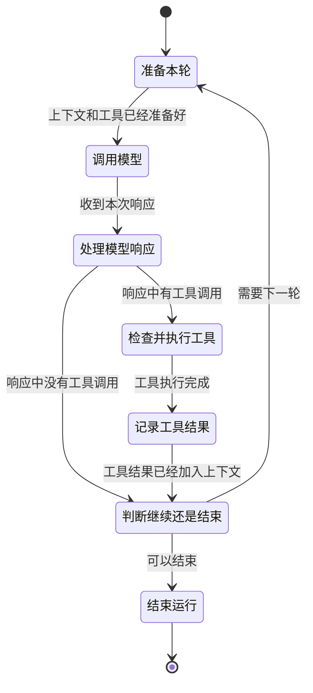

# 别把停止交给模型：从 PI 与 Claude Code 源码拆解 Agent 核心执行循环

假设一个 Coding Agent 正在修改代码。

模型先输出了半句解释，紧接着生成一个“执行数据库迁移”的工具调用。参数刚传到一半，网络断了。UI 上已经显示了一段文字，工具进程也许已经启动，但服务端没有返回完整的结束事件。系统准备切到备用模型重试——这时真正棘手的问题不是“再调用一次模型”这么简单，而是：刚才那次调用究竟算不算数？迁移是否已经执行？残缺参数能不能用？旧模型产生的工具调用 ID 能否交给新模型继续？用户此时按下中断键，又该由谁收尾？

这正是 **Agent loop（智能体执行循环）** 与普通聊天请求的区别。Agent loop 是一段反复调用模型、执行工具并把结果送回模型的控制程序；遇到网络中断或半条工具调用时，它还要判断工具是否已经执行、能否重试，以及是否应该停止。所谓 **副作用（side effect）**，指调用结束后会改变外部状态的操作，例如写文件、发邮件、扣款或执行数据库迁移。文本生成失败可以重来，副作用执行两次却可能造成真实损失。

本文分为两部分。第一部分沿着“最小循环—真实故障—生产级实现—可以直接实现的设计”的顺序，阅读 PI 与 Claude Code 的源码；第二部分把主要结论整理成一套适合面试口述的分析式回答。

> **本文使用哪些源码，哪些结论是推断**
>
> - PI 使用 `earendil-works/pi` commit `46bb9a2c3bdb296b0d2179f7309ec6b79a7f3106`。
> - Claude Code 使用本地保存的**非官方公开源码快照**，标注 commit `09f43552c76cb8856c4a5414f9aa9c9cda6ee035`。它不是 Anthropic 官方源码仓库，本文只把快照中可直接核对的代码当作实现证据。
> - 文中会明确区分“源码事实”“基于源码的工程推断”和“推荐设计”，不把后两者伪装成项目现状。

---

# 第一部分：源码如何实现，以及为什么这样实现

## 1. 先把四个容易混淆的层次分开

在读循环以前，先约定四个概念。它们日常都可能被含糊地叫作“一轮”，但在设计重试和预算时必须分开：

- **Run（一次运行）**：从用户提交任务到 Agent 最终结束的全过程。
- **Turn（交互轮次）**：一次模型响应，加上该响应触发的一批工具执行和工具结果。PI 的事件注释就是这样定义 turn 的。
- **Model attempt（模型请求尝试）**：为了拿到这一次模型响应而发出的一次网络请求。限流重试、流式转非流式，都可能让一个 turn 包含多个 attempt。
- **Tool batch（工具批次）**：同一条模型响应里出现的一组工具调用。它们可能串行，也可能在确认安全后并行。

这个区分看似只是命名，实际上决定了“重试谁”。网络超时通常只重试 model attempt；模型输出被截断，可能要重做一个 turn；已经执行过的付款工具，则不能因为 turn 重试而再付一次。

一个最小循环大致只有下面这些步骤：

```text
state = initial_state

while true:
    enforce_hard_limits(state)
    response = call_model(build_context(state))
    settled = finalize_response(response)

    if settled.failed_or_aborted:
        return terminal(settled.reason)

    calls = collect_complete_tool_calls(settled)
    if calls is not empty:
        results = validate_and_execute(calls)
        state.append(settled, results)
        continue

    if host_requires_continuation(state, settled):
        state.append_continuation_message()
        continue

    return terminal("completed")
```

真正的系统不过是在这副骨架上回答更多问题：`response` 还在流式传输时算不算状态？多个工具如何并发？模型说结束就结束吗？预算在哪一行检查？网络中断后，前一个 attempt 的半成品如何清理？

这些问题适合用 **状态机（state machine）** 建模。状态机是把“系统现在处于哪个阶段、这一阶段可以处理什么、处理后会进入哪个阶段”写成有限且可检查的规则。例如，只有“调用模型”结束后才能“处理模型响应”，不能拿尚未收完的参数直接执行工具。这里不要求引入专门的状态机框架，普通的类型、分支和循环也能实现。

先不展开网络重试、输出截断和中断恢复，只看一个简化但完整的 Agent loop：



一次循环从准备上下文开始。运行时把已有消息、系统提示和当前可用工具整理好，然后调用模型。模型返回后，运行时读取响应内容，先看其中有没有工具调用。这一步不能只看模型给出的停止原因，因为真正决定下一步的是响应里实际出现了什么。

如果响应中有工具调用，运行时就检查参数和权限，执行工具，再把结果加入上下文。这里的结果不只包括成功值，也包括工具报错、参数不合法或调用被拒绝。模型必须在下一轮看到这些结果，才能继续判断任务是否完成，所以工具调用不是循环的终点，而是连接前后两个 turn 的中间步骤。

如果响应中没有工具调用，或者工具结果已经记录完成，运行时就判断是否还需要下一轮。需要继续时，系统带着更新后的上下文重新调用模型；不需要继续时，整个 run 结束。这个判断由运行时负责，模型的停止原因只是其中一个输入；上层应用新加入的消息、步数或预算限制也会改变结果。

因此，一个 Agent loop 的核心可以归纳为五步：准备上下文、调用模型、处理响应、执行并记录工具结果、判断是否继续。图中所谓“完整”，指这组步骤能够从开始走到结束，也能够在工具结果返回后进入下一轮。网络重试、输出截断、切换备用方案和用户中断会改变其中某些步骤的处理方式，后文再分别展开。

## 2. PI：先看一套足够小、又真实可用的核心实现

PI 的 [`packages/agent/src/agent-loop.ts`](../related-repos/pi/packages/agent/src/agent-loop.ts) 很适合用来理解基本循环。核心入口是 `runLoop`，模型流式处理集中在 `streamAssistantResponse`，工具处理则拆成 prepare、execute、finalize 三段。

### 2.1 一次 turn 到底发生了什么

`runLoop` 有内外两层循环：

1. 内层循环逐条处理等待插入的 steering message，调用模型，执行这次响应中的工具，再判断要不要进入下一轮。
2. 当模型原本准备结束时，外层循环再查看 follow-up 队列；若有新消息，就重新进入内层。

这里的 **steering message（转向消息）** 是运行过程中插入、用于改变当前方向的消息，例如用户在 Agent 工作时补一句“先别改配置”；follow-up 则是在 Agent 本来准备结束后才接续的新消息。这两个队列解释了一个容易被忽略的事实：模型认为自己答完了，不代表运行 Agent 的上层应用没有新工作。

PI 每个 turn 的主要顺序是：

```text
插入 pending message
→ streamAssistantResponse
→ 从最终消息中筛出 toolCall
→ 工具调用检查和执行
→ 把 toolResult 写回上下文
→ turn_end
→ prepareNextTurn / shouldStopAfterTurn
→ 拉取下一批 steering message
```

这不是凭注释推测，而是 `runLoop` 的直接控制流程。相应的生命周期会发出 `turn_start`、`message_start/update/end`、`tool_execution_start/update/end`、`turn_end` 和 `agent_end` 等事件。UI、日志和上层应用可以用这些事件显示进度或保存记录，但写回上下文的消息顺序不会因此改变。

### 2.2 流式片段不是最终事实

模型通常不是一次性返回完整响应，而是不断发来 text delta、thinking delta 和 tool-call delta。所谓 **delta（增量）**，就是“相对于上一时刻新增的那一小段内容”。

在 `streamAssistantResponse` 中，PI 收到 `start` 后，会把 partial message 临时放进上下文；收到各种 delta 后，用新 partial 替换最后一条；只有收到 `done` 或 `error`，才调用 `response.result()` 取得最终消息并覆盖临时值。

因此需要区分两类内容：

- 流式 partial 只供 UI 显示当前进度；
- final message 是 **canonical state**，也就是系统最终采用的那份完整消息。后续工具执行和持久化都以它为准。

这么做的理由很现实：工具参数在流式阶段可能只是 `{"path":"/tmp`，甚至尚未形成合法 JSON。把 partial 当成可执行命令，会让网络分包方式决定业务行为。

PI 的 [`packages/agent/README.md`](../related-repos/pi/packages/agent/README.md) 还特意提醒：低层 `agentLoop()` 发出的事件是 observational，也就是只用来观察进度；它不会等异步事件监听器全部处理完再继续。如果上层应用要求“消息监听处理完成后才能检查工具调用”，应使用更高层的 `Agent` 来保证这个先后顺序。监听器收到了事件，并不等于循环已经完成这一步。

### 2.3 决定继续的是实际工具调用，不是一个标签

PI 的 `AssistantMessage` 带有 `stopReason`，可取 `stop`、`length`、`toolUse`、`error`、`aborted` 等值。这里的 **provider（模型服务提供方）** 是实际接收请求并返回模型响应的 API 服务，例如 Anthropic API；运行时通常还会在它前面放一层 adapter（适配层），把不同服务返回的事件和错误转成 loop 能统一处理的格式。**Stop reason（停止原因）**是 provider 用来说明“这次生成为什么停止”的字段，例如自然结束、达到输出上限或准备使用工具。它很有用，但不能单独决定整个 Agent 是否结束。

`runLoop` 只把 `error` 和 `aborted` 直接视为终止错误。对于工具，它没有写成：

```text
if stopReason == "toolUse": execute tools
```

而是直接从 `message.content` 中筛出所有 `toolCall`。只要实际存在调用，就进入工具阶段；没有调用，循环才可能自然停下。也就是说，`stopReason` 说明 provider 为什么停止本次生成，响应中真实存在的 `toolCall` 才决定运行时是否执行工具。

Claude Code 在 [`src/query.ts`](../related-repos/claude-code/src/query.ts) 中把这个判断写得更直白：注释明确说 `stop_reason === 'tool_use'` 并不总是可靠，所以循环在流式过程中只要观察到真实 `tool_use` block，就设置 `needsFollowUp=true`；最终根据实际出现的 `tool_use` 决定是否继续。

这回答了“模型返回的停止信号可信吗”：

> 可以相信它描述了一次 provider 响应，但不能把它当成整个 Agent run 的最终决定。运行时还要检查响应中是否真的有工具调用、上层应用是否还有待处理消息、最终输出是否符合指定格式和业务要求，以及步数、token 和成本是否已经达到限制。

### 2.4 工具执行不是一个 `execute(args)` 就结束了

PI 把工具调用分成三个阶段，很值得借鉴：

1. **Prepare**：按名称找到工具，必要时整理参数，依据 schema 校验，再执行 `beforeToolCall` 权限或策略钩子。这里的 **schema（结构约束）** 描述参数允许有哪些字段、字段类型是什么、哪些字段必填；例如文件读取工具可以规定 `path` 必须是字符串，而且不能为空。
2. **Execute**：真正调用工具；工具可以持续上报进度。发生异常时，PI 会生成错误结果，保证原来的 `toolCall` 仍有对应的 `toolResult`。
3. **Finalize**：运行 `afterToolCall`，允许上层应用调整内容、错误标记、usage 或终止提示，最后生成 `toolResult` 消息。

这里的 **hook（钩子）** 是上层应用在固定处理步骤上提供的回调，例如在工具执行前检查权限、执行后删除敏感信息。它由程序执行，不是让模型自由发挥的提示词。

PI 支持串行和并行两种工具执行。如果配置要求串行，或者批次中任何一个工具声明 `executionMode="sequential"`，整批就串行；否则先检查所有调用，再用 `Promise.all` 并发执行。即使并行完成顺序不同，结果仍按原工具调用顺序回填，从而保持稳定的消息顺序。

工具还可以在结果中设置 `terminate=true`，表示“这个工具的结果本身就是终点，不必再花一轮让模型复述”。但 PI 的 `shouldTerminateToolBatch` 要求**批次中每一个结果都同意终止**。如果两个并行调用中，一个是“提交最终答案”，另一个仍需要模型解释错误，仅凭前者就结束会丢失后续工作。因此，只有整批结果都表示不需要下一轮时，PI 才结束。

### 2.5 低层 loop 故意不包办所有规则

PI 提供 `prepareNextTurn`，允许上层应用在一个 turn 结束后替换上下文、模型或 reasoning level（模型的推理强度）；又提供 `shouldStopAfterTurn`，让上层应用在工具全部结束、`turn_end` 已经发出之后增加停止条件。

它没有在最小 loop 里硬编码统一的步数、token 或美成本限制。低层 loop 负责正确保存模型消息，并保证每个工具调用都有结果；运行 Agent 的上层应用负责产品侧的步数和预算规则。PI 更高层的 **durable harness（可恢复运行层）** 包在低层 loop 外，负责保存执行进度、设置 retry policy，并在进程中断后从已保存的位置继续，见 [`packages/agent/docs/harness.md`](../related-repos/pi/packages/agent/docs/harness.md)。例如，工具执行前保存“准备调用哪个工具”，进程重启后就能先确认该工具是否已经执行，而不是直接再调用一次。

## 3. 从 `stop_reason` 到下一步：模型停了，Agent 不一定结束

拿到一次模型响应后，运行时首先要判断它是最终回答、工具请求、截断内容还是拒绝；处理完这次响应后，还要判断 Agent 是否有事情需要下一 turn，以及是否允许再次调用模型。本节就沿着这条顺序展开。

下面使用 Anthropic Messages API 举例，因为 Claude Code 直接使用这套消息格式，PI 也包含对应的 Anthropic adapter。不同 LLM API 的具体字段并不统一：有些使用 `stop_reason`，有些通过响应状态、结束原因、输出条目或流式结束事件表达相近信息；工具调用的字段和结束事件也可能不同。实现多模型 Agent 时，需要为每个 provider 编写转换层。可以复用的是后面的判断顺序，不能直接复用 Anthropic 的字段枚举。

### 3.1 先看 Anthropic：`stop_reason` 只说明这次生成为什么停

例如，Anthropic Messages API 可能返回下面这条响应：

```json
{
  "stop_reason": "tool_use",
  "content": [
    {
      "type": "tool_use",
      "id": "toolu_01",
      "name": "read_file",
      "input": { "path": "app.yaml" }
    }
  ]
}
```

模型此时已经停止生成，但任务显然没有完成。`tool_use` 表示模型正在等待应用读取工具调用、执行 `read_file`，再把结果放进下一次请求。Anthropic 的[停止原因说明](https://platform.claude.com/docs/en/build-with-claude/handling-stop-reasons)列出了下面几种常见情况：

| Anthropic `stop_reason` | 这次生成发生了什么 | 应用接下来做什么 |
|---|---|---|
| `end_turn` | 模型到达自然停止点 | 检查实际输出和待处理消息；满足整个 run 的完成条件后才能结束 |
| `tool_use` | 模型正在等待客户端工具结果 | 从 `content` 中读取完整的 `tool_use` block，校验、执行并返回 `tool_result` |
| `max_tokens` / `model_context_window_exceeded` | 响应被输出上限或上下文窗口截断 | 进入截断恢复，不能执行可能残缺的工具调用 |
| `stop_sequence` | 命中了调用方设置的停止序列 | 查看具体命中的序列，并按它在应用中的用途处理 |
| `pause_turn` | Anthropic 的服务端工具循环达到单次请求的迭代上限 | 保留已有 assistant 内容和工具配置，再发一次请求让服务端工具循环继续 |
| `refusal` | 模型拒绝完成请求 | 读取拒绝信息，返回拒绝或按产品策略切换模型，不能当作普通格式错误反复重试 |

这里的 `pause_turn` 是 Anthropic 服务端工具特有的返回值，不是 Agent loop 通用的“暂停状态”。客户端工具仍以 `tool_use` 返回，由应用执行并提交 `tool_result`。

`stop_reason` 属于成功返回的 Messages API 响应。网络超时、连接失败等情况可能根本没有完整响应，自然也没有可用的 `stop_reason`，这些故障要交给第 8 节的请求重试处理。未知停止原因也不能默认当作 `end_turn`：PI 的 [`mapStopReason`](../related-repos/pi/packages/ai/src/api/anthropic-messages.ts) 对无法识别的值直接抛错，避免 provider 新增枚举后被旧程序误判成正常完成。

### 3.2 为什么不能只写 `switch (stop_reason)`

`stop_reason` 是重要输入，但它不能代替对实际响应内容的检查。PI 与 Claude Code 都体现了这一点：

| 实现 | 源码实际做法 | 说明 |
|---|---|---|
| PI Anthropic adapter | `mapStopReason` 把 `end_turn`、`max_tokens`、`tool_use`、`refusal` 等值转换成 PI 内部的 `stop`、`length`、`toolUse` 和 `error` | 多 provider 系统需要先把不同 API 的返回方式转换成内部统一表示 |
| PI `runLoop` | 完成转换后，仍从 `message.content` 中筛选真实的 `toolCall` | 内部停止原因也不能代替实际内容检查 |
| PI 截断处理 | `stopReason === "length"` 时不执行消息中的工具调用，而是为整批调用生成错误结果 | 停止原因和实际内容必须结合判断 |
| Claude Code `queryLoop` | 源码明确注明 `stop_reason === 'tool_use'` 不总可靠；观察到真实 `tool_use` block 才设置 `needsFollowUp` | 是否进入工具流程应以真实工具块为准 |
| [OpenAI Agents SDK](https://openai.github.io/openai-agents-python/running_agents/) | 只有已经得到最终输出并且不存在工具调用时才结束；存在工具调用就执行并把结果加入下一轮 | 不同 provider 的字段不同，但都要检查模型实际返回了什么 |

因此，provider 的结束字段用来解释这次生成为什么停，模型实际返回的内容决定接下来要处理什么。多模型 Agent 可以先通过 adapter 把不同 provider 的返回格式转换成内部表示，但转换后的状态仍要与真实文本、工具调用和错误内容一起判断。

### 3.3 从一次模型响应，上升到整个 run 的继续与结束

3.1 解释了 provider 为什么停止生成，3.2 进一步说明 adapter 不能只转换停止字段，还要检查实际返回的内容。不过，这两步仍然只解决“一次模型请求该怎样处理”。生产级 Agent 还要继续向外判断：当前 turn 是否已经处理完整，整个 run 是否还有后续工作，以及步数、预算和用户操作是否允许再次调用模型。

下面这张图把三个范围套在一起：一个 run 包含多个 turn，一个 turn 又可能包含多个 model attempt。它是结合 PI 与 Claude Code 整理出的工程抽象，不是任一项目的原样 API。


最里面的 model attempt 只负责拿到一条可用的模型响应。网络临时失败、输出截断或 fallback 可能产生新的 attempt，但它们不会自动开始新的 turn。响应可以继续处理后，程序才进入 turn 的其余部分：检查实际工具调用，执行完整调用，并为每个调用记录成功、失败、拒绝或中断结果。普通工具失败通常也是一个 `tool_result`，不等于整个 run 失败。

当前 turn 处理完整后，run 先判断还有没有事情需要模型处理。工具结果需要分析、steering 或 follow-up 队列还有消息、Stop hook 要求修复，都会产生下一 turn；这些情况都不存在时才是正常完成。确实需要下一 turn 时，程序才检查 `maxTurns`、累计 token、成本和停止策略，决定是否允许再次发起模型请求。

用户取消不属于上述顺序中的某一步。它可能发生在模型生成、退避等待或工具执行期间，因此必须能立即传给当前请求和可取消工具；退出前还要为已经记录的工具调用补上中断结果。用户追加消息则相反：它会增加待处理工作，通常推动 loop 进入下一 turn。

#### 生产级 loop 在决定继续或结束时检查什么

下面的表格不是简单罗列“停止原因”，而是把可能要求恢复、继续或结束的条件放在一起。阅读时要注意四个区别：`max_tokens` 表示单次响应被截断，不是整个 run 的 token 预算；用户追加消息和用户取消的作用相反；普通工具失败通常交给模型继续处理；只有已经没有后续工作时，才可以把结果称为 `completed`。

| 影响范围 | 需要检查的情况 | 检查时间 | 运行时怎样处理 | 典型结果 |
|---|---|---|---|---|
| Model attempt | 单次响应截断或临时请求失败 | 收到截断响应或请求失败时 | 不执行残缺工具调用；重试、要求模型继续生成或 fallback | 通常仍在当前 turn，不直接结束 run |
| Model attempt | 拒绝或无法恢复的模型错误 | 当前请求处理完成后 | 保留具体错误并停止自动恢复 | `model_error` 或产品定义的拒绝结果 |
| Turn | 工具结果还需分析、steering/follow-up 还有消息、Stop hook 要求修复 | 工具结果全部记录后 | 标记仍需要下一 turn | 如果运行限制允许，则继续 |
| Turn | 没有工具结果要处理、没有待处理消息，也没有修复要求 | 当前 turn 完整处理后 | 正常返回最终输出 | `completed` |
| Run 全程 | 用户取消 | 模型生成、退避等待或工具执行期间均可发生 | 取消当前工作，为已记录的工具调用补上中断结果 | `user_aborted` |
| 下一 turn 前 | `maxTurns` 已达到 | 当前 turn 完成后、下一次模型请求前 | 不再发起模型请求 | `max_turns` |
| 下一 turn 前 | 累计 token 达到限制 | 更新本轮 usage 后 | 不再发起模型请求 | `token_budget` |
| 下一 turn 前 | 累计成本达到限制 | 更新本轮费用后 | 不再发起模型请求；可能出现一次请求范围内的小幅超限 | `cost_budget` |
| Turn 或 run | 工具明确要求结束整个 run | 工具结果记录完成后 | 根据工具执行器与上层 loop 的约定结束 | `tool_terminated` |
| Run | 策略、Stop hook 或上层应用明确禁止继续 | 检查最终输出或准备下一次请求时 | 保留禁止原因并结束 | `policy_blocked` |
| Run 全程 | 无法恢复的内部运行错误 | 错误发生时 | 停止当前工作，完成必要清理后结束 | 推荐记录为 `runtime_error` |

表中的检查位置可以在源码中找到对应依据。PI 先记录工具结果并发出 `turn_end`，再调用 `shouldStopAfterTurn`，steering 和 follow-up 还能增加下一轮工作；它也会让 `error` 和 `aborted` 直接结束当前路径。Claude Code 提供了 `max_turns`、`aborted_streaming`、`aborted_tools` 和 Stop hook 等具体结果，并在 [`QueryEngine`](../related-repos/claude-code/src/QueryEngine.ts) 中使用 `maxBudgetUsd` 阻止后续请求。

累计 token 硬上限，以及统一的 `token_budget`、`cost_budget`、`runtime_error` 等结束原因，是基于这些源码提出的推荐设计，不是 PI 或 Claude Code 的原样 API。Claude Code 的 `taskBudget`、本地 `tokenBudget` 和单次 `max_tokens` 也有不同用途，不能合并成同一个限制。PI 工具结果里的 `terminate` 已在 2.4 解释；它是否结束整个 run，仍取决于工具执行器和外层循环的约定。

## 4. 模型响应被截断后怎样处理

模型响应触及输出 token 上限后，Agent loop 首先要判断已经收到的内容能否继续使用。普通文本没有写完，和工具参数没有生成完整，不能采用同一种处理方式。

### 4.1 普通文本和工具调用的风险不同

普通文本被截断，通常只是表达没有完成。只要没有产生工具副作用，程序可以保留已有文本，再通过新的模型请求继续生成。工具调用被截断则不同：工具名称或参数可能不完整，运行时拿到的对象即使能够解析，含义也可能已经改变。

例如模型实际想生成：

```json
{"path":"db.sql","mode":"dry-run"}
```

截断后只留下 `{"path":"db.sql"}`。如果 `mode` 在 schema 中可选，解析和校验仍可能通过，但默认模式也许会直接修改文件。此时不能根据“JSON 可以解析”推断调用是完整的。

因此，普通文本可以继续生成；残缺工具调用不能执行，也不能靠补括号、补字段或拼接两段 JSON 恢复。

### 4.2 PI 怎样处理截断

PI 收到因长度限制而结束的模型响应时，只要其中包含工具调用，就不会执行这一批工具。它会为每个调用返回一条错误结果，说明参数可能被截断，要求模型重新发出完整调用。

这里选择整批不执行，而不是只丢掉最后一个调用，是因为不同 provider 组装并行工具调用的方式可能不同。运行时如果无法证明前面的调用已经完整，整批作废虽然会多用一轮模型请求，却能保证没有工具拿着不确定的参数开始执行。

### 4.3 Claude Code 怎样处理截断

Claude Code 在模型响应因输出上限而截断、又没有完整工具调用等待执行时，先保持原输入不变，用更高的单次输出额度重新发起模型请求。如果仍然截断，它会保留已经生成的 assistant 内容，再加入一条“从中断处继续，不要道歉或复述”的消息，然后重新调用模型。该源码快照把这种恢复限制在最多三次。

这里的**续写**有一个很具体的含义：程序把已经生成的文本放进对话历史，再发起一次新的模型请求，让模型从上次停止的位置接着表达。它不是恢复已经结束的网络数据流，新的内容也是另一条 assistant 消息；更不能把这种方式用于拼接前后两段工具参数。

Claude Code 只会把已经完整结束的工具块交给执行器。截断前已经完整生成的工具块可以继续处理；最后一个没有完整结束的工具块不会被当成可执行调用。文本续写也不会被用来补齐这个工具块。

### 4.4 从两种实现中可以归纳的规则

下面是基于 PI 与 Claude Code 实现整理出的工程建议，不是两个项目现有的公共接口：

1. `max_tokens` 表示当前模型响应不完整，不直接表示整个 run 应当结束。
2. 普通文本可以通过新的模型请求继续生成。
3. 工具参数不能通过补 JSON 或拼接两次模型输出来恢复。
4. 只有能够证明完整的工具调用才能执行。如果消息格式不能可靠标出每个调用是否完整，就让整批调用失败并重新生成。
5. 提高输出额度、继续生成和重新请求都必须有最大次数或总耗时限制，避免模型一直产生新的截断响应。

## 5. Fallback 发生时怎样处理旧 attempt

**Fallback（降级切换）**指主要方案不可用时换到备用方案，负责在普通重试仍无法恢复时继续任务。例如流式请求失败后改用非流式请求，或主模型持续过载后切换备用模型。它和普通重试的差别在于：执行方式或模型身份发生了变化，旧 attempt 留下的消息、工具调用和模型专属信息未必能直接复用。

### 5.1 PI：模型切换由上层应用决定

PI 的核心 Agent loop 遇到模型错误或用户取消时，会结束当前运行，不会自动挑选备用模型并重放失败的 attempt。因此，如果把 fallback 专指“模型请求失败后，由 loop 自动切换备用模型”，PI 没有提供一套内建的统一机制。

不过，PI 并非完全不支持模型切换。它的 AI 层能够把不同 provider 产生的历史消息转换成对方可以接收的格式，同一会话可以在后续请求中改用另一模型；运行 Agent 的上层应用也可以在一个 turn 完成后替换下一轮使用的模型。个别 provider adapter 还会处理自身的传输方式降级，例如 WebSocket 不可用时改走 SSE。

所以更准确的说法是：PI 提供跨 provider 继续会话和由上层应用更换模型的能力，但核心 loop 没有统一的、由失败自动触发的 run 级 fallback。何时切换、选择哪个备用模型，以及怎样处理失败 attempt 留下的状态，需要由上层应用决定。

### 5.2 Claude Code：清理旧 attempt 后再切换

Claude Code 处理了两类自动 fallback。第一类是流式请求失败后改用非流式请求。切换发生时，程序会把 UI 和会话记录中已经显示的半成品标记为无效，清空旧 attempt 收集的消息、工具调用和工具结果，并停止使用旧的工具执行器，防止旧调用 ID 的结果混入新响应。

这里使用的 **tombstone（作废标记）**，是一条“这条已显示消息已经失效”的通知。UI 和会话记录程序收到后不再使用旧消息，但它不会删除已经写入的文件，也不会撤销已经发送给外部服务的请求。

第二类是主模型持续过载后切换备用模型。程序会先为旧消息中缺少结果的工具调用补上失败结果，再清空旧响应和工具状态、切换模型，并删除不能交给备用模型的思考签名。

**Thinking signature（思考签名）**是 provider 用来证明某段思考内容完整、未被篡改的模型相关元数据。它可能只适用于生成该内容的模型或 API 格式，把主模型签名原样交给备用模型会触发请求校验错误。因此切模型不只换一个字符串，还要清理不能跨模型使用的信息。

这些操作解决的是旧 attempt 在消息、UI 和工具调度状态中留下的内容，不能撤销已经发生的外部操作。

### 5.3 工具可能已经执行时，不能直接重放请求

Claude Code 的源码已经明确识别出重复执行风险：流式阶段可能已经启动工具，非流式 fallback 又可能生成相同的调用，导致工具执行两次。它提供的通用处理不是自动撤销第一次操作，而是允许关闭这条 fallback，让错误直接返回。这个做法是在无法保证安全时停止自动重放。

Claude Code 没有实现一套能够撤销任意工具副作用、查询所有外部系统状态或自动完成幂等去重的统一恢复系统。这样的能力也很难只由通用 loop 提供，因为只有具体工具和下游服务知道一次付款、发信或文件写入能否查询、撤销或去重。

是否可以继续 fallback，需要分三种情况判断：

1. 工具尚未开始执行：清理旧 attempt 后，可以自动切换备用路径并重新请求。
2. 工具已经执行，而且结果可以查询，或者调用带有稳定的幂等键：上层应用可以复用第一次结果，或者让下游服务识别重复请求并返回原结果。
3. 工具可能执行过，但结果无法确认：停止自动 fallback，先检查外部状态；仍然无法判断时，需要人工确认，不能直接重放整个 turn。

第一种情况和“关闭不安全的自动 fallback”可以从 Claude Code 源码中直接看到。结果查询、幂等键和人工确认则是基于这一风险提出的生产级做法，需要工具或下游服务配合，不是 Claude Code 通用 loop 已经实现的能力。运行时至少要知道工具是否已经开始、结果是否确定；幂等的具体实现放到第 8 节再展开。

## 6. 流式输出：更快，但中途失败更难处理

等完整响应结束后再执行工具，最容易避免执行残缺参数或重复调用，却会增加等待时间：模型可能先完整生成了第一个工具调用，之后还要思考很久才结束整条响应。Claude Code 的 `StreamingToolExecutor` 选择在完整 `tool_use` block 到达后尽早启动工具。

它并不是“来一个 delta 就执行一个 delta”，而是：

1. 工具块完整形成后，先查找工具并用 schema 校验参数。
2. 工具声明并发安全时，可以和其他并发安全工具一起执行；非并发安全工具必须单独执行，不能和其他工具并行。
3. 工具进度可以即时流出，但最终结果按工具出现顺序缓冲和回填。
4. Bash 等工具失败时，可以取消同一批中仍在运行的进程；用户中断或 fallback 时，为未完成调用生成说明中断原因的错误结果。

“并发安全”不是“工具速度快”，而是多个实例同时执行不会互相破坏状态。例如并行读取两个文件通常安全，同时改写同一个配置文件通常不安全。

流式执行的收益是降低延迟，但模型响应还没有结束时，工具可能已经修改了文件或调用了外部服务；如果此时网络中断，运行时就很难确认哪些操作已经完成。所以推荐把实现分成两个级别：

- 默认模式：完整收完并确认响应后才执行工具，适合高风险写操作。
- 优化模式：完整工具块到达即可执行，但仅对只读、可取消或有幂等保护的工具开放。

无论哪种模式，都必须保证：每个已经写入消息历史的工具调用，最终都有对应结果。用户中断也不能只 `return`；PI 和 Claude Code 都会把异常或中断转成工具结果或中断消息，避免下一次 API 请求看到只有 `tool_use`、没有结果的消息。

## 7. 结构化输出：合法 JSON 还不够

**Structured output（结构化输出）**是要求模型最终产出符合指定数据结构的结果，负责让程序能按字段读取模型结果。例如程序可以直接读取 `{ "severity": "high", "issues": [...] }` 中的 `severity`，而不必从一段自然语言里猜严重程度。

只要求 JSON 模式通常只能保证语法像 JSON，不能保证字段、类型和枚举正确。**Strict schema（严格模式 schema）**则要求输出遵守给定的 JSON Schema；Schema 可以规定必填字段、类型、枚举以及是否允许额外字段。

Claude Code 的 [`src/tools/SyntheticOutputTool/SyntheticOutputTool.ts`](../related-repos/claude-code/src/tools/SyntheticOutputTool/SyntheticOutputTool.ts) 把最终结果建模为一个名为 `StructuredOutput` 的工具：

- `createSyntheticOutputTool` 先用 Ajv（JavaScript 的 JSON Schema 校验器）检查并编译调用方提供的 JSON Schema；
- 模型调用该工具时，输入就是最终结构化结果；
- 工具再次用编译后的 validator（校验函数）检查真实输入，不匹配就返回具体错误；
- 成功结果被转换为 `structured_output` attachment（附加数据），由 `QueryEngine` 单独收集并放入最终 SDK result。

仅有校验还不够，模型也可能直接输出一段自然语言然后结束。Claude Code 因此通过 [`src/utils/hooks/hookHelpers.ts`](../related-repos/claude-code/src/utils/hooks/hookHelpers.ts) 注册 Stop hook：模型准备结束时，检查历史中是否已有成功的 `StructuredOutput` 调用；若没有，就加入一条错误消息，要求模型现在调用该工具。`QueryEngine` 再统计本次 query 中的工具调用次数，默认尝试五次后终止。

前文介绍的 Stop hook 适合验证“测试是否通过”“最终结果工具是否已提交”，但必须有重试上限；否则会形成“模型结束—hook 拒绝—模型再结束”的死循环。

结构化输出失败至少要分成四类：

| 情况 | 应对方式 |
|---|---|
| Schema 本身非法 | 请求前失败，直接告诉调用方修正 schema |
| 模型输出不符合 schema | 把精确校验错误反馈给模型，并限制修复次数 |
| 输出被 token 上限截断 | 按不完整响应处理，不能把解析失败伪装成普通字段错误 |
| 模型安全拒绝或 API 错误 | 按模型明确拒绝（refusal）或 provider error 处理，不应强迫模型无限重试 |

OpenAI 的[函数调用文档](https://developers.openai.com/api/docs/guides/function-calling)同样建议能用时开启 strict mode，并明确要求应用仍然负责执行函数和回填结果；[结构化输出文档](https://developers.openai.com/api/docs/guides/structured-outputs)还把 refusal 与 incomplete response 单独列出。更稳妥的做法不是“相信模型一定给合法 JSON”，而是由应用校验字段，分别处理拒绝和不完整响应，并限制让模型修复格式的次数。

## 8. 重试：先回答“什么失败了”，再决定“重做什么”

把所有错误都包在一个 `retry(3)` 里，是 Agent 中最危险的简化之一。至少要区分三层：

1. **请求级重试**：同一模型请求因为网络、限流或服务端瞬时错误失败，且尚未产生工具副作用。
2. **Turn 级恢复**：模型确实返回了一个可记录但不完整的响应，例如输出截断，需要追加恢复消息或重新生成调用。
3. **工具级重试**：外部操作本身失败。是否可重试取决于工具具体做了什么，以及是否有幂等设计，不能直接沿用模型请求的策略。

### 8.1 PI：小而清楚、次数有限的重试

PI 的 [`packages/ai/src/utils/retry.ts`](../related-repos/pi/packages/ai/src/utils/retry.ts) 提供 `retryAssistantCall`。它只处理产生 assistant message 的调用：

- `aborted` 永不重试；
- 非 `error` 立即成功返回；
- 只有 `isRetryableAssistantError` 识别出的瞬时 provider 或网络传输错误才重试；
- 配额、billing、usage limit 等被明确排除；
- 延迟为 `baseDelayMs * 2^(attempt-1)`，达到 `maxRetries` 后结束；
- 退避等待也监听 `AbortSignal`，用户中断时转为统一的 `aborted` 消息。

这种逐次翻倍等待叫 **指数退避（exponential backoff）**。第一次等 500ms，第二次约 1s，第三次约 2s，可以避免服务已经过载时客户端还以固定高频继续施压。PI 这里没有加入随机抖动，胜在行为简单、可预测。

### 8.2 Claude Code：按错误、来源和用户可见性细分

Claude Code 的 `withRetry` 处理了更多实际服务错误和调用场景：

- 网络连接错误、408、409、部分 429、5xx、529 过载以及可刷新的云凭证错误可进入重试；
- 服务端 `x-should-retry` 与 `Retry-After` 会影响决策；
- 默认设置最大重试次数，连续 529（Anthropic 用于表示服务暂时过载的 HTTP 状态码）达到阈值后可触发模型 fallback；
- 前台用户正在等待的 query source（请求用途标签，例如主对话、摘要或标题生成）才积极重试 529，后台摘要、标题等请求快速失败，避免服务过载时让请求数量继续增加；
- 延迟采用指数退避，并增加最多约 25% 的 **jitter（随机抖动）**。Jitter 是在理论等待时间上加入随机量，防止大量客户端同时醒来、再次形成尖峰；
- 用户中断会打断退避等待；特殊 unattended（无人值守运行）模式虽然允许长期重试，也会限制单次最大等待时间，并定期发送心跳消息，表明程序仍在运行。

可以把常见错误粗略分成下表：

| 错误 | 通常是否重试 | 关键条件 |
|---|---|---|
| 网络断开、连接重置、请求超时 | 是 | 请求未产生不可重复的工具副作用 |
| 429 限流、529/503 过载 | 是 | 尊重 `Retry-After`，指数退避，并限制次数或总时长 |
| 500/502/504 | 是 | 限制重试次数或总时长，并观察服务恢复情况 |
| 401 凭证过期 | 有条件 | 先刷新凭证，不能拿同一坏凭证机械重试 |
| 400 参数或 schema 错误 | 否 | 修正请求后才可重新发起 |
| 配额、余额、billing 耗尽 | 否 | 等待外部状态变化或用户处理 |
| 安全拒绝、业务拒绝 | 否 | 它们是有效结果，不是瞬时基础设施故障 |
| 工具执行超时 | 视工具而定 | 先判断第一次是否已经生效，再谈重试 |

AWS 的[重试控制最佳实践](https://docs.aws.amazon.com/wellarchitected/latest/framework/rel_mitigate_interaction_failure_limit_retries.html)强调三点：指数退避与 jitter、明确最大重试次数或总时长、避免在多个层级叠加同一类重试。否则 SDK 重试三次、provider 适配层再重试三次、Agent loop 又重试三次，一次用户操作最终可能发出数十个请求，进一步加重服务压力。

### 8.3 幂等不是客户端“记住执行过”这么简单

对有副作用的工具，推荐为每个逻辑调用生成稳定的 `invocationId`（这次工具调用的唯一 ID），并让下游服务把它作为幂等键：

```text
intent(invocationId, tool, args_hash)
→ execute with idempotency_key=invocationId
→ settlement(invocationId, result_or_error)
```

这里的 `intent` 表示“执行前记录要做什么”，包括工具名称、调用 ID 和参数摘要；它必须在副作用开始前写入。`settlement` 表示“执行后记录结果”，说明这次调用已经确定成功或失败。恢复时若只看到 intent，看不到 settlement，系统不能直接假设“没执行”，而应先查询下游服务是否已经处理，无法确认时交给人工判断。

PI 的 durable harness 文档把这个做法写得更完整：它用 `op.state/{operationId}` 保存 program counter，也就是“程序执行到哪一步”；在可能改变外部状态的工具执行前，写入 `effect_pending`，记录准备执行什么；已经确认的响应与 usage ledger（累计用量记录）一起持久化。恢复时不靠“消息列表最后一条像什么”来猜，而是读取这些记录，判断应该继续、查询工具结果还是停止。这类 **durable execution（持久化执行）** 负责在进程崩溃后从保存的步骤继续。例如程序重启后发现 intent 已存在而 settlement 缺失，就先查第一次付款请求的结果，而不是再次付款。

AWS 的[幂等 API 指南](https://docs.aws.amazon.com/wellarchitected/2022-03-31/framework/rel_prevent_interaction_failure_idempotent.html)也采用同一原则：客户端重发时携带相同 token，服务端识别并返回第一次处理结果。真正的幂等需要调用方和服务端都支持同一个幂等键，不是客户端在内存里加一个布尔变量。

## 9. 把前面的结论写成可实现的状态机

前面从简单循环一路讲到截断、fallback 和持久化，最后可以用三组类型明确记录循环当前走到哪里、为什么结束：

```ts
type LoopPhase =
  | "preparing_turn"
  | "calling_model"
  | "finalizing_response"
  | "preparing_retry"
  | "checking_tool_calls"
  | "running_tools"
  | "recording_tool_results"
  | "repairing_interrupted_state"
  | "deciding_next_step"
  | "terminal"

type TerminalReason =
  | "completed"
  | "model_error"
  | "runtime_error"
  | "max_turns"
  | "token_budget"
  | "cost_budget"
  | "user_aborted"
  | "tool_terminated"
  | "policy_blocked"

type LoopState = {
  phase: LoopPhase
  turn: number
  attempt: AttemptState | null
  pendingToolCallIds: Set<string>
  cumulativeUsage: { inputTokens: number; outputTokens: number; cost: number }
  terminalReason?: TerminalReason
}
```

这些类型不是 PI 或 Claude Code 的原样 API，而是根据两份实现整理出的建议数据结构。字段名可以调整，但程序至少要单独记录当前步骤、turn、model attempt、待处理工具 ID、累计用量和结束原因。这样出错后才能直接判断可以重试哪一步，不必从消息数组和十几个布尔变量中反推。`preparing_retry` 表示同一 turn 内准备重试模型请求；`repairing_interrupted_state` 表示工具可能已经执行，需要先查询结果或停止，不能直接再次执行。这两个阶段属于生产环境中的异常处理，所以没有放进第 1 节的简化主图。`runtime_error` 用于循环程序或工具执行器自身无法恢复的错误，避免把它误记为模型错误。这里的 `tool_terminated` 是推荐设计中的 run 级结束原因，只有工具或上层应用明确要求结束整个 run 时才使用，不能直接等同于 PI 工具结果里的 `terminate` 字段。

判断是否继续可以按下面的顺序进行：

```text
1. 先处理用户取消和不可恢复错误
2. 再为缺少结果的工具调用补上错误结果，或者明确将调用作废
3. 若有完整工具调用，先检查参数和权限，再执行并记录整批结果
4. 这一 turn 的响应和工具结果都处理完后，再检查步数、token、成本，以及工具或上层应用是否禁止下一轮
5. 运行 stop hook，检查结构化输出、测试结果或合规要求
6. 检查 steering / follow-up 队列
7. 全部通过，才接受模型的自然结束
```

无论具体框架怎样变化，下面四件事都必须保证：

1. **每个已经记录的工具调用最终都有对应结果。** 成功、失败、拒绝和中断都不能留下只有调用、没有结果的消息。
2. **尚未完整收完的流式内容不能直接改变外部状态。** 只有工具调用已经完整生成，并且重复执行也不会造成额外影响时，才允许提前执行。
3. **已经产生副作用的 turn 不能盲目重放。** 必须使用幂等键、已保存的工具结果、能够撤销第一次操作的对应操作，或者人工确认。
4. **任何重复调用模型或工具的分支都必须能停下来。** 步数、token、成本、重试次数、总时长或用户中断，至少有一种能结束循环。

到这里，核心 loop 已不再是一句“不断调用模型直到它说完成”，而是一段负责控制执行顺序的程序：模型提出下一步，执行引擎检查工具调用，避免外部操作被错误地执行或重复执行，保存工具结果，再决定是否真的继续。

---

# 第二部分：面试场景中的分析式回答

## 10. 3—5 分钟完整回答

如果面试官问“Agent 的核心执行循环怎么设计”，可以按下面的思路展开：

> Agent loop 不应被理解成“模型没说 stop 就一直 while”。分析这类系统时，首先要把一次运行拆成 run、turn、model attempt 和 tool batch 四层：一次 turn 是一条模型响应加上它触发的一批工具；一次 turn 里可能因为网络重试包含多个模型 attempt。这样发生错误时，才能明确应该重试的是网络请求、整个模型轮次，还是某个工具，而不是笼统地“再来一次”。
>
> 状态机通常可分成准备本轮、调用模型、处理模型响应、检查并执行工具、记录工具结果、判断是否继续和结束运行几个阶段。流式 delta 可以用于 UI 实时展示，但工具只能读取已经完整生成并通过 schema 校验的参数。无论工具成功、失败、被权限检查拒绝还是被用户中断，都要为原来的 tool call 生成一个结果，不能让下一轮只看到调用、看不到结果。
>
> 模型停止生成后，先看 provider 返回的停止信息，再看实际输出内容。以 Anthropic 为例，`end_turn` 表示自然停止，`tool_use` 表示等待客户端工具结果，`max_tokens` 表示响应被截断；其他 LLM API 的字段和值可能不同，需要先由 adapter 转换。这一步仍只决定当前 model attempt 怎样处理：临时失败或截断可能在同一 turn 内产生新的 attempt，无法恢复才按错误结束。拿到可用响应后，程序还要处理完整个 turn，为每个工具调用记录结果；随后判断工具结果、steering、follow-up 和 Stop hook 是否产生了下一 turn。确实需要继续时，最后检查 `maxTurns`、累计 token、成本和策略是否允许再次调用模型。没有后续工作是正常完成，有后续工作但受到限制则要带着具体原因结束；用户取消则可以在上述任意阶段中断当前工作。
>
> 模型响应被截断时，要区分普通文本和工具调用。普通文本可以提高输出额度，或者把已有文本放进对话历史，再通过一次新的模型请求继续生成；这不是恢复旧数据流。工具调用如果没有完整生成，就不能靠猜测补 JSON 后执行：PI 会让这一批调用全部失败并要求模型重发，Claude Code 只把已经完整结束的工具块交给执行器。
>
> PI 支持上层应用在后续 turn 更换模型，也能转换不同 provider 的历史消息，但核心 loop 不会在模型失败后自动选择备用模型。Claude Code 提供了自动 fallback：切换前会把 UI 中的半成品标记为无效，为缺少结果的工具调用补上失败结果，清空旧 attempt 的消息和工具状态，并移除不能跨模型使用的思考签名。如果工具尚未开始，清理后可以重新请求；如果工具可能已经执行，源码提供的通用防护是关闭不安全的自动 fallback。结果查询和幂等去重必须由具体工具或下游服务支持，无法确认时只能停止并要求人工处理。
>
> 流式工具执行只能缩短等待时间，不能让结果变得更可靠。只读、可取消或幂等的工具，可以在完整 tool block 到达后提前执行；会写文件或调用外部服务的工具，最好等整条响应收完并确认。结构化输出则要用 strict schema 或专门的提交结果工具，在运行时再次校验，失败后把具体错误反馈给模型，但必须设置最大修复次数，并单独处理 refusal 和 token 截断。
>
> 最后是重试。瞬时错误和确定性错误必须分开处理：网络失败、超时、429、部分 5xx 可以在尚未执行工具时重试模型请求，同时尊重 `Retry-After`，使用指数退避加 jitter，并限制最大次数或总时长；用户取消还要能打断等待。参数错误、配额耗尽、安全拒绝不应该机械重试。同一种故障只交给一个层级重试，避免 SDK、provider 和 Agent 各自重试三次。写操作要使用稳定的 invocation ID 和下游幂等键，必要时在执行前记录 intent，执行后记录 settlement。
>
> 所以，核心 loop 可以归纳为：模型负责提出下一步，执行引擎负责检查工具调用、保存工具结果、限制循环次数，并决定是否真的继续。

这段回答先分清 run、turn、model attempt 和 tool batch，再讲正常循环、停止条件、故障处理、重试与幂等。即使面试官中途打断，也可以从任一部分继续展开。

## 11. 高频追问

### 追问一：一个 loop 里具体干哪几件事？状态机怎么建模？

一次 turn 通常包含：准备上下文和工具定义、调用模型并逐段接收流式响应、确认最终响应、提取完整工具调用、校验参数与权限、串行或并行执行工具、按原顺序记录结果、累计 usage，最后判断继续或终止。推荐单独记录 `phase`、`turn`、`attemptId`、`responseSettled`、`effectsStarted`、待处理工具 ID 和累计预算，不从消息数组临时反推所有状态。

PI 的 `runLoop` 清楚标出了模型响应、工具批次和一个 turn 在哪里结束；Claude Code 的 `queryLoop` 则用 `State` 在多次循环之间保留上下文压缩记录、截断重试次数、turn count 和 transition reason（为什么切换到下一阶段）。消息历史负责保存对话内容，“程序现在执行到哪一步”则最好另用状态字段记录。

### 追问二：模型返回的停止信号到底可不可信？

停止信号可以相信，但只能相信它描述的那一层。以 Anthropic 为例，`end_turn` 表示模型自然停止生成，`tool_use` 表示模型在等待客户端工具结果，`max_tokens` 表示这次响应被截断；它们都没有直接回答整个 Agent run 是否完成。其他 LLM API 的字段和值可能不同，所以多模型 Agent 通常先用 adapter 转换，再进入统一的 loop。

转换后的停止原因也不能代替内容检查。PI 仍从 content 中筛选真实 `toolCall`；Claude Code 也根据实际 `tool_use` block 设置 `needsFollowUp`，源码注释还明确指出单独依赖 `stop_reason === 'tool_use'` 不可靠。处理完实际内容和工具结果后，运行时再判断是否还需要下一 turn；如果需要，还要检查步数、预算和用户取消是否允许继续。

### 追问三：几类终止条件分别在哪一层拦？

可以沿着 model attempt、turn 和 run 三个范围回答。单次输出的 `length` 或 `max_tokens` 属于 model attempt：它表示当前响应不完整，恢复程序可以提高额度、续写或重新请求；只有无法恢复时才按模型错误结束，不能把它当成整个 run 的 token 预算。

进入 turn 后，程序先处理实际工具调用并记录每个结果。工具结果还需分析、steering 或 follow-up 还有消息、Stop hook 要求修复，都表示需要下一 turn；这些条件都不存在时才是 `completed`。普通工具报错一般作为 `tool_result` 交给模型，不会直接结束 run。工具或策略明确要求停止时，也要先记录工具结果，再按约定返回 `tool_terminated` 或 `policy_blocked`。

确定仍有后续工作后，run 才在下一次模型请求前检查 `maxTurns`、累计 token 和成本；达到限制就分别以 `max_turns`、`token_budget` 或 `cost_budget` 结束。用户取消和无法恢复的内部错误不必等待上述检查，可以在模型生成、退避等待或工具执行期间中断；退出前仍要取消当前工作，并为已经记录的工具调用补上必要的中断结果。

PI 的顺序是先记录工具结果并发出 `turn_end`，再执行 `shouldStopAfterTurn`，随后检查 steering 和 follow-up。Claude Code 同样在工具结果完成后检查 `maxTurns`，`QueryEngine` 再根据已经返回的 usage 累计 `maxBudgetUsd`。因此，这些限制的作用不是把当前 turn 截断，而是阻止下一次模型请求。

### 追问四：模型响应被截断，文本和工具调用分别怎么办？

普通文本可以先提高单次输出额度；仍然不够时，把已经生成的内容放回对话历史，再发起新的模型请求，让模型从中断处继续。这里的续写不是恢复旧数据流，而是一次带着已有文本的新请求，因此必须限制次数。

工具调用要严格得多。没有完整生成的工具参数不能执行，也不能把两段 JSON 拼起来执行。PI 无法证明同批调用是否完整时，会让整批调用失败并要求模型重发；Claude Code 则只把已经完整结束的工具块交给执行器，未完成的最后一个工具块不会执行。

### 追问五：主模型失败切备用模型，半成品状态怎么处理？

先区分项目能力。PI 支持上层应用更换模型并转换跨 provider 的历史消息，但核心 loop 不会因为一次模型请求失败就自动切换备用模型。Claude Code 会自动切换流式与非流式路径，也能在主模型过载时改用备用模型；切换前会作废 UI 中的半成品、为缺少结果的工具调用补失败结果、清空旧 attempt 的消息和工具状态，并删除不能交给备用模型的思考签名。

完成这些清理后，还要看工具是否已经执行。工具尚未开始，可以重新请求；工具已经执行且结果能够查询或调用支持幂等键，可以复用第一次结果或安全去重；工具可能执行过但结果无法确认，就必须停止自动 fallback，先检查外部状态，必要时要求人工确认。Claude Code 已实现状态清理和关闭不安全 fallback，但通用的结果查询与幂等去重仍需要具体工具和下游服务配合。

### 追问六：流式输出如何和 loop 结合？

流事件和最终确认的消息应分开处理：delta 可以实时更新 UI 和进度，但只有 final event 才能把 assistant message 写入最终上下文，交给后续工具处理。工具也必须等到完整 block、参数校验和权限检查通过后才能执行。流异常或取消时，要停止接收更新、取消可取消工具，并为已经出现的调用生成对应结果。

如果要做流式工具执行，只对并发安全、可取消或幂等工具开放；结果可以并行计算，但回填顺序保持稳定。高风险写工具默认等完整响应收完并确认。

PI 会用最终消息替换上下文中的 partial；Claude Code 的 `StreamingToolExecutor` 会并行执行并发安全工具，让非并发安全工具单独运行，并按原调用顺序输出最终结果。用户中断时，两者都不会简单丢弃生成器，而是为已经出现的工具调用生成结果或中断消息。

### 追问七：结构化输出不合规怎么办？

请求前先校验 schema；模型输出后再校验一次实际结果。字段不匹配时，把具体的字段名和校验错误反馈给模型，并限制修复次数。达到上限就返回明确失败，不无限循环。模型明确拒绝、输出截断和 provider error 要单独分类，因为它们不是普通 schema 错误，继续要求“按格式重答”可能永远不会成功。

Claude Code 没有只在 prompt 里写一句“请输出 JSON”，而是把结构化结果做成 `StructuredOutput` 工具，用 Ajv 编译动态 schema；Stop hook 检查模型是否真的调用了该工具，`QueryEngine` 再限制本次 query 的调用次数。这样，格式错误可以回到下一轮修复，达到次数上限后又能明确停止。

### 追问八：什么错误可以重试？退避、上限和幂等怎么保证？

只应重试有较大概率自行恢复的瞬时错误，例如网络断开、超时、限流和部分 5xx。参数错误、权限拒绝、配额耗尽和安全拒绝要快速失败。重试采用指数退避加 jitter，优先尊重服务端 `Retry-After`，同时设置最大次数和总时长；用户取消必须能中断等待。

此外，同一种错误只能由一个层级负责重试，避免 SDK、provider 适配层和 Agent loop 同时重试。重试模型请求前，要确认尚未执行会改变外部状态的工具；重试工具前，则必须带稳定的 invocation ID 和幂等键，或者先查询第一次调用的结果。

PI 的 `retryAssistantCall` 只负责模型请求：abort 和配额类错误不重试，其余可恢复错误按指数退避，并受最大次数限制。Claude Code 进一步按 query source 决定是否重试 529，避免后台任务在服务过载时继续增加请求，又加入 `Retry-After`、jitter、凭证刷新和模型 fallback。两份实现都在回答三个具体问题：哪些错误能重试、最多重试多久，以及重试前是否已经执行过工具。

### 追问九：如果只能保留几条设计原则，应当保留什么？

可以保留四条：第一，响应里实际出现的工具调用比 stop reason 更能决定下一步；第二，流式片段和最终确认的消息分开处理；第三，每个工具调用必须有结果，已经执行过外部操作的 turn 不能直接重放；第四，所有重复调用模型或工具的分支都必须受步数、预算、次数、总时长或用户取消限制。

这四条能覆盖绝大多数实现差异。框架会变、模型 API 会变，但“不要执行残缺工具参数、不要重复修改外部状态、不要留下只有调用却没有结果的消息、不要无限循环”不会变。

## 12. 结语

最小 Agent loop 的确可以写成几十行：调用模型、执行工具、回填结果、继续循环。PI 展示了怎样把这组核心步骤写得清楚；Claude Code 则展示了产品进入真实环境后，截断、流式 fallback、预算、hook、并行工具和中断分别需要增加哪些判断和处理步骤。

理解源码的目的，不是背下 `runLoop` 或 `queryLoop` 的函数名，而是弄清三组差别：完整响应和残缺响应怎样处理，模型建议结束和运行时真正结束怎样区分，以及哪些请求可以重试、哪些外部操作不能重复执行。

把这些规则写成明确的状态和判断以后，核心执行循环才真正成立：

> **模型负责提出下一步，执行引擎负责检查工具调用、保存工具结果、限制循环次数，并决定是否真的继续。**

---

## 参考源码与一手资料

### PI（commit `46bb9a2c3bdb296b0d2179f7309ec6b79a7f3106`）

- [`packages/agent/src/agent-loop.ts`](../related-repos/pi/packages/agent/src/agent-loop.ts)：`runLoop`、`streamAssistantResponse`、`failToolCallsFromTruncatedMessage`、`executeToolCalls*`、`shouldTerminateToolBatch`。
- [`packages/agent/src/types.ts`](../related-repos/pi/packages/agent/src/types.ts)：`AgentLoopConfig`、`shouldStopAfterTurn`，以及工具结果中 `terminate` 字段的含义。
- [`packages/ai/src/api/anthropic-messages.ts`](../related-repos/pi/packages/ai/src/api/anthropic-messages.ts)：Anthropic `stop_reason` 到 PI 内部停止原因的 `mapStopReason` 转换。
- [`packages/ai/src/types.ts`](../related-repos/pi/packages/ai/src/types.ts)：`StopReason`、`AssistantMessage` 和流事件类型。
- [`packages/ai/README.md`](../related-repos/pi/packages/ai/README.md)：跨 provider handoff、历史消息转换和切换模型后的上下文兼容。
- [`packages/ai/src/utils/retry.ts`](../related-repos/pi/packages/ai/src/utils/retry.ts)：`retryAssistantCall`、`isRetryableAssistantError`。
- [`packages/agent/docs/harness.md`](../related-repos/pi/packages/agent/docs/harness.md)：durable program counter、effect intent、执行后结果记录、恢复和 usage ledger。

### Claude Code 非官方公开源码快照（标注 commit `09f43552c76cb8856c4a5414f9aa9c9cda6ee035`）

- [`src/query.ts`](../related-repos/claude-code/src/query.ts)：`queryLoop`、跨迭代 `State`、工具驱动续轮、截断恢复、fallback 清理、turn 上限与 stop hook。
- [`src/QueryEngine.ts`](../related-repos/claude-code/src/QueryEngine.ts)：会话状态、usage/成本、结构化输出结果和重试上限。
- [`src/services/api/claude.ts`](../related-repos/claude-code/src/services/api/claude.ts)：流式消息组装、最终 stop reason、输出上限错误和流式转非流式 fallback。
- [`src/services/api/withRetry.ts`](../related-repos/claude-code/src/services/api/withRetry.ts)：错误分类、退避、jitter、`Retry-After`、529 策略与模型 fallback。
- [`src/services/tools/StreamingToolExecutor.ts`](../related-repos/claude-code/src/services/tools/StreamingToolExecutor.ts)：流式工具调度、并发约束、顺序回填和中断结果。
- [`src/tools/SyntheticOutputTool/SyntheticOutputTool.ts`](../related-repos/claude-code/src/tools/SyntheticOutputTool/SyntheticOutputTool.ts) 与 [`src/utils/hooks/hookHelpers.ts`](../related-repos/claude-code/src/utils/hooks/hookHelpers.ts)：动态 JSON Schema 校验与结构化输出 Stop hook。

### 官方资料

- Anthropic：[Stop reasons and fallback](https://platform.claude.com/docs/en/build-with-claude/handling-stop-reasons)、[Define tools](https://platform.claude.com/docs/en/agents-and-tools/tool-use/define-tools)。
- OpenAI：[Agents SDK agent loop](https://openai.github.io/openai-agents-python/running_agents/)、[Function calling](https://developers.openai.com/api/docs/guides/function-calling)、[Structured model outputs](https://developers.openai.com/api/docs/guides/structured-outputs)。
- AWS Well-Architected Framework：[Control and limit retry calls](https://docs.aws.amazon.com/wellarchitected/latest/framework/rel_mitigate_interaction_failure_limit_retries.html)、[Make all responses idempotent](https://docs.aws.amazon.com/wellarchitected/2022-03-31/framework/rel_prevent_interaction_failure_idempotent.html)。
