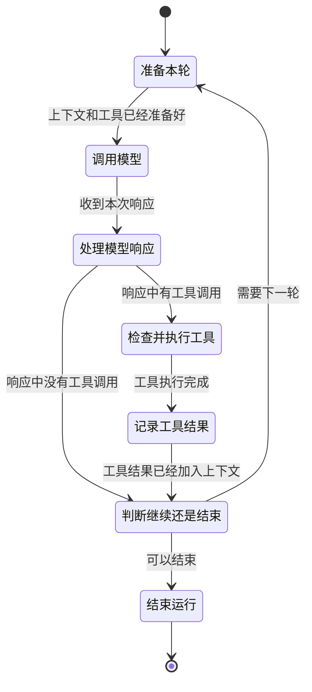

# 别把停止交给模型：从 PI 与 Claude Code 源码拆解 Agent 核心执行循环

假设一个 Coding Agent 正在修改代码。

模型先输出了半句解释，紧接着生成一个“执行数据库迁移”的工具调用。参数刚传到一半，网络断了。UI 上已经显示了一段文字，工具进程也许已经启动，但服务端没有返回完整的结束事件。系统准备切到备用模型重试——这时真正棘手的问题不是“再调用一次模型”这么简单，而是：刚才那次调用究竟算不算数？迁移是否已经执行？残缺参数能不能用？旧模型产生的工具调用 ID 能否交给新模型继续？用户此时按下中断键，又该由谁收尾？

这正是 **Agent loop（智能体执行循环）** 与普通聊天请求的分界。Agent loop 是一段反复调用模型、执行工具并把结果送回模型的控制程序；更重要的是，它还是一台管理不确定性和外部副作用的执行引擎。所谓 **副作用（side effect）**，指调用结束后会改变外部世界的操作，例如写文件、发邮件、扣款或执行数据库迁移。文本生成失败可以重来，副作用执行两次却可能造成真实损失。

本文分为两部分。第一部分沿着“最小循环—真实故障—生产级实现—可落地设计”的顺序，阅读 PI 与 Claude Code 的源码；第二部分把结论压缩成一套适合面试口述的分析式回答。

> **源码范围与证据边界**
>
> - PI 使用 `earendil-works/pi` commit `46bb9a2c3bdb296b0d2179f7309ec6b79a7f3106`。
> - Claude Code 使用本地保存的**非官方公开源码快照**，标注 commit `09f43552c76cb8856c4a5414f9aa9c9cda6ee035`。它不是 Anthropic 官方源码仓库，本文只把快照中可直接核对的代码当作实现证据。
> - 文中会明确区分“源码事实”“基于源码的工程推断”和“推荐设计”，不把后两者伪装成项目现状。

---

# 第一部分：源码如何实现，以及为什么这样实现

## 1. 先把四个容易混淆的尺度分开

在读循环以前，先约定四个概念。它们日常都可能被含糊地叫作“一轮”，但在设计重试和预算时必须分开：

- **Run（一次运行）**：从用户提交任务到 Agent 最终结束的全过程。
- **Turn（交互轮次）**：一次模型响应，加上该响应触发的一批工具执行和工具结果。PI 的事件注释就是这样定义 turn 的。
- **Model attempt（模型请求尝试）**：为了拿到这一次模型响应而发出的一次网络请求。限流重试、流式转非流式，都可能让一个 turn 包含多个 attempt。
- **Tool batch（工具批次）**：同一条模型响应里出现的一组工具调用。它们可能串行，也可能在确认安全后并行。

这个区分看似只是命名，实际上决定了“重试谁”。网络超时通常只重试 model attempt；模型输出被截断，可能要重做一个 turn；已经执行过的付款工具，则不能因为 turn 重试而再付一次。

一个最小循环大致只有下面这些步骤：

```text
state = initial_state

while true:
    enforce_hard_limits(state)
    response = call_model(build_context(state))
    settled = finalize_response(response)

    if settled.failed_or_aborted:
        return terminal(settled.reason)

    calls = collect_complete_tool_calls(settled)
    if calls is not empty:
        results = validate_and_execute(calls)
        state.append(settled, results)
        continue

    if host_requires_continuation(state, settled):
        state.append_continuation_message()
        continue

    return terminal("completed")
```

真正的系统不过是在这副骨架上回答更多问题：`response` 还在流式传输时算不算状态？多个工具如何并发？模型说结束就结束吗？预算在哪一行检查？网络中断后，前一个 attempt 的半成品如何清理？

这些问题适合用 **状态机（state machine）** 建模。状态机的意思不是一定要引入某个框架，而是把“系统现在处于哪个阶段、允许接受什么事件、下一步能去哪里”写成有限且可检查的规则。

先不展开网络重试、输出截断和中断恢复，只看一个简化但完整的 Agent loop：



一次循环从准备上下文开始。运行时把已有消息、系统提示和当前可用工具整理好，然后调用模型。模型返回后，运行时读取响应内容，先看其中有没有工具调用。这一步不能只看模型给出的停止原因，因为真正决定下一步的是响应里实际出现了什么。

如果响应中有工具调用，运行时就检查参数和权限，执行工具，再把结果加入上下文。这里的结果不只包括成功值，也包括工具报错、参数不合法或调用被拒绝。模型必须在下一轮看到这些结果，才能继续判断任务是否完成，所以工具调用不是循环的终点，而是连接前后两个 turn 的中间步骤。

如果响应中没有工具调用，或者工具结果已经记录完成，运行时就判断是否还需要下一轮。需要继续时，系统带着更新后的上下文重新调用模型；不需要继续时，整个 run 结束。这个判断由运行时负责，模型的停止原因只是其中一个输入，宿主追加的新消息或强制停止条件也会改变结果。

因此，一个 Agent loop 的核心可以归纳为五步：准备上下文、调用模型、处理响应、执行并记录工具结果、判断是否继续。图中所谓“完整”，指这条主控制流能够从开始走到结束，也能够在工具结果返回后进入下一轮；重试、截断、fallback 和用户中断，是在这条主干上继续增加的生产环境处理，后文再分别展开。

## 2. PI：先看一颗足够小、又真实可用的内核

PI 的 [`packages/agent/src/agent-loop.ts`](../related-repos/pi/packages/agent/src/agent-loop.ts) 很适合用来建立第一版心智模型。核心入口是 `runLoop`，模型流式处理集中在 `streamAssistantResponse`，工具处理则拆成 prepare、execute、finalize 三段。

### 2.1 一次 turn 到底发生了什么

`runLoop` 有内外两层循环：

1. 内层循环消费待插入的 steering message，调用模型，执行这次响应中的工具，再判断要不要进入下一轮。
2. 当模型原本准备结束时，外层循环再查看 follow-up 队列；若有新消息，就重新进入内层。

这里的 **steering message（转向消息）** 是运行过程中插入、用于改变当前方向的消息，例如用户在 Agent 工作时补一句“先别改配置”；follow-up 则是在 Agent 本来准备结束后才接续的新消息。这两个队列解释了一个容易被忽略的事实：模型认为自己答完了，不代表宿主环境没有新工作。

PI 每个 turn 的主要顺序是：

```text
注入 pending message
→ streamAssistantResponse
→ 从最终消息中筛出 toolCall
→ 工具调用检查和执行
→ 把 toolResult 写回上下文
→ turn_end
→ prepareNextTurn / shouldStopAfterTurn
→ 拉取下一批 steering message
```

这不是凭注释推测，而是 `runLoop` 的直接控制流。相应的生命周期会发出 `turn_start`、`message_start/update/end`、`tool_execution_start/update/end`、`turn_end` 和 `agent_end` 等事件。事件让 UI、日志和宿主可以观察循环，却不改变“消息必须按顺序写回上下文”这个主干。

### 2.2 流式片段不是最终事实

模型通常不是一次性返回完整响应，而是不断发来 text delta、thinking delta 和 tool-call delta。所谓 **delta（增量）**，就是“相对于上一时刻新增的那一小段内容”。

在 `streamAssistantResponse` 中，PI 收到 `start` 后，会把 partial message 临时放进上下文；收到各种 delta 后，用新 partial 替换最后一条；只有收到 `done` 或 `error`，才调用 `response.result()` 取得最终消息并覆盖临时值。

因此需要区分两类状态：

- 流式 partial 是 UI 可以展示的**观察状态**；
- final message 是后续工具执行和持久化依赖的 **canonical state（规范状态）**，也就是发生冲突时被视为最终事实的那一份状态。

这么做的理由很现实：工具参数在流式阶段可能只是 `{"path":"/tmp`，甚至尚未形成合法 JSON。把 partial 当成可执行命令，会让网络分包方式决定业务行为。

PI 的 [`packages/agent/README.md`](../related-repos/pi/packages/agent/README.md) 还特意提醒：低层 `agentLoop()` 发出的事件是 observational，也就是用于观察；它不会等待异步事件监听器全部处理完再继续。如果宿主要求“消息监听处理完成后才能检查工具调用”，应使用更高层的 `Agent` 来保证这个先后顺序。监听器收到了事件，并不等于系统已经完成这一步。

### 2.3 决定继续的是实际工具调用，不是一个标签

PI 的 `AssistantMessage` 带有 `stopReason`，可取 `stop`、`length`、`toolUse`、`error`、`aborted` 等值。这里的 **provider（模型服务提供方）** 是实际接收请求并返回模型响应的 API 服务；运行时通常还会在它前面放一层 adapter，把不同厂商的事件转换成统一格式。**Stop reason（停止原因）**就是 provider 对“这次生成为什么结束”的协议级说明，例如自然结束、达到输出上限或开始使用工具。它很有用，但不能单独决定整个 Agent 是否结束。

`runLoop` 只把 `error` 和 `aborted` 直接视为终止错误。对于工具，它没有写成：

```text
if stopReason == "toolUse": execute tools
```

而是直接从 `message.content` 中筛出所有 `toolCall`。只要实际存在调用，就进入工具阶段；没有调用，循环才可能自然停下。换句话说，**协议标签提供线索，结构化内容提供证据**。

Claude Code 在 [`src/query.ts`](../related-repos/claude-code/src/query.ts) 中把这个判断写得更直白：注释明确说 `stop_reason === 'tool_use'` 并不总是可靠，所以循环在流式过程中只要观察到真实 `tool_use` block，就设置 `needsFollowUp=true`；最终是否继续由这个结构事实决定。

这回答了“模型返回的停止信号可信吗”：

> 可以相信它描述了一次 provider 响应，但不能把它当成整个 Agent run 的最终决定。运行时还要核对内容结构、待处理工具、宿主队列、输出契约和硬预算。

### 2.4 工具执行不是一个 `execute(args)` 就结束了

PI 把工具调用分成三个阶段，很值得借鉴：

1. **Prepare**：按名称找到工具，必要时整理参数，依据 schema 校验，再执行 `beforeToolCall` 权限或策略钩子。这里的 **schema（结构约束）** 描述参数允许有哪些字段、字段类型是什么、哪些字段必填。
2. **Execute**：真正调用工具；工具可以持续上报进度，异常会被转换成错误结果，而不是直接破坏整个消息协议。
3. **Finalize**：运行 `afterToolCall`，允许宿主调整内容、错误标记、usage 或终止提示，最后统一生成 `toolResult` 消息。

这里的 **hook（钩子）** 是插在固定生命周期节点上的宿主回调。它不是让模型自由发挥的提示词，而是程序侧的扩展点，例如在工具执行前做权限判断、执行后脱敏结果。

PI 支持串行和并行两种工具执行。如果配置要求串行，或者批次中任何一个工具声明 `executionMode="sequential"`，整批就串行；否则先检查所有调用，再用 `Promise.all` 并发执行。即使并行完成顺序不同，结果仍按原工具调用顺序回填，从而保持稳定的消息顺序。

工具还可以在结果中设置 `terminate=true`，表示“这个工具的结果本身就是终点，不必再花一轮让模型复述”。但 PI 的 `shouldTerminateToolBatch` 要求**批次中每一个结果都同意终止**。如果两个并行调用中，一个是“提交最终答案”，另一个仍需要模型解释错误，仅凭前者就结束会丢失后续工作。全体同意才停，是一种保守的批次语义。

### 2.5 低层 loop 故意不包办所有政策

PI 提供 `prepareNextTurn`，允许宿主在 turn 边界替换上下文、模型或 reasoning level；又提供 `shouldStopAfterTurn`，让宿主在工具全部结束、`turn_end` 已经发出之后施加额外停止政策。

它没有在最小 loop 里硬编码统一的步数、token 或美元成本策略。这不是“功能缺失”那么简单，而是一种分层：低层 loop 保证消息与工具协议，高层宿主决定产品预算。PI 更高层的 durable harness 则进一步引入持久化状态、retry policy 和恢复流程，见 [`packages/agent/docs/harness.md`](../related-repos/pi/packages/agent/docs/harness.md)。

## 3. 停止不是一个布尔值，而是由多层共同判断

朴素实现常写成 `if model_finished: break`。生产系统需要综合模型响应、工具执行状态、预算和用户操作，再按优先级判断是否停止。

| 终止来源 | 典型信号 | 最合适的拦截层 | 为什么放在这里 |
|---|---|---|---|
| 模型自然结束 | `end_turn`、`stop`，且无工具调用 | Loop / orchestrator | Provider 只知道本次生成，不知道宿主队列与业务目标 |
| 模型或请求失败 | `error`、不可恢复的 4xx | Provider adapter + loop | Adapter负责规范化错误，loop 负责收尾和对外结果 |
| 步数上限 | `turnCount > maxTurns` | Loop | 只有 loop 知道完整 turn 已经结束 |
| 单次输出上限 | `max_tokens`、`length` | Provider adapter + recovery policy | 先识别截断，再决定提高额度、续写或失败 |
| 总 token / 成本预算 | 累计 usage 或美元成本超限 | Host / session | 预算往往跨多个请求甚至跨压缩边界 |
| 用户中断 | `AbortSignal` | 从 host 向下传播到模型和工具 | 取消必须能打断网络等待、退避睡眠和工具进程 |
| 工具主动终止 | `terminate=true`、提交结果工具 | Tool executor + loop | 必须先记录结果，并保证整个批次的处理方式一致 |
| Stop hook 拦截 | 验证失败、合规检查不通过 | Loop 的终止边界 | 它检查的是候选最终结果，而不是模型请求本身 |

**Orchestrator（编排器）**就是协调模型、工具、队列和策略的那层控制程序；本文中的核心 loop 正是最小编排器。

表中的 `AbortSignal` 是 JavaScript 生态常用的协作式取消信号：上层把同一个“已取消”状态向下传给网络请求、定时等待和工具进程，各层看到信号后自行尽快退出。它不是强杀线程，因此工具仍要实现自己的收尾逻辑。

表中的 **Stop hook（停止钩子）**则是模型准备结束后、运行时正式接受结果前执行的程序化检查。例如模型说“修改完成”时，Stop hook 可以检查测试是否通过；若不通过就把错误送回下一轮，而不是接受这次结束。

Claude Code 展示了这些限制如何落到不同位置：

- [`src/query.ts`](../related-repos/claude-code/src/query.ts) 在工具批次结束、结果回填后检查 `maxTurns`。这样即使刚好达到上限，也不会留下一个有 `tool_use` 却没有 `tool_result` 的断尾。
- [`src/QueryEngine.ts`](../related-repos/claude-code/src/QueryEngine.ts) 在消费 query 产出的消息时累计 usage（输入、输出和缓存 token 等用量）与成本，并在达到 `maxBudgetUsd` 后返回专门的错误结果。成本策略属于会话宿主，而不是单个 provider 请求。由于费用通常在响应产生后才能精确结算，这类预算是防止继续消费的 guardrail（护栏），不应承诺一分钱也不超；需要更硬的上限时，还要在请求前预留最坏情况额度。
- 同一文件跟踪结构化输出的尝试次数，达到上限后返回 `error_max_structured_output_retries`。
- `query.ts` 的本地 token-budget 功能并不单纯是“硬上限”：预算尚未使用到目标比例时，它可能注入一条提醒让模型继续；达到约定阈值或出现边际收益下降时才停止。这里的“边际收益下降”指连续几轮消耗了 token，却几乎没有新增有效输出。
- `taskBudget` 又是另一层概念：它会随请求传给支持任务预算的 API，并在上下文压缩后显式结转剩余额度。不能把单次 `max_tokens`、本地 turn token 目标和服务端 task budget 混成一个数字。

把这些条件合在一起，可以得到一个比“信不信模型”更准确的终止公式：

```text
可以正常结束 =
    模型响应已经整理完成
    且没有待处理或未配对的工具调用
    且最终输出满足契约
    且没有 steering / follow-up / stop-hook 续跑要求
    且没有更高优先级的错误、中断或预算终止
```

模型自然结束只是第一项证据，而不是最终权限。

## 4. 输出被截断：最危险的不是少了一段文字

当模型达到输出 token 上限，普通聊天最多是结尾少一段；Agent 却可能在结尾留下半个工具调用。即便一个“尽力修复 JSON”的解析器能把它补成合法对象，缺失字段也可能恰好都是可选字段：参数通过 schema，却已经不是模型原本想表达的调用。

例如模型实际想生成：

```json
{"path":"db.sql","mode":"dry-run"}
```

传输截断后只留下 `{"path":"db.sql"}`。如果 `mode` 在 schema 中可选，解析与校验都会成功，但把默认模式解释成“立即执行”就可能造成事故。

### 4.1 PI：宁愿整批作废，也不猜哪一个安全

PI 的 `runLoop` 发现 `message.stopReason === "length"` 且消息中含工具调用时，不会走普通执行路径，而是调用 `failToolCallsFromTruncatedMessage`。这个函数对该消息中的**所有**工具调用生成错误结果，明确告诉模型：响应触及输出上限，参数可能被截断，请重新发出完整调用。

为什么不是只丢掉最后一个？因为并行工具调用在 provider 与适配器中的组装方式可能不同，运行时无法证明“前几个一定完整”。整批失败会多花一轮 token，却建立了清晰的提交边界：这条截断响应里的工具副作用一个也没有发生。

### 4.2 Claude Code：先提高单次额度，再做有限续写

Claude Code 在 [`src/services/api/claude.ts`](../related-repos/claude-code/src/services/api/claude.ts) 的 `message_delta` 处理中捕获最终 `stop_reason`。遇到 `max_tokens` 或 `model_context_window_exceeded` 时，它生成带 `apiError: 'max_output_tokens'` 的合成 assistant error。

`query.ts` 在流式阶段先暂扣这类可恢复错误，不立刻暴露给 SDK（Software Development Kit，供其他程序调用该能力的软件接口包）调用方。原因是很多调用方看到任何 error 就会结束会话；如果错误先发出，内部恢复虽然仍在运行，外面已经没人继续消费结果。

在没有进入工具后续处理的截断分支中，恢复分两级：

1. 若特性开关允许、调用方也没有固定输出上限，先把**同一请求**的最大输出额度提高到 `64K`，重新生成一次。
2. 如果提高额度后仍然截断，就保留已有 assistant 内容，追加一条“直接从中断处继续，不要道歉和复述”的元消息，最多再恢复三次。

最终仍失败，之前暂扣的错误才对外可见。这个设计兼顾了三件事：第一次重试尽量保持单条完整响应；大输出确实需要分段时允许多 turn 续写；所有恢复都有上限，不会形成无限“继续”。

这里必须补一个边界：Claude Code 用 `content_block_stop` 形成完成的工具块，观察到完整 `tool_use` 后会进入工具路径；上述输出续写主要处理没有待执行工具的截断响应。对于无法证明完整的工具调用，仍然不能把“续写文本”当作“补完同一个可执行 JSON”。Anthropic 的[停止原因官方说明](https://platform.claude.com/docs/en/build-with-claude/handling-stop-reasons)也把 `max_tokens` 视为截断，并建议在工具调用不完整时提高额度重新请求，而不是执行残缺输入。

因此可以提炼出一条通用规则：

> 文本可以续写；尚未完整生成的工具调用只能重新生成。任何“看起来解析成功”的残缺参数，都不能直接交给工具执行。

## 5. Fallback：切换模型之前，先处理旧世界

**Fallback（降级切换）**指主要方案不可用时换到备用方案，例如流式请求失败后改用非流式请求，或主模型持续过载后切换备用模型。它和普通重试的差别在于：执行方式或模型身份发生了变化，旧 attempt 的产物未必能直接复用。

Claude Code 至少处理了两类 fallback。

### 5.1 流式转非流式：UI 已经看见半成品怎么办

在 `query.ts` 中，`callModel` 可以通过 `onStreamingFallback` 通知外层“流式路径失败，正在改走非流式”。一旦发生，外层会：

- 对已经 yield 给 UI 或 transcript（会话执行记录）的 partial assistant message 发出 **tombstone（墓碑标记）**。墓碑不是删除数据库文件，而是一条控制事件，告诉消费者这条旧消息已经失效，应从视图与记录中移除。
- 清空这次 attempt 收集的 assistant message、tool result、tool-use block 和 `needsFollowUp`。
- `discard()` 旧的 `StreamingToolExecutor`，再创建一个全新的 executor，防止旧工具调用 ID 的结果混入新响应。

这里清的是会话内状态。如果一个工具已经真的写了文件，tombstone 并不会让文件自动恢复。

### 5.2 主模型切备用模型：旧调用必须闭合

主模型持续返回容量错误时，[`src/services/api/withRetry.ts`](../related-repos/claude-code/src/services/api/withRetry.ts) 会抛出专门的 `FallbackTriggeredError`，由 `query.ts` 真正切换模型。外层不是带着原数组直接重跑，而是：

- 为旧 assistant message 中尚未配对的工具调用生成“Model fallback triggered”错误结果；
- 清空旧响应和工具状态，丢弃旧 executor；
- 更新 `mainLoopModel`；
- 在特定内部路径上移除旧模型生成的 thinking signature。

**Thinking signature（思考签名）**是 provider 用来证明某段思考内容完整、未被篡改的模型相关元数据。它可能和模型或协议绑定，把主模型签名原样交给备用模型会触发请求校验错误。因此切模型不只换一个字符串，还要清理模型专属状态。

### 5.3 最难的事实：消息能作废，副作用不能

Claude Code 的 `claude.ts` 留有一段很关键的实现注释：流式阶段若已经启动工具，随后再做非流式 fallback，新响应可能再次生成同一个工具调用，造成重复执行。因此代码提供了禁用这条 fallback 的开关，在相应条件下让错误向上传播。

这暴露了所有 Agent 都必须回答的一个关键问题：什么时候还可以安全重试？

```text
模型调用可以重试的安全窗口：尚未开始外部副作用
模型调用不可盲目重放的窗口：至少一个工具副作用已经开始
```

推荐显式维护以下状态，而不是从消息数组临时猜：

```ts
type AttemptState = {
  attemptId: string
  responseSettled: boolean
  effectsStarted: boolean
  pendingToolCallIds: Set<string>
  completedToolCallIds: Set<string>
}
```

一旦 `effectsStarted=true`，整轮 fallback 只能走三条路之一：工具本身支持幂等重放；运行时能查询并复用第一次结果；或者终止并要求人工确认。所谓 **幂等（idempotency）**，是同一个操作执行一次或重复执行多次，最终效果相同。例如“把任务状态设为 completed”可以设计成幂等，而“账户余额减 100”天然不是；后者通常需要带稳定的幂等键，让服务端识别重复请求并返回第一次结果。

## 6. 流式输出：更快，但中途失败更难处理

等待完整响应后再执行工具，最容易保证一致性，却会浪费时间：模型可能先完整生成了第一个工具调用，之后还要思考很久才结束整条响应。Claude Code 的 `StreamingToolExecutor` 选择在完整 `tool_use` block 到达后尽早启动工具。

它并不是“来一个 delta 就执行一个 delta”，而是：

1. 工具块完整形成后，先查找工具并用 schema 解析参数。
2. 工具声明并发安全时，可以和其他并发安全工具一起执行；非并发安全工具获得独占执行窗口。
3. 工具进度可以即时流出，但最终结果按工具出现顺序缓冲和回填。
4. Bash 等工具失败时，可以取消仍在运行的兄弟进程；用户中断或 fallback 时，为未完成调用生成合成错误结果。

“并发安全”不是“工具速度快”，而是多个实例同时执行不会互相破坏状态。例如并行读取两个文件通常安全，同时改写同一个配置文件通常不安全。

流式执行的收益是降低延迟，代价是形成新的不确定窗口：模型响应尚未结束，外部副作用已经开始。所以推荐把实现分成两个级别：

- 默认模式：完整收完并确认响应后才执行工具，适合高风险写操作。
- 优化模式：完整工具块到达即可执行，但仅对只读、可取消或有幂等保护的工具开放。

无论哪种模式，都必须保证：每个已经写入消息历史的工具调用，最终都有对应结果。用户中断也不能只 `return`；PI 和 Claude Code 都会把异常或中断转成工具结果或中断消息，避免下一次 API 请求看到只有 `tool_use`、没有结果的消息。

## 7. 结构化输出：合法 JSON 还不够

**Structured output（结构化输出）**是要求模型最终产出符合指定数据结构的结果，例如 `{ "severity": "high", "issues": [...] }`。它解决的是“程序要消费结果”，不是“人能大概看懂结果”。

只要求 JSON 模式通常只能保证语法像 JSON，不能保证字段、类型和枚举正确。**Strict schema（严格模式 schema）**则要求输出遵守给定的 JSON Schema；Schema 可以规定必填字段、类型、枚举以及是否允许额外字段。

Claude Code 的 [`src/tools/SyntheticOutputTool/SyntheticOutputTool.ts`](../related-repos/claude-code/src/tools/SyntheticOutputTool/SyntheticOutputTool.ts) 把最终结果建模为一个名为 `StructuredOutput` 的工具：

- `createSyntheticOutputTool` 先用 Ajv（JavaScript 的 JSON Schema 校验器）检查并编译调用方提供的 JSON Schema；
- 模型调用该工具时，输入就是最终结构化结果；
- 工具再次用编译后的 validator 校验真实输入，不匹配就返回带诊断的错误；
- 成功结果被转换为 `structured_output` attachment，由 `QueryEngine` 单独收集并放入最终 SDK result。

仅有校验还不够，模型也可能直接输出一段自然语言然后结束。Claude Code 因此通过 [`src/utils/hooks/hookHelpers.ts`](../related-repos/claude-code/src/utils/hooks/hookHelpers.ts) 注册 Stop hook：候选结束时检查历史中是否已有成功的 `StructuredOutput` 调用；若没有，就注入一条错误消息要求模型现在调用该工具。`QueryEngine` 再以本次 query 中的工具调用计数限制修复次数，默认达到五次便终止。

前文介绍的 Stop hook 适合验证“测试是否通过”“最终结果工具是否已提交”，但必须有重试上限；否则会形成“模型结束—hook 拒绝—模型再结束”的死循环。

结构化输出失败至少要分成四类：

| 情况 | 应对方式 |
|---|---|
| Schema 本身非法 | 请求前失败，直接告诉调用方修正 schema |
| 模型输出不符合 schema | 把精确校验错误反馈给模型，有限次数修复 |
| 输出被 token 上限截断 | 按不完整响应处理，不能把解析失败伪装成普通字段错误 |
| 模型安全拒绝或 API 错误 | 走 refusal / provider error 分支，不应强迫模型无限重试 |

OpenAI 的[函数调用文档](https://developers.openai.com/api/docs/guides/function-calling)同样建议能用时开启 strict mode，并明确要求应用仍然负责执行函数和回填结果；[结构化输出文档](https://developers.openai.com/api/docs/guides/structured-outputs)还把 refusal 与 incomplete response 单独列出。最佳实践不是“相信模型一定给合法 JSON”，而是把结构化输出当作一个有校验、有拒绝分支、有重试预算的协议。

## 8. 重试：先回答“什么失败了”，再决定“重做什么”

把所有错误都包在一个 `retry(3)` 里，是 Agent 中最危险的简化之一。至少要区分三层：

1. **请求级重试**：同一模型请求因为网络、限流或服务端瞬时错误失败，且尚未产生工具副作用。
2. **Turn 级恢复**：模型确实返回了一个可记录但不完整的响应，例如输出截断，需要追加恢复消息或重新生成调用。
3. **工具级重试**：外部操作本身失败。是否可重试取决于工具语义和幂等设计，不能继承模型请求的策略。

### 8.1 PI：小而清楚的有界重试

PI 的 [`packages/ai/src/utils/retry.ts`](../related-repos/pi/packages/ai/src/utils/retry.ts) 提供 `retryAssistantCall`。它只处理产生 assistant message 的调用：

- `aborted` 永不重试；
- 非 `error` 立即成功返回；
- 只有 `isRetryableAssistantError` 识别出的瞬时 provider/transport 错误才重试；
- 配额、billing、usage limit 等被明确排除；
- 延迟为 `baseDelayMs * 2^(attempt-1)`，达到 `maxRetries` 后结束；
- 退避等待也监听 `AbortSignal`，用户中断时转为统一的 `aborted` 消息。

这种逐次翻倍等待叫 **指数退避（exponential backoff）**。第一次等 500ms，第二次约 1s，第三次约 2s，可以避免服务已经过载时客户端还以固定高频继续施压。PI 这里没有加入随机抖动，胜在行为简单、可预测。

### 8.2 Claude Code：按错误、来源和用户可见性细分

Claude Code 的 `withRetry` 更接近生产流量治理：

- 网络连接错误、408、409、部分 429、5xx、529 过载以及可刷新的云凭证错误可进入重试；
- 服务端 `x-should-retry` 与 `Retry-After` 会影响决策；
- 默认重试有界，连续 529（Anthropic 用于表示服务暂时过载的 HTTP 状态码）达到阈值后可触发模型 fallback；
- 前台用户正在等待的 query source（请求用途标签，例如主对话、摘要或标题生成）才积极重试 529，后台摘要、标题等请求快速失败，避免容量故障时产生放大流量；
- 延迟采用指数退避，并增加最多约 25% 的 **jitter（随机抖动）**。Jitter 是在理论等待时间上加入随机量，防止大量客户端同时醒来、再次形成尖峰；
- 用户中断会打断退避睡眠；特殊 unattended 模式虽然允许长期重试，也会限制最大等待并定期发心跳。

可以把常见错误粗略分成下表：

| 错误 | 通常是否重试 | 关键条件 |
|---|---|---|
| 网络断开、连接重置、请求超时 | 是 | 请求未产生不可重复的工具副作用 |
| 429 限流、529/503 过载 | 是 | 尊重 `Retry-After`，指数退避、有上限 |
| 500/502/504 | 是 | 有界重试，并观察服务恢复情况 |
| 401 凭证过期 | 有条件 | 先刷新凭证，不能拿同一坏凭证机械重试 |
| 400 参数或 schema 错误 | 否 | 修正请求后才可重新发起 |
| 配额、余额、billing 耗尽 | 否 | 等待外部状态变化或用户处理 |
| 安全拒绝、业务拒绝 | 否 | 它们是有效结果，不是瞬时基础设施故障 |
| 工具执行超时 | 视工具而定 | 先判断第一次是否已经生效，再谈重试 |

AWS 的[重试控制最佳实践](https://docs.aws.amazon.com/wellarchitected/latest/framework/rel_mitigate_interaction_failure_limit_retries.html)强调三点：指数退避与 jitter、明确最大重试次数或总时长、避免在多个层级叠加同一类重试。否则 SDK 重试三次、provider wrapper 再重试三次、Agent loop 又重试三次，一次用户操作会膨胀为数十次请求。

### 8.3 幂等不是客户端“记住执行过”这么简单

对有副作用的工具，推荐为每个逻辑调用生成稳定的 `invocationId`，并让下游服务把它作为幂等键：

```text
intent(invocationId, tool, args_hash)
→ execute with idempotency_key=invocationId
→ settlement(invocationId, result_or_error)
```

这里的 `intent` 是执行意图，必须在副作用开始前记录；`settlement` 是最终结果记录，表示这次调用已经确定成功或失败。恢复时若只看到 intent，看不到 settlement，系统不能直接假设“没执行”，而应先查询下游或进入人工确认。

PI 的 durable harness 文档把这个思想做得更完整：它用 `op.state/{operationId}` 保存完整的当前程序计数状态，在不确定副作用前写入 `effect_pending` 意图；已结算的响应与 usage 一起持久化。恢复不是凭“消息列表最后一条像什么”来猜，而是读取明确状态再分支。这类 **durable execution（持久化执行）** 的目标，是进程崩溃后仍能从已记录边界继续，而不重复已经确认的效果。

AWS 的[幂等 API 指南](https://docs.aws.amazon.com/wellarchitected/2022-03-31/framework/rel_prevent_interaction_failure_idempotent.html)也采用同一原则：客户端重发时携带相同 token，服务端识别并返回第一次处理结果。真正的幂等是协议双方合作，不是客户端在内存里加一个布尔变量。

## 9. 把前面的结论写成可实现的状态机

前面从简单循环一路走到截断、fallback 和持久化，最后可以把推荐设计整理成三组类型：

```ts
type LoopPhase =
  | "preparing_turn"
  | "calling_model"
  | "finalizing_response"
  | "preparing_retry"
  | "checking_tool_calls"
  | "running_tools"
  | "recording_tool_results"
  | "repairing_interrupted_state"
  | "deciding_next_step"
  | "terminal"

type TerminalReason =
  | "completed"
  | "model_error"
  | "max_turns"
  | "token_budget"
  | "cost_budget"
  | "user_aborted"
  | "tool_terminated"
  | "policy_blocked"

type LoopState = {
  phase: LoopPhase
  turn: number
  attempt: AttemptState | null
  pendingToolCallIds: Set<string>
  cumulativeUsage: { inputTokens: number; outputTokens: number; cost: number }
  terminalReason?: TerminalReason
}
```

这些类型不是 PI 或 Claude Code 的原样 API，而是基于两份实现整理出的推荐模型。关键不在字段名，而在于明确记录程序执行到哪一步、出错后允许做什么，不要把这些信息藏在十几个布尔变量和消息数组里。

判断是否继续可以按下面的顺序进行：

```text
1. 先处理用户取消和不可恢复错误
2. 再修复未配对的工具调用/结果
3. 若有完整工具调用，先检查参数和权限，再执行并记录整批结果
4. 在 turn 边界检查步数、token、成本和工具终止
5. 运行结构化输出、测试、合规等 stop hook
6. 检查 steering / follow-up 队列
7. 全部通过，才接受模型的自然结束
```

无论具体框架怎样变化，下面四件事都必须保证：

1. **每个已经记录的工具调用最终都有对应结果。** 成功、失败、拒绝和中断都不能留下只有调用、没有结果的消息。
2. **尚未完整收完的流式内容不能产生不受保护的副作用。** 提前执行只对已经完整形成、并且能够安全重复执行的调用开放。
3. **已经产生副作用的 turn 不能盲目重放。** 必须使用幂等键、已保存的工具结果、补偿操作或人工确认。
4. **每一条继续路径都有停止办法。** 步数、token、成本、重试次数、总时长或用户中断，至少有一种能结束循环。

到这里，核心 loop 已不再是一句“不断调用模型直到它说完成”，而是一段负责控制执行顺序和风险的程序：模型提出下一步，执行引擎检查输入、管理副作用、记录结果，再决定是否真的继续。

---

# 第二部分：面试场景中的分析式回答

## 10. 3—5 分钟完整回答

如果面试官问“Agent 的核心执行循环怎么设计”，可以按下面的思路展开：

> Agent loop 不应被理解成“模型没说 stop 就一直 while”。分析这类系统时，首先要把一次运行拆成 run、turn、model attempt 和 tool batch 四层：一次 turn 是一条模型响应加上它触发的一批工具；一次 turn 里可能因为网络重试包含多个模型 attempt。这样发生错误时，才能明确应该重试的是网络请求、整个模型轮次，还是某个工具，而不是笼统地“再来一次”。
>
> 状态机通常可分成准备本轮、调用模型、整理并确认响应、检查工具调用、执行工具、记录工具结果、判断是否继续和结束运行几个阶段。流式 delta 只给 UI 展示，只有收到完整结束事件、工具参数也通过 schema 校验后，才能交给后续程序处理。工具结果无论成功、失败、权限拒绝还是用户中断，都必须和原来的 tool call 配对，不能给下一轮留下只有调用、没有结果的消息。
>
> 停止方面，模型的 stop reason 只能作为输入，不能单独决定整个 run 是否结束。PI 和 Claude Code 都会看响应里实际有没有 tool call；Claude Code 源码还明确写了 `stop_reason=tool_use` 不总是可靠。最终能不能停，要同时满足：没有待执行工具、模型响应已经整理完成且输出符合要求、没有 steering 或 follow-up、stop hook 没有要求继续，并且没有其他续跑策略。另一方面，步数、token、成本和用户取消属于强制停止条件，应该由 loop 或宿主直接检查，不需要征求模型意见。
>
> 截断处理需要区分文本和工具。文本可以提高输出额度或者追加“从中断处继续”的元消息；残缺工具调用不能靠猜测补 JSON 后执行。PI 在 `length` 时会把这一批工具调用全部标成失败，让模型重新发完整调用；Claude Code 会先尝试提高输出额度，再做有次数上限的续写。核心原则是：尚未完整生成并确认的工具调用不能产生副作用。
>
> 主模型失败切备用模型时，必须先处理旧 attempt 留下的状态：已经流给 UI 的半成品要 tombstone，旧工具调用要补错误结果或作废，旧 executor 和调用 ID 要丢弃，模型绑定的 thinking signature 也不能跨模型复用。但消息清理不能撤销外部副作用，所以一旦 `effectsStarted=true`，就不能盲目整轮重放；必须依赖幂等键、结果查询或人工确认。
>
> 流式工具执行是一种降低延迟的优化，不是默认正确性。只读、可取消或幂等的工具，可以在完整 tool block 到达后提前执行；高风险写操作最好等整条响应收完并确认。结构化输出则要用 strict schema 或专门的提交结果工具，在运行时再次校验，失败后把精确错误反馈给模型，但必须设置最大修复次数，并单独处理 refusal 和 token 截断。
>
> 最后是重试。瞬时错误和确定性错误必须分开处理：网络失败、超时、429、部分 5xx 可以在没有副作用的请求层做有界重试，尊重 `Retry-After`，使用指数退避加 jitter，并让用户取消能打断等待；参数错误、配额耗尽、安全拒绝不应该机械重试。重试只放在一个明确层级，防止 SDK、provider 和 Agent 三层相乘。对写操作使用稳定 invocation ID 和下游幂等键，必要时在执行前记 intent、执行后记 settlement。
>
> 所以，核心 loop 可以归纳为：模型负责提出下一步，执行引擎负责检查、记录结果、控制风险，并决定是否真的继续。

这段回答的结构不是罗列功能，而是先说明建模单位，再讲正常路径，接着讲停止和故障，最后落到重试与幂等。即使面试官中途打断，也能沿任一关键词继续追问。

## 11. 高频追问

### 追问一：一个 loop 里具体干哪几件事？状态机怎么建模？

一次 turn 通常包含：准备上下文和工具定义、调用模型并消费流、整理并确认响应、提取完整工具调用、校验参数与权限、串行或并行执行工具、按原顺序记录结果、累计 usage，最后判断继续或终止。推荐显式记录 `phase`、`turn`、`attemptId`、`responseSettled`、`effectsStarted`、待处理工具 ID 和累计预算，不从消息数组临时反推所有状态。

PI 的 `runLoop` 把模型响应、工具批次和 turn 边界写得很清楚；Claude Code 的 `queryLoop` 则用一个跨迭代 `State` 保存压缩追踪、截断恢复次数、turn count 和 transition reason。两种实现共同说明：消息历史是业务数据，但“程序现在执行到哪”最好由独立状态记录。

### 追问二：模型返回的停止信号到底可不可信？

它可信到“可以描述本次 provider 响应为什么停”，但不可信到“可以决定整个 Agent run 已完成”。运行时应把 stop reason 和响应内容交叉验证：实际存在工具调用就处理工具；`length` 就走截断恢复；`error`、`aborted` 走失败收尾。只有模型响应已经整理完成、没有待处理工具、输出合法、宿主也没有续跑要求时，才接受自然结束。

源码里的处理与这个判断一致：PI 直接从 content 中筛 `toolCall`；Claude Code 也根据实际 `tool_use` block 设置 `needsFollowUp`，并在注释中指出单独依赖 `stop_reason === 'tool_use'` 不可靠。背后的原则是“结构事实优先于摘要标签”。

### 追问三：几类终止条件分别在哪一层拦？

- 模型自然结束：在 loop 最后判断是否继续时接受。
- 步数上限：在完整 turn 边界检查，先补齐本轮工具结果。
- 单次输出 token 上限：provider adapter 识别，交给恢复策略提高额度或续写。
- 总 token、任务预算和成本预算：由会话宿主累计并拦截。
- 用户中断：由宿主发出统一取消信号，向下传播到网络请求、退避等待和工具进程。
- 工具主动终止：工具 executor 提交结果后，由 loop 结束，不再额外调用模型。
- Hook 或策略拦截：在候选结束点运行；失败可以要求继续，但必须有次数上限。

这种分层也反映在源码中：Claude Code 把 `maxTurns` 放在工具执行后，把 `maxBudgetUsd` 放在 `QueryEngine` 的消息消费层；PI 则用 `shouldStopAfterTurn` 让宿主提供停止规则。终止条件并不是越早检查越好，而要保证已经出现的工具调用都有对应结果。

### 追问四：输出被 token 上限截断，末尾还有残缺工具调用，整批作废还是续写？

先区分文本和工具。纯文本可以先提高单次额度，或者把已完成文本放回历史后要求模型从中断处继续。工具调用如果没有完成提交，就整批或至少整个未提交调用作废，重新生成；不能让模型“续写后半段 JSON”再和前半段拼接执行。若无法证明同批其他调用完整，整批作废最稳妥。

PI 对 `length` 消息中的整批调用都回填错误，不执行任何一个；Claude Code 对 `max_output_tokens` 先暂扣错误，可选升级到 64K，再做最多三次续写。两者的恢复策略不同，但共同原则都是“不把尚未完整收完并确认的内容直接当工具输入”。

### 追问五：主模型失败切备用模型，半成品状态怎么处理？

先冻结旧 attempt，不把旧状态和新状态混用。对外已经可见的 partial message 发作废事件；对已经提交到历史的工具调用补齐错误结果；清空旧调用 ID、结果缓冲和 executor；清理模型专属元数据；然后用干净的输入重新请求备用模型。如果已有外部副作用，就禁止盲目整轮 fallback，改为查询第一次执行结果、依赖幂等键，或者让用户确认。

Claude Code 的流式 fallback 正是这样处理：先 tombstone 旧 assistant message 并重建 `StreamingToolExecutor`；模型 fallback 还会生成缺失工具结果、切换 `mainLoopModel` 并处理 thinking signature。源码同时承认，流式阶段已经启动工具时，fallback 可能造成重复执行，因此提供了禁用路径。这说明内部状态清理不等于外部事务回滚。

### 追问六：流式输出如何和 loop 结合？

流事件和最终确认的消息应分开处理：delta 可以实时更新 UI 和进度，但只有 final event 才能提交 assistant message。工具也必须等到完整 block、参数校验和权限检查通过后才能执行。流异常或取消时，要停止接收更新、取消可取消工具，并为已经出现的调用生成配对结果。

如果要做流式工具执行，只对并发安全、可取消或幂等工具开放；结果可以并行计算，但回填顺序保持稳定。高风险写工具默认等完整响应收完并确认。

PI 会用最终消息替换上下文中的 partial；Claude Code 的 `StreamingToolExecutor` 对并发安全工具并行、对非并发安全工具独占，并把最终结果按原调用顺序输出。用户中断时，两者都不会简单丢弃生成器，而是修复工具调用与结果的配对。

### 追问七：结构化输出不合规怎么办？

请求前先校验 schema；模型输出后再做运行时校验。字段不匹配时把精确错误反馈给模型，让它有限次数修复。达到上限就返回明确失败，不无限循环。安全拒绝、输出截断和 provider error 要单独分类，因为它们不是普通 schema 错误，继续要求“按格式重答”可能永远不会成功。

Claude Code 没有只在 prompt 里写一句“请输出 JSON”，而是把结构化结果做成 `StructuredOutput` 工具，用 Ajv 编译动态 schema；Stop hook 检查模型是否真的调用了该工具，`QueryEngine` 再限制本次 query 的调用次数。这样才能把格式修复纳入受控的 loop，而不是变成新的无限循环。

### 追问八：什么错误可以重试？退避、上限和幂等怎么保证？

只应重试有较大概率自行恢复的瞬时错误，例如网络断开、超时、限流和部分 5xx。参数错误、权限拒绝、配额耗尽和安全拒绝要快速失败。重试采用指数退避加 jitter，优先尊重服务端 `Retry-After`，同时设置最大次数和总时长；用户取消必须能中断 sleep。

此外要指定唯一重试层，避免 SDK、provider wrapper 和 Agent loop 同时重试。模型请求重试还要满足“未开始不可重复副作用”；工具重试则必须带稳定 invocation ID 和幂等键，或者先查询第一次调用的结果。

PI 的 `retryAssistantCall` 是一个边界清楚的请求级重试器：abort 不重试、配额类错误不重试、有界指数退避。Claude Code 进一步按 query source 控制 529，避免后台任务参与容量放大，并加入 `Retry-After`、jitter、凭证刷新和模型 fallback。这些实现把 retry loop、重试风暴和副作用安全放在了同一套控制逻辑中。

### 追问九：如果只能保留几条设计原则，应当保留什么？

可以保留四条：第一，结构化内容比 stop 标签更可信；第二，流式片段和最终确认的消息分开处理；第三，每个工具调用必须有结果，已经产生副作用的 turn 不能盲目重放；第四，所有继续路径都必须有预算或取消出口。

这四条能覆盖绝大多数实现差异。框架会变、模型协议会变，但“不要执行半成品、不要重复副作用、不要留下孤儿状态、不要无限循环”不会变。

## 12. 结语

最小 Agent loop 的确可以写成几十行：调用模型、执行工具、回填结果、继续循环。PI 证明了这个内核可以保持清楚；Claude Code 则展示了产品进入真实环境后，截断、流式 fallback、预算、hook、并行工具和中断如何把每一个简单判断变成状态边界。

理解源码的目的，不是背下 `runLoop` 或 `queryLoop` 的函数名，而是看见它们共同守护的东西：完整响应与半成品的区别、模型建议与运行时决定的区别、可以重试的计算与不能重复的外部操作之间的区别。

把这些边界建模清楚以后，核心执行循环才真正成立：

> **模型负责提出下一步，执行引擎负责检查、记录结果、控制风险，并决定是否真的继续。**

---

## 参考源码与一手资料

### PI（commit `46bb9a2c3bdb296b0d2179f7309ec6b79a7f3106`）

- [`packages/agent/src/agent-loop.ts`](../related-repos/pi/packages/agent/src/agent-loop.ts)：`runLoop`、`streamAssistantResponse`、`failToolCallsFromTruncatedMessage`、`executeToolCalls*`、`shouldTerminateToolBatch`。
- [`packages/agent/src/types.ts`](../related-repos/pi/packages/agent/src/types.ts)：`AgentLoopConfig`、`shouldStopAfterTurn`、工具结果的 `terminate` 语义。
- [`packages/ai/src/types.ts`](../related-repos/pi/packages/ai/src/types.ts)：`StopReason`、`AssistantMessage` 和流事件类型。
- [`packages/ai/src/utils/retry.ts`](../related-repos/pi/packages/ai/src/utils/retry.ts)：`retryAssistantCall`、`isRetryableAssistantError`。
- [`packages/agent/docs/harness.md`](../related-repos/pi/packages/agent/docs/harness.md)：durable program counter、effect intent、结算、恢复和 usage ledger。

### Claude Code 非官方公开源码快照（标注 commit `09f43552c76cb8856c4a5414f9aa9c9cda6ee035`）

- [`src/query.ts`](../related-repos/claude-code/src/query.ts)：`queryLoop`、跨迭代 `State`、工具驱动续轮、截断恢复、fallback 清理、turn 上限与 stop hook。
- [`src/QueryEngine.ts`](../related-repos/claude-code/src/QueryEngine.ts)：会话状态、usage/成本、结构化输出结果和重试上限。
- [`src/services/api/claude.ts`](../related-repos/claude-code/src/services/api/claude.ts)：流式消息组装、最终 stop reason、输出上限错误和流式转非流式 fallback。
- [`src/services/api/withRetry.ts`](../related-repos/claude-code/src/services/api/withRetry.ts)：错误分类、退避、jitter、`Retry-After`、529 策略与模型 fallback。
- [`src/services/tools/StreamingToolExecutor.ts`](../related-repos/claude-code/src/services/tools/StreamingToolExecutor.ts)：流式工具调度、并发约束、顺序回填和中断结果。
- [`src/tools/SyntheticOutputTool/SyntheticOutputTool.ts`](../related-repos/claude-code/src/tools/SyntheticOutputTool/SyntheticOutputTool.ts) 与 [`src/utils/hooks/hookHelpers.ts`](../related-repos/claude-code/src/utils/hooks/hookHelpers.ts)：动态 JSON Schema 校验与结构化输出 Stop hook。

### 官方资料

- Anthropic：[Stop reasons and fallback](https://platform.claude.com/docs/en/build-with-claude/handling-stop-reasons)、[Define tools](https://platform.claude.com/docs/en/agents-and-tools/tool-use/define-tools)。
- OpenAI：[Agents SDK agent loop](https://openai.github.io/openai-agents-python/running_agents/)、[Function calling](https://developers.openai.com/api/docs/guides/function-calling)、[Structured model outputs](https://developers.openai.com/api/docs/guides/structured-outputs)。
- AWS Well-Architected Framework：[Control and limit retry calls](https://docs.aws.amazon.com/wellarchitected/latest/framework/rel_mitigate_interaction_failure_limit_retries.html)、[Make all responses idempotent](https://docs.aws.amazon.com/wellarchitected/2022-03-31/framework/rel_prevent_interaction_failure_idempotent.html)。
